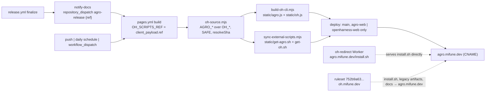

# AGRO Web Pipeline

## Relevant Source Files
Core repository (the declared `sources:`):
- `.github/workflows/release.yml:377-402` — `notify-docs`, the `agro-release` `repository_dispatch`.
- `.agro/skills/release/SKILL.md:58-76,195-210` — the token and variable prerequisites, and how to confirm a dispatch landed.
- `docs/agro-compatibility.md:283-300` — the `oh.mifune.dev` endpoint table, including the CDN-owned `/install.sh`.
- `docs/agro-cutover-runbook.md:126-196` — the Cloudflare redirect rules the operator applies.
- `.agro/scripts/get-agro.sh`, `.agro/scripts/get-oh.sh` — the two installers the site mirrors.

External repository `mifunedev/openharness-web` (renamed `mifunedev/agro-web` by the operator). Every `sources:` form in the schema resolves inside this repository, so these files are cited by repository and commit here and are not declared dependencies; re-read them when either commit is superseded.
- `scripts/oh-source.mjs` at `05e81c7` (PR #46) — the source resolver both mirror scripts share.
- `scripts/build-oh-cli.mjs` at `05e81c7` — the CLI bundle build.
- `scripts/sync-external-scripts.mjs` at `05e81c7` — the installer mirror.
- `.github/workflows/pages.yml` at `05e81c7` — triggers, `client_payload.ref`, repository assertions, Pages deploy.
- `docusaurus.config.ts`, `static/CNAME`, `scripts/check-docs-drift.mjs` at `73a06e7` (PR #47) — site identity and the `LEGACY_IDENTITY` rule.

## Summary
The docs site is a Docusaurus build that also mirrors the harness: at build time it fetches `get-agro.sh` and `get-oh.sh` from the core repository and builds `agro.js` and `oh.js` from the core CLI, so `https://agro.mifune.dev/get-agro.sh` and `/agro.js` serve the same artifacts the GitHub Release carries. The mirror rebuilds on push, daily, and — since #943 — on the `agro-release` dispatch the core release sends. `/install.sh` is not part of the site: on the canonical host a Cloudflare Worker serves it directly, and on the legacy host a Cloudflare ruleset redirects it.

## Detail
**Resolver.** `scripts/oh-source.mjs` (05e81c7) resolves one repository and one ref for both mirror scripts. `AGRO_GITHUB_REPO` wins over `OH_GITHUB_REPO` and `AGRO_SCRIPTS_REF` over `OH_SCRIPTS_REF`; when both are set and differ it warns and uses the `AGRO_` value. Defaults are `mifunedev/openharness` and `main` (a `refs/heads/` prefix is stripped); the repository default flips to `mifunedev/agro` in US-006, after the operator rename. Both values reach `git clone` as arguments, so `SAFE` (`^[A-Za-z0-9][A-Za-z0-9._/-]*$`) rejects anything else and exits 1. `resolveSha` turns the ref into a commit through the GitHub API and doubles as the existence check. `reportAndExit` keeps a previously published artifact only on a transient failure (408, 429, 5xx, network) and only when that artifact is on disk; anything else fails the build rather than deploying a stale mirror.

**CLI build.** `scripts/build-oh-cli.mjs` clones `REPO@REF` shallow, takes the first of `.agro/cli` then `.oh/cli` that holds a `package.json`, runs `npm install` and `npm run build`, takes `dist/agro.js` else `dist/oh.js`, refuses a bundle that does not start with `#!`, and copies that one bundle to both `static/agro.js` and `static/oh.js`.

**Installer mirror.** `scripts/sync-external-scripts.mjs` fetches `.agro/scripts/get-agro.sh` and `.agro/scripts/get-oh.sh` from `raw.githubusercontent.com/<REPO>/<REF>`, falling back to the `.oh/` spelling of each path; when both spellings are missing the build fails naming both URLs, and a body without a shebang fails too. `install.sh` is deliberately absent from the list.

**Workflow.** `.github/workflows/pages.yml` runs on push to `main`, on pull requests (build only), on `repository_dispatch` types `agro-release` and `openharness-release`, on a daily `17 6 * * *` schedule, and on `workflow_dispatch` with a `ref` input. `OH_SCRIPTS_REF` is `client_payload.ref || inputs.ref || 'main'`, so a dispatch mirrors exactly the released commit. The drift check runs on pull requests only and never gates the deploy. `configure-pages`, the artifact upload, and the `deploy` job run only on `refs/heads/main` and only when `github.repository` is `mifunedev/agro-web` or `mifunedev/openharness-web`, so the workflow survives the rename in either order.

**`/install.sh` is CDN-owned.** No `static/install.sh` exists. Before the cutover, the `http_request_dynamic_redirect` phase held no entrypoint ruleset at all on zone `mifune.dev` (id `70c7b49f48707d47766c45c12cd988d6`). On the canonical host, `/install.sh` is served directly by a Cloudflare Worker named `oh-redirect`, bound to the route `agro.mifune.dev/install.sh`. On the legacy host, the advisor created ruleset `752b9a63a91b44c0be739401481f5a59` (version 1) in that phase, with three enabled rules in order: `agro-install-sh` (`http.host eq "oh.mifune.dev"` and path `/install.sh`, 302 to the raw `install.sh` on `main`), `agro-legacy-artifacts` (`oh.mifune.dev` paths `/get-oh.sh`, `/oh.js`, `/get-agro.sh`, `/agro.js`, 302 to the same path on `agro.mifune.dev`), and `agro-docs-catch-all` (everything else on `oh.mifune.dev`, 301 to the same path on `agro.mifune.dev`). Rule 1 is scoped to the legacy host on purpose: Cloudflare evaluates Redirect Rules before Workers, so a rule matching the canonical host would shadow the `oh-redirect` Worker — one mechanism owns each host. Mirroring the file into the site would add a third mechanism behind one path, so US-006 keeps it out.

Both rule 1's target and the `oh-redirect` Worker point at `.oh/scripts/install.sh` on `main`; that path exists only because `main` predates the `.oh/` → `.agro/` rename. The first release carrying the rename deletes it, so both must move to `https://raw.githubusercontent.com/mifunedev/agro/main/.agro/scripts/install.sh` in the same change window as that release, never earlier.

**Site identity (73a06e7).** `docusaurus.config.ts` sets `url: "https://agro.mifune.dev"`, `title: "AGRO"`, `projectName: "agro-web"`, and edit and footer links to `mifunedev/agro` and `mifunedev/agro-web`; `static/CNAME` is `agro.mifune.dev`. `check-docs-drift.mjs` adds `LEGACY_IDENTITY`: `oh.mifune.dev` and `mifunedev/openharness(-web)` are violations in `docs/` and `src/pages/` unless the line, or the heading of the section it sits in, contains the word "compatibility"; `ghcr.io/mifunedev/openharness` is exempt because the release workflow owns the image name, and `promos/` is not scanned.

**Core side.** `notify-docs` (`release.yml:377-402`) runs after `finalize` succeeds on a non-no-op release and POSTs `/repos/${AGRO_WEB_REPO}/dispatches` with `event_type=agro-release` and `client_payload[ref]=<releaseSha>`, using the secret `AGRO_WEB_DISPATCH_TOKEN`. `AGRO_WEB_REPO` is a repository variable, default `mifunedev/openharness-web`, re-pointed with `gh variable set` after the web rename (`release/SKILL.md:71-76`). An empty secret prints `::notice::` and exits 0; the daily schedule remains the backstop. Before #943 the core sent nothing and the site relied on that schedule alone.

## System Relationships

Ownership: the core owns the artifacts and the dispatch; the web repository owns the mirror, the build, and the site identity; Cloudflare owns `/install.sh` on the canonical host through the `oh-redirect` Worker, and the `oh.mifune.dev` aliases through ruleset `752b9a63a91b44c0be739401481f5a59`.

## See Also
- [[release-versioning]] — the pipeline that sends the dispatch and uploads the same four assets to the Release.
- [[fresh-machine-setup]] — the installer entry points the site serves.
