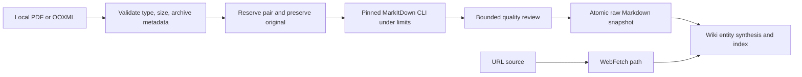

# Local Document Ingestion

## Relevant Source Files
- `.agro/knowledge/raw/2026-07-18-markitdown.md` — immutable upstream README snapshot documenting supported formats, direct CLI usage, optional dependencies, and security guidance.
- `.agro/skills/wiki/references/ingest.md` — owns source classification, validation, conversion, review, provenance publication, and synthesis handoff.
- `.agro/evals/probes/markitdown-wiki-ingest.sh` — guards the pinned/local-only contract and prevents wrapper or runtime-package drift.
- `.oh/tasks/markitdown-wiki-pilot/smoke-evidence.md@0fd2efcb` — records real conversion, resource-limit, cleanup, and network-boundary evidence. `.agro/tasks/` is gitignored and this folder is not in the working tree, so the citation is a pin: the path is the pre-#942 spelling because that is where the content lived at that commit, and the pin must not be re-spelled.

## Summary
`/wiki ingest` can normalize local PDF, DOCX, PPTX, and XLSX documents into Markdown by invoking Microsoft MarkItDown's pinned upstream CLI directly through `uvx`. MarkItDown owns only lossy document-to-Markdown conversion; the orchestrator retains input validation, trust decisions, immutable provenance, quality review, entity synthesis, and wiki indexing. #942 moved `ingest.md` and the probe from `.oh/` to `.agro/` without changing a line of the contract: both files kept their exact length, every substituted line was a path string, and so every line citation on this page still resolves to the sentence it named.

## Detail
URL acquisition remains on WebFetch and never enters MarkItDown's permissive remote path; converted bytes are untrusted evidence rather than instructions (`.agro/skills/wiki/references/ingest.md:146-148`). The pilot deliberately avoids a wrapper command, ambient executable lookup, plugins, cloud/LLM conversion, and image installation. Conversion runs through `uvx --from 'markitdown[pdf,docx,pptx,xlsx]==0.1.6' markitdown` with a 120-second timeout, one-thread native pools, a 2 GiB virtual-memory ceiling, and a prospectively enforced 10 MiB file ceiling (`.agro/skills/wiki/references/ingest.md:299-334`).

Before conversion, the orchestrator rejects symlinks, oversized inputs, invalid PDF signatures, unsafe or encrypted OOXML members, and excessive declared archive expansion. It reserves one collision suffix for the original/Markdown pair, copies once, then hashes and converts that preserved copy (`.agro/skills/wiki/references/ingest.md:183-240`). A bounded preview and structure counts gate publication; quality warnings abort unattended updates and require explicit confirmation before replacing an existing entity (`.agro/skills/wiki/references/ingest.md:336-376`). The complete snapshot is published atomically and retains basename-only source metadata, preserved artifact path, SHA-256, converter identity, and an unconditional lossy/untrusted warning (`.agro/skills/wiki/references/ingest.md:378-409`).

Behavioral evidence covers all four formats, blank/non-zero/capped failures, cleanup, invalid signatures/traversal, and unchanged URL/text routing. A DOCX external relationship produced zero requests to its local recorder (`.oh/tasks/markitdown-wiki-pilot/smoke-evidence.md@0fd2efcb:21-60`). The protected Tier-A probe checks the contract without pretending static inspection replaces those smoke results (`.agro/evals/probes/markitdown-wiki-ingest.sh:33-64`).

Rollback removes ordinary tracked pilot surfaces, but the protected probe requires a separate reviewed removal PR. Published raw provenance remains unless an operator confirms it is local-only and unreferenced (`.agro/skills/wiki/references/ingest.md:411-413`).

## System Relationships

## See Also
- [[sandbox-dependency-installs]]
