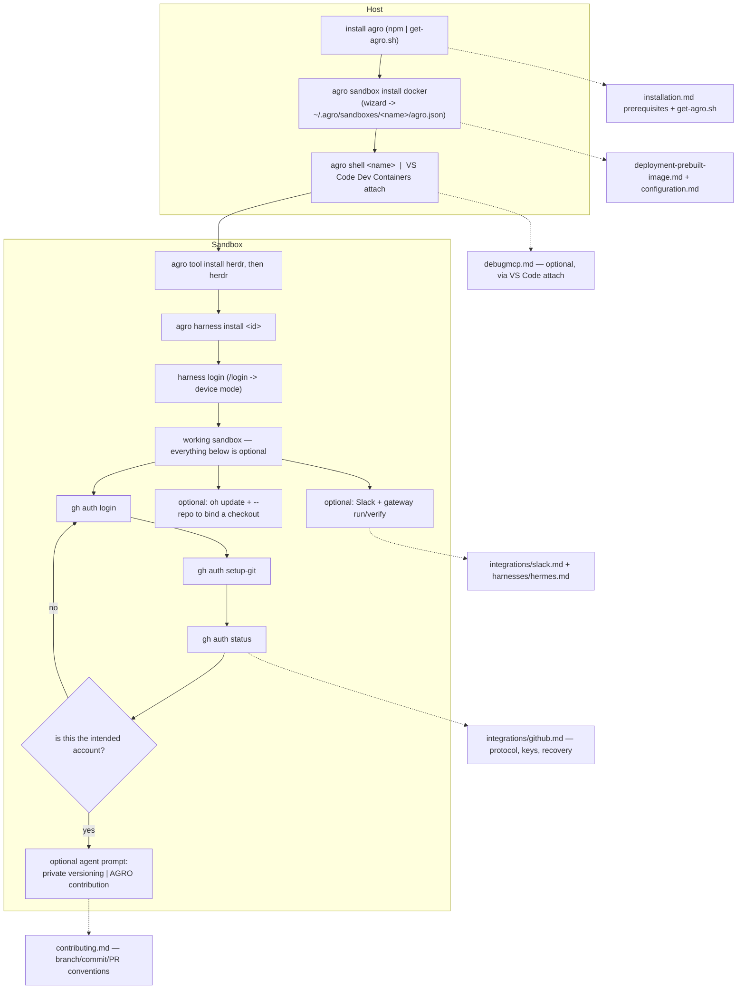

# Fresh-Machine Setup Flow

## Relevant Source Files
- `docs/quickstart.md` — the **canonical human walkthrough**: get `agro`, create the sandbox, enter it, install Herdr, install and authenticate one harness, then the GitHub-login prerequisite and the two optional agent prompts. This entry is a synthesis and doc-handoff map only.
- `README.md` — the same path in five numbered steps, and the shortest statement of what onboarding now is.
- `docs/installation.md` — host prerequisites, the `agro` install paths, the `oh` compatibility entry point, the package/PATH rules, and the second shape: equipping an existing project repo with `oh update`.
- `.agro/scripts/get-agro.sh` — artifact-only installer: the `agro.js` release asset, `AGRO_<NAME>` with `OH_<NAME>` fallback, no clone and no build.
- `docs/deployment-prebuilt-image.md` — the `agro sandbox install docker` page: image-only by default, `--repo` to bind a checkout.
- `docs/integrations/github.md` — the command-level GitHub reference: protocol choice, SSH-key upload (interactive + entrypoint auto-keygen), the recovery table, and `agro config repo` as a compatibility helper.
- `docs/contributing.md` — branch, commit, changelog and pull-request conventions for the contribution prompt.
- `docs/integrations/debugmcp.md` — DebugMCP extension runbook.
- `docs/integrations/slack.md`, `docs/harnesses/hermes.md` — Slack config + gateway run/verify.
- `.devcontainer/entrypoint.sh` — auto SSH keygen + pubkey upload when `GH_TOKEN` carries `admin:public_key`.
- `.devcontainer/Dockerfile`, `.agro/cli/src/commands/harness.ts`, `.agro/scripts/link-providers.sh` — Hermes runtime home and immediate shared-skill integration.
- `.agro/scripts/gateway.sh` — sandbox-only lifecycle for the sibling `client-slack-pi` / `client-slack-hermes` sessions.

## Summary
Onboarding is **sandbox-first**. The operator installs one host binary, creates a
sandbox from the published image, and does everything else inside it. There is no
fork step, no clone-and-own recipe, no one-line repository installer, and no
`~/.openharness` checkout — #942 retired all four from `README.md`,
`docs/quickstart.md`, and `docs/installation.md`. Three commands run on the
**host** (install `agro`; `agro sandbox install docker`; `agro shell <name>`);
everything after that runs **inside the sandbox**: `agro tool install herdr` then
`herdr`, then `agro harness install <id>` and that harness's login. A working
sandbox is an installed and authenticated harness inside Herdr — everything past
that point is optional. The docs write `agro`; `oh` is the compatibility alias
for the same executable (#941), and `agro migrate` moves legacy `.oh/` state when
the operator asks (#942).

## Detail
Host prerequisites are Docker (with the Compose plugin), Git, and **Node.js >= 20** —
`agro` is the only lifecycle door and needs Node to run (issue #881 retired the
Makefile). Install it with `npm install -g @mifune/agro`, run it zero-install with
`npx @mifune/agro`, or bootstrap with `get-agro.sh`: it downloads the prebuilt
`agro.js` asset of the latest GitHub Release of `AGRO_GITHUB_REPO` (default
`mifunedev/agro` since #943, so a fork can host its own) into `~/.local/bin/agro`
(`AGRO_BIN_DIR`), checks the shebang, offers nvm + Node 22 when Node is missing, and
never clones or builds — no ref override exists because nothing is checked out. Each
`AGRO_<NAME>` falls back to `OH_<NAME>`; a warning names both keys when they differ
(`agro_env`). `get-oh.sh` stays the compatibility bootstrap for `oh`, and
`@mifune/openharness` installs the delegating `oh` shim. `agro update` upgrades the
executable later ([[oh-cli-portable-lifecycle]]). The documented entry points are
`https://agro.mifune.dev/get-agro.sh` (canonical; `README.md:51`,
`docs/installation.md:38`) and `https://oh.mifune.dev/get-oh.sh` (compatibility;
`docs/installation.md:74`), and README and the docs link `mifunedev/agro`,
`mifunedev/agro-web`, and `agro.mifune.dev` (#943; `README.md:29,287`). The GitHub
repository rename is an operator step in `docs/agro-cutover-runbook.md`, pending at
this pin, so `mifunedev/openharness` still resolves directly and the `mifunedev/agro`
default takes effect once the rename lands. [[agro-web-pipeline]] describes the site
that serves the installers.

No checkout is required to create a sandbox: `agro sandbox install docker` runs from
any directory and asks name, timezone, git identity, SSH (with port), and Docker
socket, or takes every default with `--yes`. The default name is `agro-sbx-<n>`, the
lowest unused number. The answers land in a registry entry at
`~/.agro/sandboxes/<name>/agro.json`, beside the compose files and the wrapper the CLI
regenerates on every lifecycle call — the operator edits only `agro.json`. A registry
written by an earlier release stays at `~/.oh/sandboxes/<name>/oh.json` and keeps
working under both names; `agro migrate --home` moves it when the operator chooses.
Without `--repo` the sandbox runs `ghcr.io/mifunedev/openharness:latest` and seeds its
workspace from the image's `/opt/agro-seed`, so nothing is cloned and nothing is built.
Non-secret configuration is edited with `agro config set --sandbox <name>`; secrets go
through `agro secret set --sandbox <name>` into the entry's gitignored dotenv. The CLI
writes no `AGENTS.md`, provider config, or scaffold; the operator owns those files.

Enter with `agro shell <name>`, or attach VS Code's Dev Containers extension to the
running container — the recommended path, and identical whether the sandbox is local
or on a host reached over Remote-SSH. Either way the working directory is
`/home/sandbox/harness` and the user is `sandbox`.

Nothing installs at boot: a fresh sandbox has no `herdr` and no agent CLI. The first
two commands inside it are `agro tool install herdr` and `herdr`. Install what is
needed through the one door — `agro harness install <id>` and `agro tool install <id>`
(#948) — each landing in `~/.local` inside the persistent home volume, so a reinstall
upgrades in place without a rebuild. T3 Code is on demand and has no install. The
**most straightforward cross-provider login** is `/login` → **device mode** from an
agent's interactive session — a short code + URL that works on a headless or remote
host, where browser-redirect OAuth typically fails; explicit `--device-auth` flags
(`codex login --device-auth`, `grok login --device-auth`) are equivalents. Claude Code
remains the documented default. **DebugMCP** is a separate, optional cross-harness MCP
debugging capability, enabled by the VS Code attach-to-container route; any MCP-capable
harness can drive it.

**GitHub is a prerequisite, not a step in the middle.** Local sandbox use stays
available with no GitHub account; pushing, creating a repository, and opening a pull
request do not. Provider authentication authenticates the model, not GitHub, and grants
no repository access. Inside a Herdr pane, in this order: `gh auth login`, then
`gh auth setup-git`, then `gh auth status`, then **confirm the status output names the
intended account with authenticated access**, and only then hand the workspace to a
coding agent. The initial login is never delegated — an agent cannot complete an
interactive OAuth flow, and a prompt that assumes an account it cannot verify is how the
wrong identity reaches a commit. Both optional prompts assume the login is complete and
recheck it before acting.

Two optional agent prompts replace the retired recipes, and both are written to inspect
before they change anything: one asks the agent to **version-control the sandbox
workspace in the operator's own private repository** (review ignore rules and proposed
tracked files for credentials and runtime state, confirm account/name/visibility, show
the commit before pushing, and do all work inside the sandbox); the other asks it to
**prepare an AGRO contribution** (check whether the checkout shares ancestry with the
canonical repository, configure an upstream and a contribution branch without disturbing
a private origin, otherwise use a separate upstream checkout, and confirm fork, branch
and diff before pushing). `agro config repo` — which creates a repository and re-points
`origin` for the retired clone-and-own recipe — remains supported through the AGRO
compatibility window, prompts and defaults to no, skips itself in a non-interactive
shell, and is explicitly **not** the canonical onboarding path.

GitHub auth still offers two SSH paths: interactive (pick SSH during login, generate a
key, paste a token) or automatic (the entrypoint generates an ed25519 key and uploads the
public key when `GH_TOKEN` carries `admin:public_key`; idempotent). Command-level
recovery lives in `docs/integrations/github.md` — wrong account, missing credential
helper, `Permission denied (publickey)`, a token missing a scope, and the fact that
`agro destroy` or `down -v` deletes the home volume holding the token and keys.
Contribution conventions live in `docs/contributing.md`.

Optionally, a project checkout can be bound instead: `oh update` inside it vendors the
control plane and `crons/` and nothing else, then
`agro sandbox install docker --repo "$PWD" --name <project>` bind-mounts it at
`/home/sandbox/harness`. A checkout equipped by an earlier release carries `.oh/` and
`oh.json`; both keep resolving, and `agro migrate` renames them when the operator asks.

Slack + gateways: `pi-messenger-bridge` bridges Slack to Pi; Hermes uses its native
gateway. One `.agro/scripts/gateway.sh` lifecycle manages both in sibling tmux sessions
(`client-slack-pi`, `client-slack-hermes`), each with its own Slack app. Run commands are
sandbox-only (they need `pi` / `hermes` on `PATH`). Verify a live gateway read-only
(`tmux attach -r`, detach with `Ctrl-b d`); logs mirror to `/tmp/client-slack-{pi,hermes}.log`.

`confidence: provisional` — the create/enter/`tool install herdr` sequence is
live-verified against a registry child booted from the #950 head
(`.agro/tasks/sandbox-registry/evidence.md`); the Claude auth command and the
`gateway status` / `tmux -r` mechanics are live-verified in the running sandbox.
The #942 onboarding rewrite is verified against the documents themselves, not
re-walked on a bare host; Pi/Hermes/Slack auth were not re-run live for this entry.
Commands themselves live in `quickstart.md`, not here.

Hermes onboarding separates the program home from runtime state. The program remains in
`~/.local/lib/hermes-agent`; the image defaults runtime state to `~/harness/.hermes`
(`.devcontainer/Dockerfile:4`). The installer reconciles shared skills immediately and
checks the executable before reporting success (`.agro/cli/src/commands/harness.ts:176`,
`.agro/cli/src/commands/harness.ts:228`); the reconcile call now reaches the linker
through `remoteControlDirScript`, so it works against a `.agro/` or a `.oh/` sandbox.
Native skills remain beside the additive shared link. Conflicting, unset, or relative
managed homes fail before installation (`.agro/scripts/link-providers.sh:111`).

An old container needs image recreation, not only a CLI update, to acquire the image
environment. The installer does not migrate populated legacy homes. Image-only state
resides in the home volume; checkout-backed state resides in the checkout. The opt-in
smoke scenario checks the upstream home resolver, real skill discovery, native creation,
and synthetic atomic replacement (`.agro/scripts/hermes-install-smoke.sh:1`). The scenario
neither authenticates nor invokes a model; it does not extend this page's previous
live-auth claims.

## System Relationships

## See Also
- [[sandbox-dependency-installs]]
- [[oh-cli-portable-lifecycle]]
