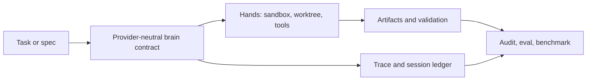

# Molt: A Scalable PyTorch-Native Training Framework for Agentic Reinforcement Learning

## Relevant Source Files
- `https://arxiv.org/abs/2607.21653v1` — the upstream source (fetched 2026-08; the snapshot was never committed, so this reference is the weakest provenance form, `schema.md` § 4). Originally captured as arXiv:2607.21653v1, published 2026-07-22.
- `docs/rfcs/rfc-trace-ledger.md:33-155` — the proposed append-only run/session event model and replay, diagnosis, and scoring minimums.
- `docs/artifact-contract-schema.md:3-49` — required-artifact and verification-command contracts enforced by audit.
- `.agro/evals/README.md:3-49,90-124` — real-state probes, three-state outcomes, and regression gate behavior.
- `docs/rfcs/rfc-selfimprove-roadmap.md:12-39` — normalized traces, diagnostic reports, benchmarks, and promotion gates.
- `docs/harnesses/overview.md:7-9` — Open Harness's deliberate one-developer/project/agent default.

## Summary
Molt is a compact, PyTorch-native framework for agentic reinforcement learning. Its design bet is that readable code, a single visible asynchronous loop, ordinary Python agent contracts, token-first trajectory capture, and explicit correctness invariants can preserve research velocity without giving up frontier-scale performance. Its reported throughput parity is scoped to a matched protocol; the paper also exposes a model-routing mismatch that makes one benchmark throughput-only.

Open Harness should borrow the shape of Molt's interfaces and evidence discipline, not its single-backend RL stack. The strongest lesson is to make every agent run inspectable end to end—from task and model call through hand/tool effects, artifacts, validation, and handoff—while keeping provider-specific machinery at replaceable boundaries.

## Detail
**1. Make inspectability a first-class capability.** Molt treats source-code readability for humans and AI coding assistants as a design requirement: a change should be traceable from flag to executed branch, data, metric, and test without hidden registries. Open Harness should apply the same test to skills, runners, and task artifacts. Provider portability remains a product requirement, so this does not mean one backend; it means each provider route should expose a small, direct contract instead of making task semantics depend on adapter indirection.

**2. Define an ordinary, provider-neutral agent contract.** Molt can drive an `Env` or capture an existing SDK-based `ChatAgent` through a loopback boundary without agent-side integration code. Open Harness's analogous contract should be: task/spec in; normalized run/session events, hand/tool outcomes, artifacts, validations, and a terminal handoff out. The trace RFC already names those event classes and stable `run_id`, `session_id`, and `step_id` fields (`docs/rfcs/rfc-trace-ledger.md:39-71`). This would let Claude, Codex, Pi, or a future agent participate without each inventing its own evidence vocabulary.

**3. Preserve provenance when context or control flow changes.** Molt keeps token IDs and behavior log-probabilities rather than reconstructing trajectories from text; when compaction rewrites a prompt prefix, it seals one segment and starts another. Open Harness should apply the same invariant at the harness level: never infer success from a prose transcript after a reset, retry, or handoff. Record the exact run/step, provider/model, command exit, artifact hash, validation result, and completion-marker parse. Context resets should create an explicit segment/cursor that remains replayable, complementing [[managed-agents]] and the proposed session ledger (`docs/rfcs/rfc-trace-ledger.md:77-155`).

**4. Disaggregate brains and hands, then scale by configuration.** Molt's asynchronous queue, persistent prompt-group pool, pause/refit/resume path, and explicit policy-version correction let generation and training fail or scale independently. For Open Harness, the brain is a provider CLI; hands are sandboxes, worktrees, browsers, MCP tools, deploy targets, and GitHub operations. A run should attach or reprovision hands lazily, classify hand failures, and preserve artifacts outside the live process. This turns the runtime RFC's substrate/deploy/fan-out axes into stable interfaces while retaining the documented one-agent default (`docs/harnesses/overview.md:7-9`).

**5. Fail fast on correctness mismatches, not only unsupported configuration.** Molt rejects partial rollout without off-policy correction and guards token, policy-version, and model-semantic alignment. Open Harness should similarly reject unverifiable completion: a missing required artifact is already an audit failure, and verification commands are explicit contracts (`docs/artifact-contract-schema.md:17-49`). The eval suite's real-state, `PASS`/`REGRESSION`/`SKIPPED` oracle prevents an absent environment from becoming silent green (`.agro/evals/README.md:20-49`).

**6. Measure the outcome on the same visible path.** Molt's author → launch → observe workflow logs per-step reward, rollout, latency, and stage timings, then compares against a matched counterfactual. Open Harness's trace roadmap calls for `cost_time`, validation, artifact, and handoff events plus a capability benchmark and promotion gate (`docs/rfcs/rfc-selfimprove-roadmap.md:29-39`). Adopt the discipline: a smaller or cleaner skill is not progress unless task success, unattended completion, cost/time, or evidence quality improves. The paper's disclosed routing mismatch is a reminder to separate throughput claims from behavioral correctness claims.

## System Relationships

## See Also
- [[managed-agents]]
- [[audit-architecture]]
- [[recursive-language-models]]
- [[runtime-isolation-landscape]]
