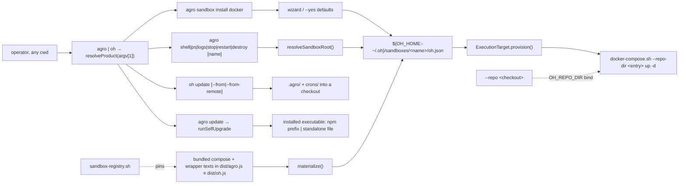

# oh CLI Portable Lifecycle

## Relevant Source Files
- `.agro/cli/src/lib/registry.ts` — the sandbox registry: `registryRoot()`, `entryRoot()`, `listEntries()`, `nextDefaultName()`, `materialize()`, `resolveSandboxRoot()`.
- `.agro/cli/build.mjs` — the `oh-asset:` esbuild plugin that inlines the four compose files and three scripts from `OH_ASSET_ROOT` (default: the repository root) into `dist/agro.js`, copied to `dist/oh.js`.
- `.agro/cli/src/lib/product.ts` — `resolveProduct(argv[1])`: basename `oh` → `LEGACY_PRODUCT`, else `AGRO_PRODUCT`.
- `.agro/cli/src/commands/self-upgrade.ts` — `classifyInstallation`, `runSelfUpgrade` (`agro update`).
- `.agro/cli/package.json` (`@mifune/agro`, bin `agro`); `.agro/cli/legacy/package.json` (`@mifune/openharness`, bin `oh`, exact pin).
- `.agro/cli/src/commands/sandbox.ts` — `oh sandbox install <runtime>` (wizard, entry write, materialise, provision) and `oh sandbox list`.
- `.agro/cli/src/commands/lifecycle.ts` — `oh shell|stop|restart|logs|ps|destroy [name]`; thin wrappers over the `ExecutionTarget` contract and the materialised wrapper script.
- `.agro/cli/src/lib/execution/target.ts`, `docker-compose-target.ts` — the provider-neutral contract and its one adapter, which owns the engine argv.
- `.agro/cli/src/cli.ts` — `main` threads the product `bin` into help and errors and dispatches `update` by product; `parseUpdateArgs`, `resolveUpdateSource`, `runWithRemoteSource`, `--sandbox` on `config` / `secret`.
- `.agro/cli/src/commands/update.ts` — the `.agro/` + `crons/` bootstrap and upgrade.
- `.agro/cli/src/lib/remote.ts` — `fetchRemoteSource`: shallow clone, `GIT_TERMINAL_PROMPT=0`, bounded timeout.
- `.agro/cli/src/lib/project.ts` — equipped-root walk-up resolver, still used by the in-repo verbs; since #940 it recognizes `.oh/` or `.agro/` through `resolveControlDir` (`.agro/cli/src/lib/compat.ts`) and fails closed when both exist and differ.
- `.agro/scripts/docker-compose.sh`, `gateway.sh` — the scripts the verbs delegate to; the wrapper sources its sibling `compat.sh` to pick `agro.json` or `oh.json` and exits 2 when the sibling is missing or the two configs differ.
- `.agro/evals/probes/sandbox-registry.sh` — the tier-A probe that pins the bundled texts to the tracked files and forbids engine argv outside the wrapper.

## Summary
Issue #950 moved sandbox configuration out of the project checkout. `oh sandbox install docker` runs from any directory: a wizard writes a **registry entry** under `${OH_HOME:-~/.oh}/sandboxes/<name>/`, the CLI materialises the compose files and wrapper script it bundles into that entry, and the container starts. `oh shell <name>` and the other lifecycle verbs resolve a sandbox by name from anywhere; a project checkout is an optional `--repo` bind mount. Since #941 one bundle answers to two names, `agro` (canonical) and `oh` (compatibility alias), chosen by the invoked name. `oh update` writes the `.agro/` + `crons/` payload and only that; `agro update` upgrades the installed executable. `oh init`, `oh runtime`, and `.agro/templates/` no longer exist; an installed `agro` file carries everything a sandbox needs.

## Detail
**A registry entry is a root.** `registryRoot()` is `<home>/sandboxes` where the home comes from `resolveUserStateHome` in `compat.ts` (#940): `AGRO_HOME`, then `OH_HOME`, then `<homedir>/.oh` unless `<homedir>/.agro/sandboxes` is the sole registry or both registries are byte-identical, and a conflict when both exist and differ (`registry.ts`); names match `^[a-z0-9][a-z0-9-]*$` (`registry.ts:15`). Each entry holds the exact layout `.oh/scripts/docker-compose.sh` already expected of a repo: `oh.json`, an optional `.env` (secrets), `.devcontainer/docker-compose.yml` plus the ssh and docker-sock overlays, and `.oh/scripts/docker-compose.sh` + `check-host-port.sh` + `compat.sh`. `materialize()` rewrites those seven files from the bundled texts on every lifecycle call, so the entry always matches the CLI version and the operator edits only `oh.json`. Without `repo` the base is the image-only compose file; with `repo` it is the checkout-binding file, whose bind and build context read `${OH_REPO_DIR:-..}` — the `..` default keeps CI and an in-checkout run byte-identical.

**Bundled assets.** `registry.ts` imports the seven files through `oh-asset:<repo-relative path>` specifiers; `build.mjs` resolves them under `OH_ASSET_ROOT` (default: the repository root above `.agro/cli`) and inlines them as text, failing the build when one is missing. The sandbox image stages exactly those seven files under `/opt/agro-assets` and builds with `OH_ASSET_ROOT=/opt/agro-assets` (`.devcontainer/Dockerfile`), because it copies only `.agro/cli/` into `/opt/oh`; it symlinks `/usr/local/bin/agro` → `dist/agro.js` and `/usr/local/bin/oh` → `dist/oh.js`. Every other build site runs inside a full checkout. `sandbox-registry.sh` compares what a materialised entry contains against the tracked files byte for byte, so a change to a compose file without a rebuild is a REGRESSION, and it fails if `lifecycle.ts` or `sandbox.ts` ever spawns `docker` directly.

**One bundle, two products.** `resolveProduct(process.argv[1])` (`product.ts`) returns `LEGACY_PRODUCT` only when the invoked basename, extension stripped, is `oh`; every other name is `AGRO_PRODUCT`. `main` (`cli.ts`) threads `bin` into help and error prefixes; `oh` adds a one-line compatibility note. `@mifune/agro` ships `dist/agro.js` as `agro`; `@mifune/openharness` is a code-free shim whose `bin/oh.js` imports `@mifune/agro/dist/agro.js` at an exact pin (`legacy/package.json`). Both packages, both image names, and the release assets come from one build — [[release-versioning]].

**`oh sandbox install <runtime>`** (`sandbox.ts:139`) accepts `docker`; `microsandbox` refuses with a pointer to `docs/rfcs/rfc-runtime-support.md` and to `oh tool install microsandbox` (the runtime catalog in `lib/runtimes/catalog.ts` now lists only those two). On a TTY without `--yes` the wizard asks name, timezone, git identity, SSH (with host port), and the Docker socket; `--yes` keeps every default (name `oh-sbx-<n>` for the lowest unused integer, `registry.ts:80`; host `TZ`; global git identity; SSH and socket off). With `--repo <dir>` the defaults seed from that checkout's `agro.json` and `repo` is written into the entry. `--image=<ref>` is persisted as `image.ref` so later verbs render the same image; `--print-argv` materialises into a temporary preview root and writes no entry (`sandbox.ts:192`). Success prints `next: oh shell <name>`. `oh sandbox list [--json]` shows name, runtime, status from `target.status()`, and repo. Bare `oh sandbox` prints help and exits 1; there is no implicit `up`.

**Name resolution.** Every lifecycle verb calls `resolveSandboxRoot({ name, cwd })` (`lifecycle.ts:93`): an explicit name → that entry; else the single registered entry; else the entry whose `repo` contains `cwd`; else an error listing the registered names (or, with an empty registry, `create one with oh sandbox install docker`). `oh destroy <name>` prompts for the name unless `--yes`, runs `down -v`, then removes the entry directory (`lifecycle.ts:370`). `oh config show|set --sandbox <name>` and `oh secret set|list --sandbox <name>` act on the entry; without the flag they use `resolveProjectRoot` on the equipped checkout as before (`cli.ts`, `main`).

**Rendering.** The verbs still render `agro.json` into a temporary `compose.env` passed as `--extra-env-file` (`lifecycle.ts:42-75`); the rendered set gained `OH_REPO_DIR` (`config-render.ts:40`). Nothing seeds a `.devcontainer/.env`; the wrapper reads `<root>/.env` for secrets.

| Verb | Side | Route | Delegates to |
| --- | --- | --- | --- |
| `oh sandbox install docker` | hands | wizard → entry `oh.json` → `materialize()` → `provision()` | `bash <entry>/.oh/scripts/docker-compose.sh --repo-dir <entry> up -d --build\|--no-build` |
| `oh shell [name]` | hands | `attach({argv:["zsh"], user:"sandbox"})` | the adapter's engine argv (`docker-compose-target.ts`) |
| `oh stop\|restart\|logs\|ps\|destroy [name]` | hands | `resolveSandboxRoot()` → `materialize()` → wrapper | `bash <entry>/.oh/scripts/docker-compose.sh <compose verb>` |
| `oh gateway <args…>` | brain | none — deliberately not routed | `bash .agro/scripts/gateway.sh` with `OH_PROJECT_ROOT=<root>` |

**`oh update` is the payload bootstrap.** `resolveUpdateSource` (`cli.ts`, `resolveUpdateSource`) picks `--from <dir>` > `--from-remote [--ref]` > the CLI's own bundled payload (manifest marker) > a remote fetch with a one-line notice. A target with no `.agro/` reads as version `0.0.0` (`update.ts:56`) and receives the full payload; a second run prints `already up to date (v…)` (`update.ts:88`). It writes only what `.agro/manifest.json` ships — `.agro/**` per the include list plus `crons/**` — and never `agro.json`, `.env`, `AGENTS.md`, `.gitignore`, `.devcontainer/`, or provider directories; the operator owns those. `templates/**` left the manifest with the scaffold. `copyOhPayload()` still walks only the source `.agro/` tree and writes only below the target `.agro/` (`vendor.ts`), so root `docs/` stays project-owned. It does not upgrade the CLI (`printUpdateHelp`).

**`agro update` upgrades the executable.** As `agro`, `update` dispatches to `runSelfUpgrade` (`cli.ts`, `main`); `parseUpdateArgs` rejects the payload flags `--from`, `--from-remote`, `--ref`, `--force` (`PAYLOAD_UPDATE_FLAGS`) with a pointer to `oh update`. `classifyInstallation` realpaths `argv[1]`: `node_modules/@mifune/openharness/` → `legacy-package`, `node_modules/@mifune/agro/` → `npm` (owning prefix), `/opt/oh/` → `image`, `dist/` beside `src/` + `package.json` → `source`, unresolvable → `unknown`, else `standalone`. Only `npm` and `standalone` proceed; the rest refuse with the supported procedure (`refuseUnsupported`). The `agro` on PATH must realpath to the target (`assertOnlyAgroOnPath`) and the target's `--version` must equal the running version (`assertTargetIsSelf`). npm: `npm view`, refuse a downgrade, `npm install -g --prefix <prefix> @mifune/agro@<v>`, re-read `--version`. Standalone: fetch `AGRO_JS_URL` (`OH_JS_URL` fallback; default `DEFAULT_ARTIFACT_URL` = the `releases/latest/download/agro.js` asset), require a writable directory (never escalate), check shebang and `--version`, refuse a downgrade, copy the target to `<target>.prev`, rename the temp file over it, re-verify, restore `.prev` on mismatch, delete it on success. `--dry-run` reports kind, target, and versions.

**Remote fetch** — `git clone --depth 1 [--branch <ref>] -- <url> <tmp>` of `https://github.com/mifunedev/openharness` with `GIT_TERMINAL_PROMPT=0` and a 120 s timeout (`remote.ts`); `runWithRemoteSource` prints `fetched payload vX (installed CLI vY)` (`cli.ts`) so version skew is visible. Public HTTPS only.

**Troubleshooting / limits**
- Host prerequisites: Node.js ≥ 20, git, docker; `get-agro.sh` or `npm install -g @mifune/agro` installs the CLI ([[fresh-machine-setup]]). No checkout is needed.
- A sandbox created before #950 from a checkout (compose project = the checkout's `.devcontainer/`) is not in the registry; `oh sandbox install docker --name <its name> --repo <checkout>` adopts the compose project and its volumes.
- `SANDBOX_NAME` in the process environment overrides the rendered name, so evidence runs inside another sandbox must `env -u SANDBOX_NAME`.
- The brain/hands rationale, the state classes, and why `attach()` is synchronous live in `docs/rfcs/rfc-brain-hands-boundary.md`; cite it, do not restate it.

## System Relationships

## See Also
- [[fresh-machine-setup]]
- [[compose-env-boundary]] — the rendered set and why `OH_REPO_DIR` is in it.
- [[release-versioning]] — the release pipeline; `version-parity.sh` pins `@mifune/agro` and the shim to the harness version.
- `docs/rfcs/rfc-brain-hands-boundary.md` — authority for the brain/hands split this entry routes through.
