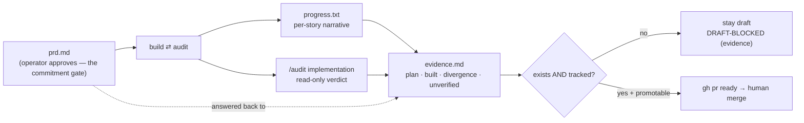

# Plan-vs-Built Reconciliation

## Relevant Source Files
- `.agro/skills/spec/references/execute.md:454` — step 7 writes `evidence.md`; `:528` gates the undraft on it.
- `.agro/skills/audit/references/reviewer-evidence-doc.md:1` — the doc's contract: path, linkage, observed-output rule, run correlation, honesty about gaps.
- `.agro/evals/probes/spec-ready-finalization.sh:58` — the three assertions that keep the gate from being quietly deleted.
- `.agro/tasks/<slug>/prd.md` / `progress.txt` / `evidence.md` — the plan, the implementation narrative, and the answer back.

## Summary
The pipeline had ~10 verification nodes and zero comprehension nodes: every gate asked *is this correct?* and none asked *is this still what you agreed to?* An operator's model of the work stops at the plan they approved, while the single implementation owner — the agent running `/spec execute` — carries implementation and verification through one owned workflow. Reconciliation closes that gap with one tracked artifact — `.agro/tasks/<slug>/evidence.md` — which the merge gate **refuses to undraft without** (`execute.md:554`).

## Detail
**It is a gate condition, not a report.** `/spec execute` checks two things before `gh pr ready`: that the file exists, and that `git ls-files --error-unmatch` finds it. The second half is not redundant — `.agro/tasks/` is gitignored, so a doc written without `git add -f` sits on disk and is **absent from the PR diff**, which from the reviewer's seat is identical to never writing it (`execute.md:566-569`). Failing either half is terminal status `DRAFT-BLOCKED(evidence)`, written to the PR and to `/tmp/spec-<slug>.state` (`execute.md:563`), not a warning.

**Five questions, in order** (`execute.md:470-489`): why this is better than not doing it, what the plan asked for, what was built, where they diverged and why, what remains unverified. The first is the one a reviewer cannot answer from the diff, the gates, or the plan. The last two are the load-bearing pair, because they are the only ones a reviewer cannot reconstruct from the diff. An empty one is written as the literal word `None` / `Nothing`; omitting it reads as *nothing diverged, nothing unchecked* — the most expensive claim the document can make by accident.

**The gate binds to one head.** A promotable verdict describes the commit it was
read against, so `execute.md:625` re-opens it on any push after `gh pr ready` and
`:544` confirms the PR's `headRefOid` is the commit being promoted. A ready PR
whose head moved past its classification is returned to draft rather than left
standing on a verdict about a different tree — the same shape as the stale
`AUDIT_RUN_ID` rule above, applied to CI instead of to the audit log.

**Observed output only** (`reviewer-evidence-doc.md:33-37`). Every claim quotes a command that actually ran, trimmed but never paraphrased into something unreproducible. Predicted or reconstructed output is forbidden, and a gate that produced no observed output is recorded as a **gap**, never as a pass — which is also the step-7 halt condition (`execute.md:655`).

**Ownership.** `/audit implementation` and `/audit pr` are read-only and do not write this file; the orchestrating caller does, from what those routes returned (`reviewer-evidence-doc.md:18-24`). A route that wrote it would break its own report-only contract.

**A second comprehension gate now sits beside it.** Issue #926 added the Actual
Knowledge Impact gate immediately before `evidence.md` (`execute.md:403`): the
implementation's real changed paths are matched against every knowledge page's
declared dependencies, and each impacted page ends `UPDATED`, `REVERIFIED`, or
`NOT-AFFECTED (<reason>)` inside this same document. Where `evidence.md` answers
*is this still what you agreed to*, that gate answers *what did this make untrue*.
Both are comprehension nodes, and both are recorded in one artifact.

**Do not confuse the two evidence artifacts.** `AUDIT_EVIDENCE_PATH` (`evidence.json`, schema v1, invocation-scoped, never inside `AUDIT_ROOT`) is the machine record that lets the audit boundary log `complete`. `evidence.md` is a separate tracked Markdown artifact for humans, correlated to the same `AUDIT_RUN_ID` (`reviewer-evidence-doc.md:13-16`). A stale run id means the doc is rewritten, not kept (`execute.md:698`).

**The implementation narrative is promoted, not stranded.** `progress.txt` holds the per-story record; the owner folds it and `evidence.md` into the PR body so the reviewer meets the work in the PR rather than by opening the task folder (`execute.md:575-583`).

**DeepWiki comparison.** Run 2026-08-24 against `https://deepwiki.com/mifunedev/openharness` (Overview page). DeepWiki has **no** entry for this concept: it does not mention `evidence.md` or any plan-versus-built reconciliation gate, and its planning-phase table still lists `/ship-spec` with the gloss *"Convert specs into executable tasks via a critic"* — the critic gate US-001 removed. So this page is **net-new relative to DeepWiki**, not a re-synthesis of it, and the divergence is upstream staleness rather than a contradiction to resolve. **The workflow no longer runs this comparison** (2026-08-24): DeepWiki regenerates on no schedule the gate could depend on, so `/spec plan` and `/spec execute` dropped it — the staleness recorded here is the evidence for that removal, kept as rationale rather than as a standing obligation.

## System Relationships

| Artifact | Written by | Read by | Tracked |
| --- | --- | --- | --- |
| `prd.md` | `/spec plan` | operator (the go/no-go) | yes (`add -f`) |
| `progress.txt` | the implementation owner | `/spec execute` implementation stage | yes (`add -f`) |
| `evidence.md` | `/spec execute` step 7 | the PR reviewer | yes (`add -f`) — gated |
| `evidence.json` | the audit boundary | the boundary's terminal log | no (invocation-scoped) |

## See Also
- [[audit-architecture]]
