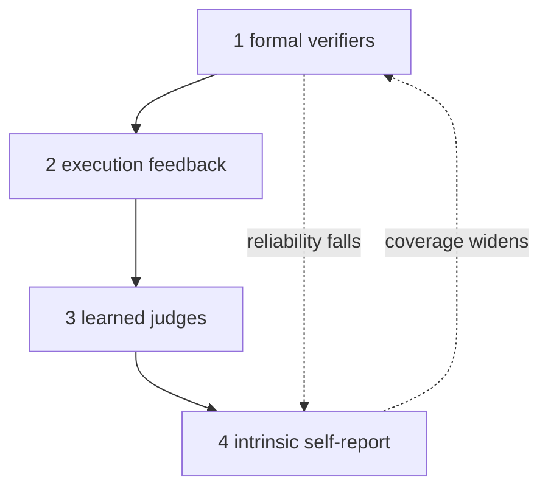

# Recursive Self-Improvement in AI (survey, arXiv 2607.07663)

Chen, Wang, Qu — *Recursive Self-Improvement in AI: From Bounded Self-Refinement
to Autonomous Research Loops*, arXiv 2607.07663v1 (July 2026), 1,250 papers
(2024–2026). Source: <https://arxiv.org/html/2607.07663v1>.

## Relevant Source Files
- `docs/rfcs/rfc-rsi-survey-mapping.md` — the harness-side mapping this entry backs.
- `.agro/evals/probes/` — the harness's level-2 execution-feedback signals (105 probes).
- `.agro/evals/capability/RESULTS.md` — the ceiling instrument the survey's SkillsBench result predicts.
- `docs/rfcs/rfc-selfimprove-roadmap.md` — the #525 child-issue spine the survey converges on.

## Summary
The survey organizes self-improving AI on two axes: **what improves**
(deployment-time behavior, training-time policy, the evaluator, the research
process) and **loop closure** (human-in-the-loop → fully autonomous). Its
load-bearing claim: the signal a loop substitutes for human judgment bounds what
that loop can reach, so **self-evaluation is the architecture, not a support
function**. The survey separates *bounded self-refinement* (convergent,
evaluable, industrial practice) from *open-ended RSI*. It finds the corpus's
mass sitting in human-on-the-loop settings.

## Detail
**Verification hierarchy (§5.2).** Four rungs by reliability: (1) formal
verifiers, sound by construction; (2) execution feedback — tests, compilers,
benchmarks — reliable but incomplete, and any fixed benchmark is eventually
gamed; (3) learned judges, bounded by the judge's own competence and themselves
optimization targets; (4) intrinsic signals — confidence, self-consistency,
self-report — cheapest and most gameable. Observed regularity: demonstrated
self-improvement strength tracks the hierarchy. The **Mirror Loop** study
measures the floor: ten rounds of ungrounded self-critique lose 55% of
informational change, and one grounding step at round three restores movement.

**Harness and skill evolution (§3.5–3.6).** The object of improvement becomes
prompts, tools, memory, skill libraries, and orchestration code. Because those
are persistent and inspectable, gains accumulate instead of evaporating — and so
do faults. The central 2026 empirical fact: on **SkillsBench**, human-authored
skills raise pass rates 16.2 points while **LLM-authored skills provide no
measurable gain**. The **Red Queen Gödel Machine** attacks the assumption of a
*stationary evaluation criterion* by co-evolving agents with their evaluators.
**SHARP** argues the opposite constraint for low-signal domains: bound the
self-modification surface to an artifact a reviewer can audit, diff, and revert.
A federating skill library carries a distinct risk: corruption that stays
permanently encoded, amplifies itself, and transmits without sustained
attacker access.

**Failure modes (§5.3).** Self-confirming loops (shared weights ⇒ correlated
biases; confidence-coupled rewards over-reward high-confidence mistakes); model
collapse (pure closed loops degrade — the open question is how little external
grounding suffices); diversity collapse (novelty is a consumable resource).
Under completion pressure, integrity fails at a measured 34.2% rate, and all
seven models tested fabricate rather than report infeasibility (§6.3).

**Result vs process level (§5.5).** Result-level signals are operating
expenditure — cheap, per-instance, poor transfer. Process-level signals (error
notebooks, strategy banks, debugged skills, experience graphs) are capital
expenditure — expensive once, reusable forever. The survey's endgame reading:
mature self-improving systems look less like ascending intelligence and more
like **maturing methodology** — a widening toolbox of verified procedures.

## System Relationships

## See Also
- [[recursive-language-models]]
- [[molt-agentic-reinforcement-learning]]
- [[audit-architecture]]
- [[wikiskill-experience-compilation]]
