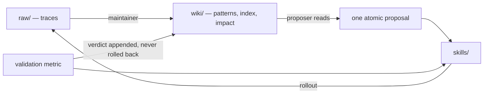

# WikiSkill: Compiling Agent Experience into Persistent Knowledge (arXiv 2608.27454)

Tang, Rashtchian, Ferng, Tomkins, Juan, Vu — arXiv 2608.27454 (2026-08-27),
cs.AI/cs.CL. Source: <https://arxiv.org/abs/2608.27454>.

## Relevant Source Files
- `.agro/skills/wiki/references/schema.md` — the local analogue of the paper's wiki layer schema.
- `.agro/knowledge/raw/` — the local analogue of the paper's raw layer, holding source snapshots rather than agent traces.
- `.agro/skills/builder/SKILL.md` — the local analogue of the paper's Skill Proposer.
- `.agro/skills/retro/SKILL.md` — report-only lesson producer; the paper's maintainer role has no local owner.
- `.agro/evals/capability/RESULTS.md` — the ceiling instrument the paper's ablation argues should move.

## Summary
WikiSkill co-evolves an agent's executable skills with a persistent knowledge
base. Its claim is that insights guiding skill development "remain scattered
across optimization histories," so it separates three layers — immutable raw
traces, an accumulated wiki, and executable skills — and makes the agent that
*proposes* skill edits read the wiki first. Its ablation isolates persistence as
the load-bearing component, not the skill format.

## Detail
**Three layers.** `raw/` holds full rollout traces. `wiki/` holds `patterns/`
(one page per failure mode or successful strategy, each with an actionable
workaround), an `index.md` catalog, a per-iteration `logs.md`, and
`skill-impact.md` recording each proposal's diff, target, validation score, and
Accepted/Rejected outcome. `skills/` holds `SKILL.md` plus a `PURPOSE.md` mapping
each skill back to the patterns that motivated it.

**The loop.** Per iteration: roll out with the current skills; a *Wiki Maintainer*
consolidates a sampled subset of traces into pattern pages by incremental,
patch-based edits; a *Wiki-Informed Skill Proposer* — a ReAct agent given the wiki
index, the impact ledger, and an outcome summary — emits **one atomic proposal
targeting one skill**; the proposal is validated and accepted only if the metric
improves, else the skill reverts.

**The invariant that matters.** "The wiki is never rolled back regardless of the
acceptance decision." A rejected proposal still leaves durable knowledge, which
is what stops the same edit being proposed again.

**Ablation (Gemini-3.5-Flash, mean).** No skill 40.4 · wiki visible to the
inference agent only 43.8 · **wiki visible to the skill proposer only 63.7** ·
both 60.9. Persistence for the proposer is worth **+15.0**; leaking the wiki into
the inference path *costs* **2.8**. Skills also transfer across model families,
sometimes beating self-evolved skills — and sometimes transferring negatively
when a skill encodes model-specific low-level workarounds.

**Stated limitations.** Skill retrieval is deliberately unsolved (skills are
injected wholesale); strict gating rejects neutral proposals the authors admit
could pay off later; there is no wiki pruning; long-horizon tasks are uncovered.

**Local reading.** All three parts the ablation credits now exist. Issue #916
added the pattern layer and the impact ledger; issue #926 added the read on the
proposer path — `/spec plan` queries tracked knowledge and then `--patterns`
before the PRD is written, and `/spec execute` deliberately does not, which is the
asymmetry the ablation measured. The layers map onto
`.agro/knowledge/{raw,source,patterns}` with the ledger moved out to
`.agro/evals/decisions/skill-impact.md`, because a record of accepted and rejected
proposals is a decision history rather than synthesis about a topic.

## System Relationships

## See Also
- [[recursive-self-improvement-survey]]
- [[molt-agentic-reinforcement-learning]]
- [[audit-architecture]]
