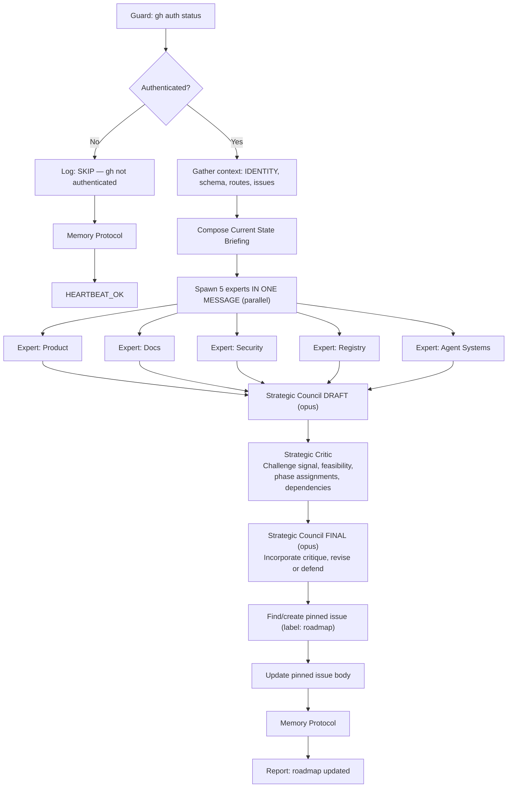

# Strategic Proposal

Spawn 5 specialized expert sub-agents in parallel, each proposing roadmap items from their domain. An Expert AI Council drafts the roadmap, a Strategic Critic challenges it with adversarial backpressure, and the Council finalizes with revisions. The result is published as a pinned GitHub issue.

**Core principle: SIGNAL OVER FEATURES.** Items require evidence of user demand before entering "Build Now" phase. Infrastructure prerequisites are exempt. The Critic ensures the council isn't inflating signal or sandbagging complexity.

## Variant: V2MOM / strategic operating model → wiki plan

Use this variant when the user asks for a council to define a V2MOM, operating model, strategic principles, or a plan to add strategic synthesis to the wiki. Do **not** force the full roadmap/GitHub-issue publishing flow unless the user explicitly asks for a roadmap update.

1. Gather current product truth from README/docs/context/wiki plus live external signal if available.
2. Spawn a small lens-diverse council (e.g. Product/Founder, Systems/Ops, Market/Docs) rather than the roadmap-specific five expert roles.
3. Run one adversarial Strategy Critic after the council draft. The critic must challenge overreach, weak measures, contradictions, and wiki-scope mistakes.
4. Final synthesis should separate:
   - **Council decision**: Vision, Values, Methods, Obstacles, Measures.
   - **Wiki plan**: exact target entry, draft frontmatter/body, verification, and rejected scope.
5. Prefer one bounded provisional wiki entry first. Extra positioning/docs-IA entries are premature unless they hold distinct durable facts.
6. Keep wiki output as synthesis, not council minutes. Raw/source material belongs under `.agro/knowledge/raw/`; the tracked entry stays within the wiki word cap and starts `confidence: provisional`.
7. Add explicit approval gates for contested strategic wording (e.g. tagline, key nouns, whether a constraint is too narrow) before implementing file changes.

Session example and final V2MOM synthesis: `references/open-harness-v2mom-council.md`.

## Decision Flow



## Instructions

### 1. Guard: gh CLI authentication

```bash
gh auth status 2>&1
```

If this fails, log `[strategic-proposal] SKIP: gh CLI not authenticated` → Memory Protocol → `HEARTBEAT_OK`. Stop.

### 2. Gather context

Read the following to build the briefing:
- `AGENTS.md` — stack, mission, URLs
- `.agro/cli/`, `scripts/`, `install/` — orchestrator entrypoints and provisioning surface
- `docs/` — GitHub-readable core docs; rendered docs site source lives in `mifunedev/agro-web`
- Open issues: `gh api "repos/mifunedev/agro/issues?state=open&per_page=50"`
- Repo stats: `gh api repos/mifunedev/agro --jq '{stars: .stargazers_count, forks: .forks_count}'`

### 3. Compose the Current State Briefing

Assemble a structured markdown briefing to pass to ALL 5 experts:

```markdown
## Current State Briefing

### Product Vision
1. Document Open Harness — the parent framework for AI agent sandboxes
2. Let users promote their forks — fork registry/showcase
3. End goal: curate Docker registries with monthly licensing — SaaS marketplace

### App State
- Routes: [list from step 2]
- Prisma models: [list or "none"]
- Auth: none
- API routes: none

### Infrastructure
- Docker Compose + opt-in PostgreSQL 16 overlay
- CI/CD: GitHub Actions (lint, format, type-check, build, test, E2E)
- Release: SemVer → GHCR Docker image
- Agent: 8 skills, 7 sub-agents, 4 heartbeats

### Community Signal
- Stars: [N], Forks: [N], Watchers: [N]
- Open issues: [N] (list titles + reaction counts)
- Recent fork activity: [list]

### Gaps
1. User accounts + auth (CRITICAL)
2. Fork registry data model (CRITICAL)
3. Docker registry integration (HIGH)
4. Subscription/licensing model (HIGH)
5. Open Harness documentation (HIGH)
6. Testing (MEDIUM — 2 tests total)
7. Observability (MEDIUM — no health endpoint)
8. Agent autonomy gap (MEDIUM — plans but no implementation)
```

### 4. Spawn 5 expert sub-agents in ONE message (parallel)

Launch 5 Agent tool calls **in a single message** for parallel execution:

| Expert | Perspective |
|--------|-------------|
| **Product** | Data models, APIs, features |
| **Docs** | Documentation, fork showcase UX |
| **Security** | Auth, headers, access control |
| **Registry** | Docker registry, licensing |
| **Agent Systems** | Agent autonomy, Ralph loop |

Worker model and effort follow `.agro/skills/delegate/SKILL.md`: operator selections and
exclusions bind, and the advisor selects and records unspecified settings per task.

Each expert is a **prompt for a bounded provider-native worker**, not a repository
agent definition. Use `subagent_type: general-purpose` (or a read-only built-in when
the expert only reads) and put the perspective, the Current State Briefing, and the
required output format in the prompt itself. There is no `.claude/agents/` file to
read — this repository authors no project agents.

Experts operate **independently** — they do NOT see each other's proposals.

### 5. Strategic Council DRAFT

Launch a single Agent tool call for the council worker — a provider-native worker whose prompt carries the council role:

Pass the council:
- All 5 expert proposals
- The Current State Briefing
- Instruction to query actual signal data (repo stats, issue reactions, fork activity)
- Instruction to produce a **DRAFT** roadmap (the council's first pass — not final)

Save the council's draft output for the next step.

### 6. Strategic Critic review

Launch a single Agent tool call for the strategic critic — a provider-native worker whose prompt carries the adversarial role:

Pass the critic:
- The council's DRAFT roadmap
- The Current State Briefing
- Instruction to query actual signal data independently (verify, don't trust the council)
- Instruction to challenge every "Now" phase assignment, every signal claim, and every complexity estimate

The critic provides **adversarial backpressure** — its job is to find what's weak in the draft and force revision.

### 7. Strategic Council FINAL

Launch a second Agent tool call for the council worker, reusing the same council role prompt:

Pass the council:
- Its own DRAFT roadmap from step 5
- The critic's review from step 6
- Instruction: **incorporate valid criticisms and revise, or explicitly defend against each challenge**
- Every challenge from the critic MUST be addressed — either the item moves phase, the score changes, or the council explains why the critic is wrong
- The output is the **FINAL** roadmap — this is what gets published

The council's final output becomes the pinned issue body.

### 8. Find or create the pinned roadmap issue

Search for existing:
```bash
gh api "repos/mifunedev/agro/issues?state=open&labels=roadmap&per_page=10" \
  --jq '[.[] | select(.title == "Product Roadmap")] | first'
```

If none exists:
```bash
gh label create roadmap --repo mifunedev/agro \
  --description "Product roadmap tracking" --color "0075ca" 2>/dev/null || true

gh issue create --repo mifunedev/agro \
  --title "Product Roadmap" --label roadmap \
  --body "<council output>"
```

Then pin it: `gh issue pin <NUMBER> --repo mifunedev/agro`

If it already exists, update:
```bash
gh issue edit <NUMBER> --repo mifunedev/agro --body "<council output>"
```

### 9. Report

- `HEARTBEAT_OK` (if skipped)
- Full report: pinned issue # + top 3 "Now" items + signal summary

## Reference

### Key Resources

| Resource | Where it lives |
|----------|----------------|
| Expert roles (Product, Docs, Security, Registry, Agent Systems) | Prompts written inline in step 4 of this skill |
| Strategic Council role | Prompt written inline in steps 5 and 7 of this skill |
| Strategic Critic role | Prompt written inline in step 6 of this skill |
| Worker type for every role above | A provider built-in (`general-purpose`, or a read-only built-in) — no repository agent file backs any of them |
| Worker boundary policy | `/delegate` — **When a worker is justified** |
