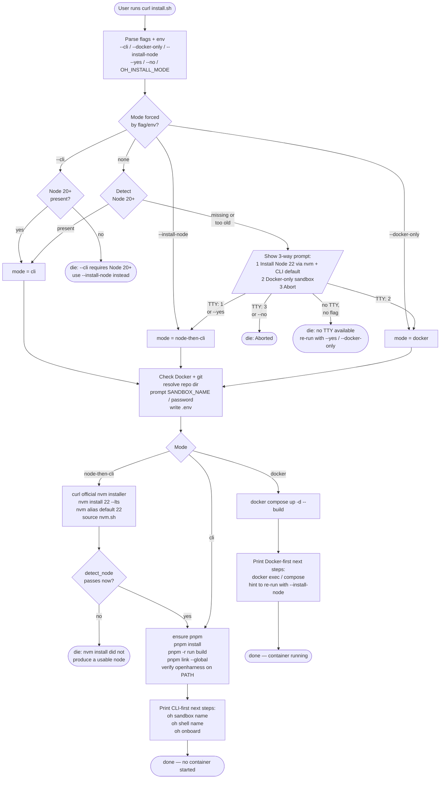
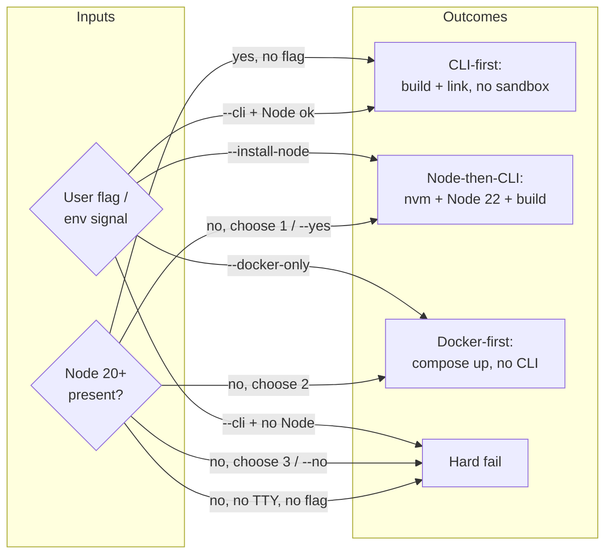
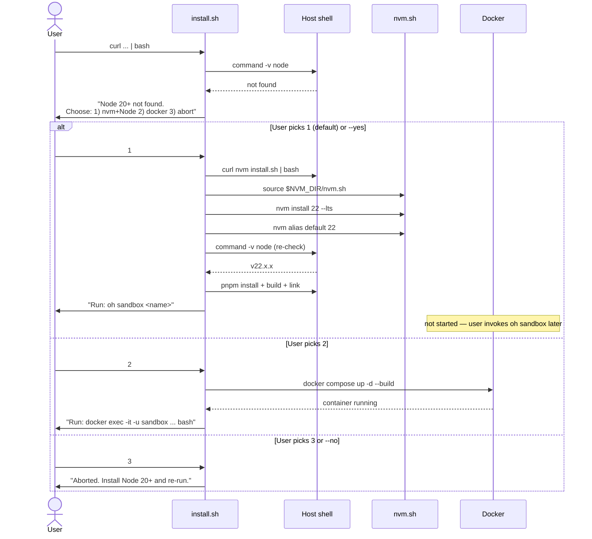
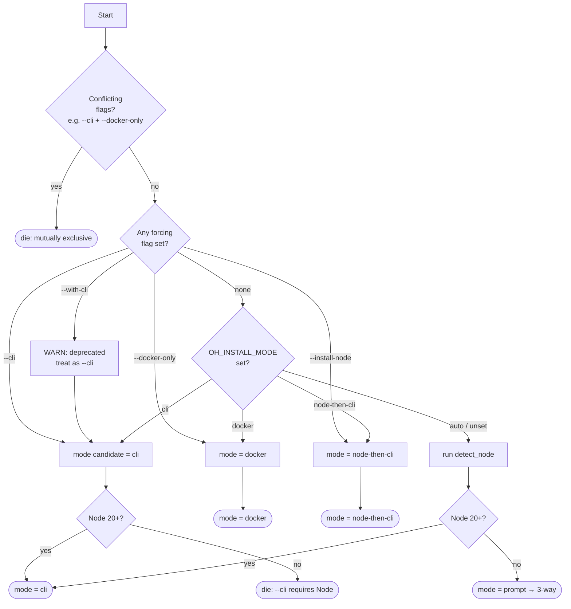

# Spec: Pre-req-Detecting `install.sh`

## Context

Today `curl -fsSL https://oh.mifune.dev/install.sh | bash` defaults to a Docker-first install — it never inspects the host for Node and silently runs `docker compose up -d --build`. A user running the quickstart on a fresh machine without Node experienced this as "the tool ignored my host setup and just spun up a container."

We want the installer to **detect host pre-reqs first** and **branch on the user's preferred shape** before doing anything destructive. Concretely:

- **Node 20+ already on host** → CLI-first. Build + link `oh`. Do NOT auto-start a sandbox; let the user run `oh sandbox <name>` and `oh shell <name>` themselves so they learn the lifecycle.
- **Node missing or too old** → ask the user how they want to proceed. They get three options:
  1. **Install nvm + Node 22 now** (then continue CLI-first). Default / recommended — gives them the same outcome as if Node had been pre-installed.
  2. **Continue Docker-only** (skip the host CLI; manage via `docker exec` / `docker compose`).
  3. **Abort** so they can install Node themselves and re-run.

Outcome: the installer matches the user's actual environment, makes the trade-off explicit, and never silently picks a path that contradicts the host's apparent intent.

## Decision

Replace the `--with-cli`-gated branch in `install.sh` with **auto-detection + interactive choice**, and decouple "install the CLI" from "start a sandbox."

## Scope

- `install.sh` (repo root — served via Cloudflare Worker → raw GitHub `main` at `oh.mifune.dev/install.sh`).
- Docs that show the curl one-liner.

Out of scope:
- Cloudflare Worker config.
- `.devcontainer/`, `packages/sandbox/`, any TS code.
- New docs pages (only edits to existing).

## Flag & Env Surface

| Flag / Env | Effect |
|---|---|
| *(none)* | Auto-detect Node 20+. If present → CLI-first. If absent → interactive 3-way prompt. |
| `--cli` | Force CLI-first. Hard-fails if Node 20+ missing (does NOT auto-install nvm — `--cli` means "I have my Node story sorted"). |
| `--docker-only` (alias `--no-cli`) | Force Docker-first. Skip Node detection. |
| `--install-node` | Force Node-via-nvm path. Skip detection. Useful for scripted "give me the full thing" installs. |
| `--with-cli` | **Deprecated alias** for `--cli`. Prints `WARN: --with-cli is deprecated; the installer now auto-detects Node` then proceeds. |
| `-y` / `--yes` | Assume "yes" / accept default at any prompt. Required for non-interactive use. |
| `-n` / `--no` | Assume "no" / abort at any prompt. |
| `OH_INSTALL_MODE=cli\|docker\|node-then-cli\|auto` | Same effect as the corresponding flag. Flags win over env. |
| `OH_ASSUME_YES=1` | Same as `--yes`. |
| `OH_INSTALL_REF=<git-ref>` | Pin the cloned repo to a specific tag/SHA instead of `main`. For supply-chain-conscious users. |
| `SANDBOX_NAME`, `SANDBOX_PASSWORD` | If set, skip the corresponding `read` prompt. **Independent**: setting one skips only its prompt; the other is still requested. |

### Conflict & combination rules

- `--cli` + `--docker-only` → `die` (mutually exclusive).
- `--cli` + `--install-node` → `die` (`--cli` says "Node already exists"; `--install-node` says "install it").
- `--docker-only` + `--install-node` → `die` (one wants no host CLI, the other wants nvm + CLI).
- `--yes` + `--no` → `die` (contradictory).
- `--yes` + `--docker-only` → **VALID, supported.** Non-interactive Docker-only install. `--docker-only` resolves the mode; `--yes` is harmless because no prompt is reached.
- `--yes` alone (no mode flag, Node missing) → option 1 (nvm + CLI).
- `--yes` alone (Node present) → no prompt fires; `--yes` is a no-op. Documented as such.
- Flag parser: a single `while [ $# -gt 0 ]` loop accumulates `FORCE_CLI=true`, `FORCE_DOCKER=true`, etc. Conflict checks run **after** the loop exits, never inside. This is critical — `for arg in "$@"` cannot detect conflicts mid-loop.
- Reject `--cli=value` style: case statement matches only exact `--cli` / `--cli=*` should explicitly `die "use --cli (no =value)"`.

## Detection

```bash
detect_node() {
  if ! command -v node &>/dev/null; then
    DETECTED_NODE_REASON="not installed"
    return 1
  fi
  DETECTED_NODE_VERSION="$(node --version 2>/dev/null || echo unknown)"
  local major
  major="$(printf '%s' "$DETECTED_NODE_VERSION" | sed -E 's/^v?([0-9]+).*/\1/')"
  if ! [[ "$major" =~ ^[0-9]+$ ]]; then
    DETECTED_NODE_REASON="unparseable version ($DETECTED_NODE_VERSION)"
    return 1
  fi
  if (( major < 20 )); then
    DETECTED_NODE_REASON="too old ($DETECTED_NODE_VERSION; need 20+)"
    return 1
  fi
  return 0
}
```

User-facing messages distinguish "not installed" vs "too old" because remediation differs.

The `|| echo unknown` branch is **mandatory and load-bearing** — without it, `node --version` exiting non-zero kills the script under `set -e`. Comment this in code so a future maintainer doesn't strip it as defensive noise.

### Shim-conflict caveat

`command -v node` returns the first hit on PATH — which may be a stale Homebrew node, an `asdf`/`volta` shim, or an `nvm` shim pointing at an uninstalled version. `detect_node` does not currently verify the shim is functional beyond `node --version`. Add a comment in code: "If a shim returns a version string but `pnpm install` later fails inscrutably, suspect a broken shim before the version check." Hardening this is out-of-scope for v1 but worth tracking.

## User Flow Diagrams

### High-level user flow



### Decision matrix at a glance



### Interactive prompt sequence (Node missing)



### Mode resolution priority



## Branch Behavior

```
parse_args + read env
   │
   ├─ resolve_mode()
   │     ├─ flag/env force → that mode
   │     └─ auto:
   │           ├─ detect_node passes → INSTALL_MODE=cli
   │           └─ detect_node fails  → INSTALL_MODE=prompt
   │
   ├─ if INSTALL_MODE=prompt → choose_path()  (interactive 3-way)
   │     ├─ 1 (default) "install Node 22 via nvm, then CLI" → INSTALL_MODE=node-then-cli
   │     ├─ 2 "continue Docker-only"                        → INSTALL_MODE=docker
   │     └─ 3 "abort"                                       → die
   │
   ├─ Common: docker check, git check, resolve repo dir, write .env
   │
   ├─ if INSTALL_MODE=node-then-cli:
   │     • install_nvm()           # curl official installer
   │     • nvm install 22 --lts    # default Node 22
   │     • nvm alias default 22
   │     • source nvm.sh into current shell
   │     • re-run detect_node      # sanity check
   │     → fall through to CLI build steps
   │
   ├─ if INSTALL_MODE in {cli, node-then-cli}:
   │     • ensure pnpm (corepack/npm install)
   │     • pnpm install
   │     • pnpm -r run build
   │     • pnpm link --global ./packages/sandbox
   │     • verify openharness on PATH
   │     • print CLI-first "Next steps" (no docker compose up)
   │
   └─ if INSTALL_MODE=docker:
         • docker compose -f .devcontainer/docker-compose.yml up -d --build
         • print Docker-first "Next steps"
```

### The 3-way prompt

```
Node.js 20+ not found (<reason>)

  How would you like to proceed?

    1) Install Node 22 via nvm, then install the 'oh' CLI on the host  [default]
       — Recommended. nvm is sandboxed to your user (no sudo).
    2) Skip the CLI; run a Docker-only sandbox now
       — You'll manage it with 'docker exec' and 'docker compose'.
    3) Abort — let me install Node myself and re-run

  Choice [1]:
```

Read from `/dev/tty` (so curl-piped installs still take input). With `--yes` or `OH_ASSUME_YES=1`, pick option 1. With `--no`, pick option 3.

### nvm installation step

Use the official installer pinned to a known-good tag, **with SHA-256 verification** (the URL is mutable — GitHub serves whatever the tag currently points at, including force-pushed content):

```bash
NVM_VERSION="v0.40.4"          # bump intentionally; no auto-latest
NVM_SHA256="<pinned-sha256>"   # generated at spec-implementation time; bump alongside NVM_VERSION

install_nvm() {
  # Functional check, not file-existence — corrupt/partial nvm installs pass `[ -f nvm.sh ]`.
  if [ -d "${NVM_DIR:-$HOME/.nvm}" ] && (
       export NVM_DIR="${NVM_DIR:-$HOME/.nvm}"
       . "$NVM_DIR/nvm.sh" 2>/dev/null
       command -v nvm >/dev/null
     ); then
    ok "nvm already installed — skipping download"
  else
    local tmp
    tmp="$(mktemp)"
    curl -fsSL "https://raw.githubusercontent.com/nvm-sh/nvm/${NVM_VERSION}/install.sh" -o "$tmp"
    local actual
    actual="$(sha256sum "$tmp" | awk '{print $1}')"
    if [ "$actual" != "$NVM_SHA256" ]; then
      rm -f "$tmp"
      die "nvm installer SHA-256 mismatch (expected $NVM_SHA256, got $actual). Refusing to execute."
    fi
    bash "$tmp"
    rm -f "$tmp"
  fi
  export NVM_DIR="${NVM_DIR:-$HOME/.nvm}"
  # shellcheck disable=SC1090
  . "$NVM_DIR/nvm.sh"
  nvm install 22 --lts
  nvm alias default 22

  # Corepack ships with Node — but in nvm-managed Node it lives under $NVM_DIR (no sudo needed).
  # Run corepack ONLY after nvm-Node is sourced into this shell, never against system Node.
  corepack enable
  corepack prepare pnpm@10.33.0 --activate    # pinned — see "Existing bugs" below
}
```

Notes:
- `corepack enable` requires Node ≥ 16.13. nvm-installed Node 22 satisfies this trivially. Crucially, this runs in the nvm context (Node binary is under `$NVM_DIR/versions/node/...`), so it never needs sudo. **Order is load-bearing**: source nvm → install Node → THEN corepack. If a future refactor moves `corepack enable` to a generic "ensure pnpm" helper that runs before nvm sourcing, it will hit the system-Node-needs-sudo bug.
- nvm writes into `~/.bashrc` / `~/.zshrc` automatically. Print a one-line note that the user may need to `source ~/.bashrc` before `node` / `pnpm` / `oh` work in **future** shells. Inside this run we already sourced it.
- After install, re-run `detect_node`. If it still fails, `die` cleanly rather than continuing into a broken `pnpm install`.
- **Fish / non-rc shells:** nvm does NOT source into Fish. If `SHELL` ends in `fish` (or `~/.bashrc` and `~/.zshrc` are both absent), append a more prominent warning pointing to `nvm.fish` or `fisher`.
- **Read-only `~/.bashrc`:** the upstream nvm installer will fail mid-run. Trap this and surface a clear error: "nvm installer cannot write to ~/.bashrc — re-run with HOME=<writable-dir> or pre-create a writable ~/.bashrc."

### Generating the nvm SHA-256

At implementation time, run:

```bash
curl -fsSL "https://raw.githubusercontent.com/nvm-sh/nvm/v0.40.4/install.sh" | sha256sum
```

Hardcode the output as `NVM_SHA256` in `install.sh`. Bump both the version and the hash together; never bump one without the other. Document the bump procedure in a code comment.

### Edge cases

- `--cli` with no Node → hard-fail. `--cli` is the "trust me, my Node is fine" flag; auto-installing nvm there would violate the contract. (Use `--install-node` instead.)
- `--install-node` with Node already present → skip nvm install, log it, continue to CLI build.
- `--docker-only` with Node present → skip detection entirely, go straight to docker.
- Local repo detected (script lives inside a checkout) → behave the same in both modes; do not clone over it.
- `pnpm install` failure in CLI-first → don't fall back to docker silently; `die` with a hint about `--docker-only`.

## Non-interactive UX (curl-piped)

When stdin isn't a TTY and `/dev/tty` isn't readable, the prompt can't run. Behavior:

- `--yes` → option 1 (install Node + CLI).
- `--no` → option 3 (abort).
- `--docker-only` → docker path, no prompt fires.
- `--yes --docker-only` → docker path (the explicit mode flag wins; `--yes` is a no-op).
- Neither flag → `die` with: *"Node 20+ not found and no TTY available for confirmation. Re-run with `--yes` to install Node 22 via nvm, `--docker-only` for a Docker sandbox, or install Node yourself and re-run. (Tip: `curl … | bash -s -- --yes`.)"*

### Existing `read` calls — pipe-mode fix is mandatory, not a "sneak fix"

Today `install.sh:68` (`read -r SANDBOX_NAME`) and `install.sh:74` (`read -rs SANDBOX_PASSWORD`) read from stdin. When the script is curl-piped to bash, **stdin is the script source itself, not the user's keyboard** — the read either consumes script bytes (corrupting parsing) or hits EOF and exits 1 under `set -e`. This is the root cause of the bug that prompted this spec; the silent "default to docker" behavior the user observed is partly because the docker compose step happens before the affected reads abort, and partly because empty `read` results fall back to defaults via `${SANDBOX_NAME:-$DEFAULT_NAME}`.

The fix must be explicit. Replace **both** existing reads, plus the new prompt, with this pattern:

```bash
prompt_input() {
  # $1=variable name, $2=prompt string, $3=default (optional), $4=secret-flag (-s) (optional)
  local __var="$1"; local __msg="$2"; local __default="${3:-}"; local __secret="${4:-}"
  # Honor pre-set env var — skip prompt entirely.
  if [ -n "${!__var:-}" ]; then
    ok "Using ${__var} from environment"
    return 0
  fi
  if [ -r /dev/tty ]; then
    if [ -n "$__default" ]; then printf "  %s [%s]: " "$__msg" "$__default"; else printf "  %s: " "$__msg"; fi
    local reply
    if [ "$__secret" = "-s" ]; then
      read -rs reply </dev/tty || reply=""
      printf "\n"
    else
      read -r reply </dev/tty || reply=""
    fi
    printf -v "$__var" '%s' "${reply:-$__default}"
  else
    if [ -n "$__default" ]; then
      printf -v "$__var" '%s' "$__default"
      ok "$__var defaulted to '$__default' (no TTY)"
    else
      die "$__var required but no TTY available. Set ${__var}=<value> as env var and re-run."
    fi
  fi
}
```

Then the existing prompts become:

```bash
prompt_input SANDBOX_NAME     "Container name"   "$DEFAULT_NAME"
prompt_input SANDBOX_PASSWORD "Sandbox password" "changeme" -s
```

This handles env-var-set-skip, default fallback in pipe mode, true secret prompts via `-s`, and partial sets (NAME set but PASSWORD not, etc.) — each prompt resolves independently.

## Decoupling Sandbox Start from CLI Install

Currently `--with-cli` builds the CLI **and** runs `docker compose up`. Going forward:

- CLI-first paths (`cli`, `node-then-cli`) DO NOT run `docker compose up`. Next-steps message instructs the user to run `oh sandbox <name>` themselves.
- Docker-first path runs `docker compose up` exactly as today.

This is the user's stated "let them learn the CLI lifecycle" requirement.

## "Next Steps" Output

**CLI-first (cli or node-then-cli):**

```
Installation complete!

  Next steps
  ──────────────────────────────────────

  1. Move into the repo (oh sandbox resolves compose files relative to CWD):
       cd <REPO_DIR>          # typically ~/.openharness

  2. Provision your sandbox:
       oh sandbox <SANDBOX_NAME>

  3. Open a shell:
       oh shell <SANDBOX_NAME>

  4. Inside the sandbox, run the one-time auth wizard:
       gh auth login && gh auth setup-git
       pi                                  # Pi Agent OAuth (for Slack/heartbeats)

  Tear down later (from host):
       oh clean <SANDBOX_NAME>

  Note: 'oh sandbox' runs docker compose for you. The container is NOT
  running yet — that's intentional so you learn the CLI lifecycle.
```

`<REPO_DIR>` is the resolved value from the script's earlier repo-resolution block — substitute it literally in the printed output.

The `gh auth login` step lives **inside the shell**, not on the host, because gh's credential helper writes into the sandbox's home, not yours. The previous version of this spec mis-listed `oh onboard` as a host-side command before `oh shell`; that order is wrong — gh runs in the container.

If we just installed nvm via the `node-then-cli` path, append:

```
  Reminder: nvm wrote to ~/.bashrc — open a new shell, or run
  'source ~/.bashrc', so 'node' / 'pnpm' / 'oh' stay on PATH later.
  (Fish users: install nvm.fish or fisher; nvm doesn't source into Fish.)
```

**Docker-first:**

```
Installation complete! Sandbox '<SANDBOX_NAME>' is running.

  Enter the sandbox:
    docker exec -it -u sandbox <SANDBOX_NAME> bash

  One-time setup (inside the sandbox):
    gh auth login
    gh auth setup-git

  Stop / restart (from <REPO_DIR>):
    cd <REPO_DIR>
    docker compose -f .devcontainer/docker-compose.yml stop
    docker compose -f .devcontainer/docker-compose.yml up -d

  Want the 'oh' CLI later? Re-run with --install-node:
    curl -fsSL https://oh.mifune.dev/install.sh | bash -s -- --install-node
```

## Critical Implementation Notes (BLOCKING)

These three issues will cause real users to fail if the implementer follows the spec mechanically without reading these notes.

### 1. `.env` path is `.devcontainer/.env`, NOT `<repo>/.env`

The current `install.sh:80` writes `.env` to the **repo root** (`$REPO_DIR/.env`). This is wrong. Verified facts:

- `packages/sandbox/src/lib/config.ts:7` hard-codes `ENV_FILE = ".devcontainer/.env"`.
- `install/entrypoint.sh` and `init-env.sh` seed `.devcontainer/.env`.
- `docker-compose.yml` reads env via `--env-file .devcontainer/.env`.

Consequence today: `oh sandbox <name>` after a curl-install silently falls back to the default sandbox name `"sandbox"` (config.ts:42) because the user-typed name was written to the wrong file. **Fix in the same change**: the spec's "write .env" step writes to `$REPO_DIR/.devcontainer/.env`, not `$REPO_DIR/.env`. Update both the new logic and the existing heredoc.

### 2. `git pull` on dirty working tree

The existing `git -C "$REPO_DIR" pull` (install.sh:52) fails with exit 1 if the user manually edited `.devcontainer/.env` or anything else in `~/.openharness`. Spec scenario 14 ("re-run idempotent") is currently false. Pre-pull check:

```bash
if ! git -C "$REPO_DIR" diff --quiet || ! git -C "$REPO_DIR" diff --cached --quiet; then
  warn "Local changes detected in $REPO_DIR — skipping git pull. Stash or commit them, then re-run."
else
  git -C "$REPO_DIR" pull --ff-only
fi
```

`.devcontainer/.env` itself: confirm it's in `.gitignore` before claiming this is fully resolved. Today `.gitignore` should already exclude it (the IDE-opened file in the conversation suggests it's tracked — verify and patch if not).

### 3. `oh sandbox` requires `cd $REPO_DIR`

`SandboxConfig` resolves compose paths relative to CWD. After CLI-first install, the user is left wherever they invoked the curl one-liner — typically not in `$REPO_DIR`. The next-steps output (above) now leads with the `cd` step explicitly. This is essential for the "let them learn the lifecycle" goal — without it, `oh sandbox <name>` fails with "no such file or directory: .devcontainer/docker-compose.yml" and the user thinks the install broke.

Longer-term, `oh sandbox` should auto-locate the repo (walk up from CWD looking for `.devcontainer/`, or honor `OH_REPO_DIR`). That's a packages/sandbox change — out of scope for this spec but **noted as a follow-up issue** (see "Harness Updates Required" below).

## Harness & Docs Updates Required

The installer change ripples into other parts of the project. Some are in-scope for this spec; some are follow-up work that should be opened as separate issues at implementation time.

### In-scope harness updates (same PR)

| File | Why |
|---|---|
| `install.sh` | All the changes above. |
| `.gitignore` | Verify `.devcontainer/.env` is excluded. If not, add. (Quick check: `git -C <repo> check-ignore .devcontainer/.env`.) |

### In-scope docs updates (same PR)

| File | Change |
|---|---|
| `apps/docs/docs/installation.md` | Drop `bash -s -- --with-cli` examples. Show one curl line. Add an "Override auto-detection" subsection with the flag table (`--cli`, `--docker-only`, `--install-node`, `--yes`, `--yes --docker-only`, `OH_INSTALL_REF`). Add note: "Node 20+ recommended; if missing, the installer offers nvm + Node 22 OR Docker-only." Update the prerequisites table footnote: Node is *recommended, not required*. Reframe the standalone "Docker-only path" header as a manual fallback since the installer now handles it. |
| `apps/docs/docs/quickstart.md` | Line 19: `bash -s -- --with-cli` → `bash`. Line 22: rewrite paragraph to describe 3-way auto-detect. Add a callout: "If you already have Node 20+, the installer skips the prompt and goes straight to CLI-first install." Re-order Step 3 ("Onboard") so `gh auth login` is shown as running INSIDE the shell from Step 4, not on the host. |
| `apps/docs/src/pages/index.tsx` | Line 8: drop `--with-cli` from `QUICKSTART`. Optional second line: comment showing it auto-detects. |
| `docs/getting-started/installation.md` | Same shape as the Docusaurus version. This is the legacy plain-markdown set; if it's slated for removal post-Docusaurus migration, just sync the curl line and leave the rest. |
| `docs/getting-started/quickstart.md` | Mirror the Docusaurus quickstart changes — `gh auth login` placement is the bigger issue here than the curl one-liner. |
| `README.md` | Line ~19: rewrite the "Add `-s -- --with-cli`" sentence. Mention auto-detect and the 3-way prompt in one sentence. |
| `CHANGELOG.md` | Add entry under `## [Unreleased]` → `### Changed`: "Installer auto-detects Node 20+; new `--cli` / `--docker-only` / `--install-node` flags; `--with-cli` deprecated." Link the PR. |

### Out-of-scope follow-ups (separate issues to open at implementation time)

| Issue | Description |
|---|---|
| `oh sandbox` repo-locating | `SandboxConfig` should walk up from CWD (or honor `OH_REPO_DIR`) so users don't have to `cd ~/.openharness` first. This is the cleanest fix for BLOCKING #3 above; the next-steps `cd` instruction is the workaround until it lands. |
| Pin `corepack prepare pnpm@<X>` | Existing `install.sh:108` uses `pnpm@latest`. Pin to the version in `package.json#packageManager` (`pnpm@10.33.0`). Spec's nvm path already does this; the non-nvm `--cli` path should match. |
| `git clone --depth 1` + `OH_INSTALL_REF` | Speed up first install + offer supply-chain pinning to a tag/SHA. |
| `OH_INSTALL_LOG=<path>` | Tee installer output for support repro. Currently no log artifact on failure. |
| CI gate on `install.sh` | The Cloudflare Worker 302s to `main` on merge — a syntax error ships immediately. Add a GitHub Actions job that runs `bash -n install.sh`, `shellcheck install.sh`, and the `--yes` / `--docker-only` non-interactive scenarios in throwaway containers. Make it required for PRs touching `install.sh`. |
| `--with-cli` removal timeline | Pick a CalVer release for hard-removal (e.g., 6 months from this change). Open a tracking issue and reference it in the deprecation `WARN:` so users see the date. |
| `--dry-run` mode | Print what the installer WOULD do without doing it. Common ask for security-conscious users running pipe-to-bash. |
| `oh onboard` host vs sandbox | If the project wants `oh onboard` to be a host-side wrapper that `docker exec`s into the sandbox for the gh/pi auth steps, that's a packages/sandbox change. Until then, the host CLI's `onboard` command should print "Run this inside the sandbox via `oh shell <name>`" rather than attempting the auth flow. Verify current behavior and patch if needed. |
| Worker pinning escape hatch | Document an `oh.mifune.dev/install.sh?ref=<tag>` query-param pass-through, so users can pin without setting `OH_INSTALL_REF`. Worker change, out of repo scope. |
| Disk-space pre-flight | `df -k $HOME` check for ≥ 1GB free before clone + build. Cheap, prevents cryptic ENOSPC mid-build. |
| Windows / WSL / Apple Silicon explicit support matrix | The spec is bash-only. Document "WSL2 required on Windows" in installation.md's prerequisites. Add ARM64 to the smoke matrix. |

## Reused Helpers / Conventions (Do Not Reinvent)

- Color helpers (`RED`, `GREEN`, `CYAN`, `NC`) and `banner` / `ok` / `die` already in `install.sh:5–8` — extend with `YELLOW` + `warn`.
- Existing repo-resolution block (`install.sh:42–60`) already handles "script inside a checkout" vs "fresh clone to `~/.openharness`". Keep verbatim.
- Existing `.env` write (lines 80–84) is the canonical pattern. Keep verbatim; only add env-var-honoring read prompts.
- Cloudflare Worker is unchanged — it 302s to raw GitHub `main`, so a merged PR ships the new installer.

## Verification

Manual smoke matrix (run in throwaway containers; none affect the user's main host):

| # | Scenario | Command | Expect |
|---|---|---|---|
| 1 | Fresh Ubuntu, no Node | `bash install.sh` (interactive) | 3-way prompt → choose 1 → nvm + Node 22 install → CLI built → CLI-first next steps |
| 2 | Fresh Ubuntu, no Node | `bash install.sh` → choose 2 | Docker compose up → Docker-first next steps |
| 3 | Fresh Ubuntu, no Node | `bash install.sh` → choose 3 | `Aborted.` exit 1 |
| 4 | Fresh Ubuntu, no Node, piped no flags | `curl … \| bash` | Dies with TTY-not-available message + flag hints |
| 5 | Fresh Ubuntu, no Node, piped + `--yes` | `curl … \| bash -s -- --yes` | nvm + Node 22 + CLI |
| 6 | Fresh Ubuntu, no Node, piped + `--docker-only` | `curl … \| bash -s -- --docker-only` | Docker compose up only |
| 7 | Host with Node 22 | `bash install.sh` | Auto-detected → CLI-first, no prompt, no docker compose up |
| 8 | Host with Node 18 | `bash install.sh` | "too old" prompt → 3-way |
| 9 | Host with Node 22 + `--docker-only` | `bash install.sh --docker-only` | Skips Node check; docker only |
| 10 | Host without Node + `--cli` | `bash install.sh --cli` | Hard-fail (`--cli` does NOT auto-install nvm) |
| 11 | Host without Node + `--install-node` | `bash install.sh --install-node` | nvm + Node 22 + CLI, no prompt |
| 12 | Legacy `--with-cli` | `bash install.sh --with-cli` | Deprecation `WARN:` then proceed as `--cli` |
| 13 | `OH_INSTALL_MODE=docker` | `OH_INSTALL_MODE=docker bash install.sh` (Node present) | Docker-first |
| 14 | Re-run on installed system, clean tree | `bash install.sh` again | Repo `git pull --ff-only` succeeds, `.devcontainer/.env` overwritten, `pnpm link` idempotent |
| 15 | Re-run with dirty working tree | edit a tracked file, re-run | `git pull` is **skipped** with a warning (not aborted), install completes |
| 16 | `--yes --docker-only` (combined) | `bash install.sh --yes --docker-only` (no Node, no TTY) | Docker-first runs; `--yes` is a no-op; no prompt fires |
| 17 | nvm SHA-256 mismatch | tamper with `NVM_SHA256` constant | Hard-fail before bash-execing the downloaded script |
| 18 | nvm already installed but broken | corrupt `$NVM_DIR/nvm.sh` | Functional check fails → re-download + re-verify |
| 19 | `SANDBOX_NAME` env set, password prompt only | `SANDBOX_NAME=foo bash install.sh` | Skips name prompt, still prompts for password (or defaults if no TTY) |
| 20 | `--cli=value` style | `bash install.sh --cli=true` | Hard-fails with "use --cli (no =value)" |
| 21 | `--cli + --install-node` (conflict) | `bash install.sh --cli --install-node` | Hard-fails before any other work |
| 22 | `OH_INSTALL_REF=v2026.1.1` | pinned ref env var | Clones at the tag, not main |
| 23 | Fish shell host | `SHELL=/usr/bin/fish bash install.sh` (Node missing → opt 1) | Install completes; reminder mentions Fish-specific re-source |

Static checks (must be CI-gated, not optional):
- `bash -n install.sh` (syntax)
- `shellcheck --shell=bash install.sh`

Smoke after success:
- CLI-first: `command -v openharness && openharness --version`
- Docker-first: `docker ps --filter "name=$SANDBOX_NAME"` shows running container
- Both: `cat $REPO_DIR/.devcontainer/.env` shows the user's `SANDBOX_NAME` (NOT default `sandbox`)

## Known Gaps & Open Questions

Synthesized from two parallel critic reviews. BLOCKING and HIGH issues are folded into the spec body above. The remaining items are tracked here for the implementer to resolve at execution time.

### MEDIUM (resolve in same PR if cheap, otherwise document)

1. **`pnpm link --global` re-run behavior** — the spec asserts idempotency without evidence. Verify by running twice on a clean machine; if duplicate links happen, add an `unlink-first` step.
2. **`trap` for partial-state cleanup** — failed `pnpm install` leaves a partial `node_modules/`; failed `nvm install` leaves a populated `$NVM_DIR`. Add a `trap 'cleanup_on_error $?' ERR INT` that prints recovery instructions (not auto-rollback — destructive in unknown directories).
3. **Locale / quoting in `.devcontainer/.env`** — `SANDBOX_NAME=$SANDBOX_NAME` breaks on names with spaces. Wrap in single quotes after escaping: `SANDBOX_NAME='${SANDBOX_NAME//\'/\'\\\'\'}'` or validate against `^[a-z][a-z0-9-]{0,30}$` (the same regex used in gateway-routing rule).
4. **Disk-space pre-flight** — cheap to add (`df -k`), prevents cryptic ENOSPC. Threshold: 1GB free in `$HOME`.
5. **`--help` content** — spec lists the flag in the parser but never defines what it prints. Spec the help block before implementation.
6. **shim conflicts** — `command -v node` may resolve to a wrapper. If `pnpm install` fails after a "passing" `detect_node`, the error message should hint at shim debugging (`type -a node`).

### LOW (track as follow-up issues, not blocking)

7. **`warn()` vs `ok()` stream interleaving** — minor; modern terminals are fine, but document the convention (`warn`/`die` → stderr, `ok`/`banner` → stdout).
8. **Telemetry** — no anonymous mode-selection stats. Project-level decision; not for this spec.
9. **Apple Silicon / WSL2 / Git Bash matrix** — currently absent. Add as smoke-matrix rows in the implementer PR if cheap; otherwise open a "Platform Coverage" tracking issue.
10. **`exec $SHELL -l` post-nvm** — cleaner UX but surprising side-effect. Decision: **no** — print the reminder instead.

### Resolved decisions (locked in)

- nvm pin: **v0.40.4** with SHA-256 verification (was v0.40.1 in draft).
- 3-way prompt default: **option 1 (install Node + CLI)** — matches "primary method = CLI on host."
- `--with-cli`: deprecated alias with `WARN:`, removal scheduled in a tracked follow-up issue (no silent removal).
- `--yes --docker-only`: explicitly valid (was ambiguous in draft).
- `.env` write target: `$REPO_DIR/.devcontainer/.env` (was wrong in draft — see BLOCKING #1).
- Existing `read` calls: replaced via `prompt_input` helper, not deferred to "sneak fix."
- `oh onboard` ordering in next-steps: moved INSIDE the sandbox shell, not on host.

## Acceptance Criteria

- Running `bash install.sh` on a host with Node 20+ installs the CLI on the host and prints "Provision your sandbox: `oh sandbox <name>`" — no container is started.
- Running `bash install.sh` on a host without Node prints a 3-way prompt; option 1 installs nvm + Node 22 + CLI; option 2 starts Docker-only sandbox; option 3 aborts.
- `--cli`, `--docker-only`, `--install-node`, `--yes`, `--no` work as documented; `--with-cli` works with a deprecation warning.
- Curl-piped install with `--yes` and no Node completes end-to-end without a TTY prompt.
- Curl-piped install with `--yes --docker-only` completes Docker-only end-to-end with no prompt.
- After CLI-first install, `cat $REPO_DIR/.devcontainer/.env` shows the user's typed `SANDBOX_NAME`; subsequent `cd $REPO_DIR && oh sandbox <name>` provisions a container with that exact name (NOT the default `sandbox`).
- Re-running the installer on a system with local edits in `$REPO_DIR` warns and skips `git pull` instead of dying.
- Docs no longer show `--with-cli` in primary examples; instead reference the auto-detect behavior.
- All `read` prompts work in curl-piped contexts via the `prompt_input` helper (env-var, TTY, default-fallback paths all covered).
- `bash -n install.sh` and `shellcheck --shell=bash install.sh` pass in CI before the script can ship to `main`.
- nvm download SHA-256 is verified before execution; tampered hash hard-fails.
