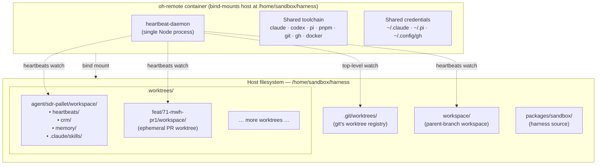
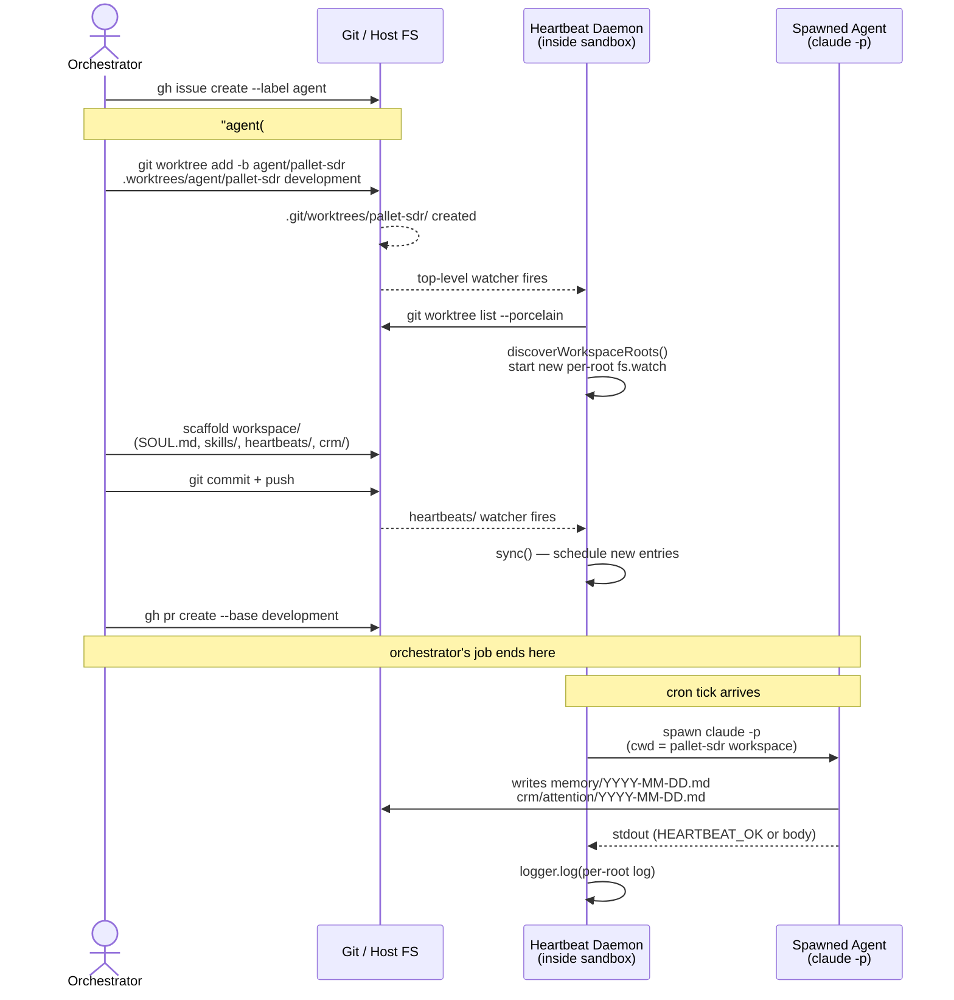
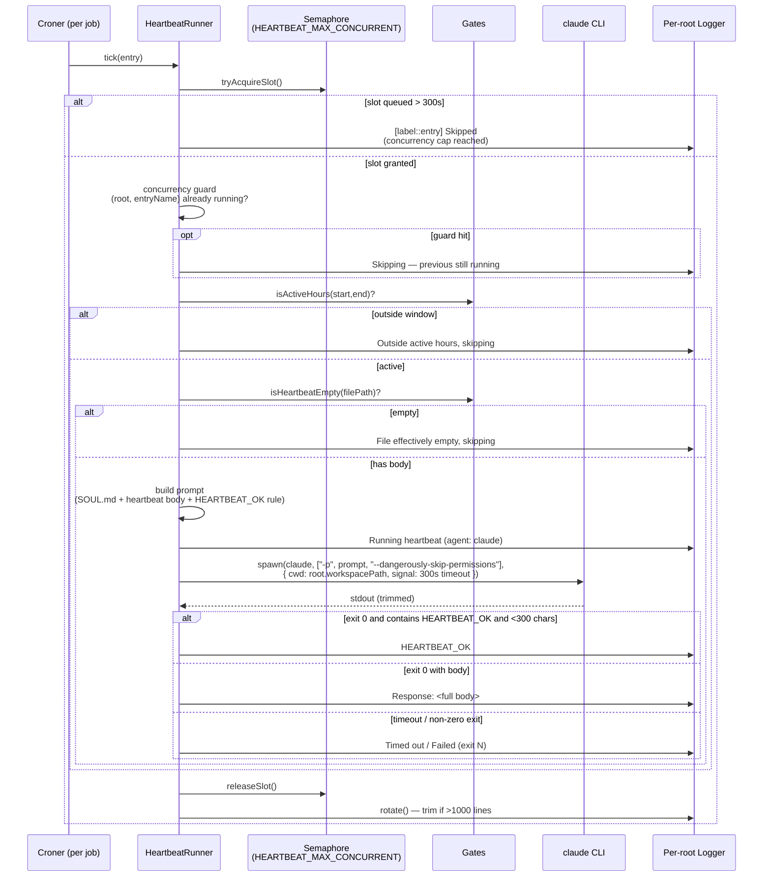

# Orchestrator + Worktree Agents in a Shared Sandbox

**Status:** canonical · **Date:** 2026-04-19 · **Owner:** harness-orchestrator

> This is the primary configuration pattern for Open Harness. If you're here
> to understand "where does this code run, and who owns what," read this
> document first. It supersedes anything implicit in `CLAUDE.md` or
> agent-level docs.

## TL;DR

- **One parent sandbox** (container) is the shared runtime. Provisioned once.
- **N git worktrees** live under `.worktrees/` on the host. Each tracks a
  branch (usually `agent/<name>`). Each ships its own `workspace/`
  (skills, CRM, SOUL.md, heartbeats, memory, wiki, projects).
- **One heartbeat daemon** inside the sandbox watches all worktree
  workspaces. Discovered automatically from `git worktree list`. Spawns
  each heartbeat with `cwd` inside that worktree's workspace, so skills
  and relative paths resolve against the correct agent.
- **The orchestrator** (the session running at the project root) scaffolds
  new agents, manages git/issues/PRs, and runs sandbox lifecycle skills
  (`/provision`, `/destroy`, `/repair`). It does NOT write application
  code — that happens inside agent workspaces.
- **Thin isolation** between agents: each has its own filesystem subtree
  and schedule, all sharing one container, one credential set, one daemon.

## Why this shape

Three forces drove this topology:

1. **Branches have identities**, not just code. An `agent/sdr-pallet`
   branch has its own CRM schema, templates, skills, heartbeats, SOUL.md.
   Agent identity is files on disk, not runtime config.
2. **Running N containers per N agents is too heavy.** Each sandbox is a
   real OS with its own toolchain, credentials, dev server. Duplicating
   that per agent explodes resource use and onboarding friction.
3. **Merging agent work back to main is a git problem**, not a
   container problem. Git worktrees already solve "multiple branches
   checked out simultaneously." The natural fit is: worktrees on the
   host, one container for all of them.

The resulting pattern — **one sandbox, N worktrees, one daemon** — gives
each agent a stable identity, shared tooling, and independent schedules
without per-agent infrastructure.

## Topology



One container. N git worktrees. One daemon watching N+1 directories
(each root's `heartbeats/` + `.git/worktrees/` itself).

## Actors

### 1. Orchestrator

- **Where it runs**: project root (`/home/sandbox/harness`), usually in a
  Claude Code session outside or attached to the sandbox. Also runs in
  the current session you're reading this in.
- **What it owns**:
  - Harness infrastructure: `.devcontainer/`, `install/`, `packages/`
  - Agent scaffolding: writing the initial `workspace/` for a new agent
  - Git operations: branches, worktrees, commits, PRs, releases
  - Sandbox lifecycle: `/provision`, `/destroy`, `/repair`
  - GitHub issues, labels, milestones
- **What it does NOT own**:
  - Agent business logic (CRM updates, outreach emails, domain code)
  - Ongoing edits to `workspace/` files once an agent is running
  - Anything inside `workspace/projects/` after the initial scaffold
- **Authoritative docs**: `/home/sandbox/harness/CLAUDE.md` (this file's
  parent orchestrator playbook).

### 2. Worktree Agent

- **Where it runs**: normally inside the sandbox, as a `claude` or `codex`
  session whose CWD is the worktree's `workspace/`. For heartbeats, as a
  short-lived `claude -p …` spawn from the daemon with the same CWD.
- **What it owns**:
  - Its `workspace/` subtree: `heartbeats/`, `skills/`, `memory/`,
    `SOUL.md`, `MEMORY.md`, `USER.md`, `IDENTITY.md`, `projects/*`,
    domain-specific dirs (`crm/`, `wiki/`, etc.)
  - Its agent-side rules and skills (`workspace/.claude/`)
  - Its branch's commit history
- **What it does NOT own**:
  - Harness source (`packages/sandbox/`, `.devcontainer/`, `install/`)
  - Other agents' workspaces
  - The daemon itself
- **Authoritative docs**: `workspace/CLAUDE.md` (agent-level) inside its
  worktree.

### 3. Sandbox (container)

- **Identity**: single Docker container, default name `oh-remote`.
- **Bind mounts**: `/home/sandbox/harness` → host's project root. This
  single mount gives the container visibility into all worktrees under
  `.worktrees/` automatically.
- **Shared resources**: credentials (`gh auth`, `~/.claude`, `~/.pi`),
  toolchain (Node, pnpm, Docker socket, `claude` / `codex` / `pi`),
  network, /tmp.
- **Boot**: `install/entrypoint.sh` starts the heartbeat daemon under a
  watchdog and optionally starts `pi` + Slack bot.

### 4. Heartbeat Daemon

- **Where it runs**: single Node process inside the sandbox.
- **Discovery**: on startup (and on `.git/worktrees/` mutations), calls
  `git worktree list --porcelain` and includes every worktree whose
  `<path>/workspace/heartbeats/` exists. Parent checkout is included
  the same way.
- **Per-root**: one `fs.watch` for each discovered `heartbeats/`, one
  `HeartbeatLogger` writing to `<root>/workspace/heartbeats/heartbeat.log`.
- **Scheduling**: single `HeartbeatScheduler` with per-root namespaced
  keys (`${label}::${slug}`) so two worktrees can ship identically-named
  heartbeats without collision.
- **Runner**: spawns `claude -p …` with `cwd: entry.root.workspacePath`.
  The agent CLI therefore loads that worktree's `.claude/settings.json`,
  skills, and relative paths. Global semaphore
  (`HEARTBEAT_MAX_CONCURRENT`, default `2`) prevents N worktrees from
  saturating the Anthropic API when their schedules align.
- **Canonical spec**: `.claude/specs/multi-worktree-heartbeats-spec.md`.
- **Source**: `packages/sandbox/src/lib/heartbeat/`.

## Filesystem Contract

| Path | Owner | Notes |
|------|-------|-------|
| `/home/sandbox/harness/` | orchestrator | Project root, main git checkout |
| `/home/sandbox/harness/.git/worktrees/` | git | Git's worktree registry. Daemon watches this for hot add/remove. |
| `/home/sandbox/harness/workspace/` | parent-branch agent | Parent checkout's workspace (when on a branch with one) |
| `/home/sandbox/harness/packages/` | orchestrator | Harness source (sandbox CLI, daemon, slack bot) |
| `/home/sandbox/harness/.worktrees/<prefix>/<slug>/` | worktree-branch agent | A single worktree on the host |
| `/home/sandbox/harness/.worktrees/<prefix>/<slug>/workspace/` | that agent | Its files |
| `/home/sandbox/harness/.claude/specs/` | orchestrator | Harness architecture specs |
| `/home/sandbox/harness/.claude/rules/` | orchestrator | Harness-wide coding rules |
| `/home/sandbox/harness/.claude/skills/` | orchestrator | Orchestrator-level skills (`/provision`, `/delegate`, …) |
| `.worktrees/<…>/workspace/.claude/rules/` | that agent | Agent-specific rules |
| `.worktrees/<…>/workspace/.claude/skills/` | that agent | Agent-specific skills |

> **Rule**: files under `.worktrees/<…>/workspace/` are agent-owned.
> The orchestrator writes them once during scaffolding, then does not
> modify them. Agents evolve their own workspaces.

## Lifecycle of a New Agent



The orchestrator's job ends once the PR is opened. After that the agent
is live and self-directing (per its heartbeat schedule + manual sessions
inside the sandbox).

## Discovery Mechanism

`discoverWorkspaceRoots(home, overrides?)` (see
`packages/sandbox/src/lib/heartbeat/discovery.ts`):

1. Run `git -C <home>/harness worktree list --porcelain`. Parse
   `worktree <path>` + `branch refs/heads/<name>` pairs.
2. For each pair, include as a root if `<path>/workspace/heartbeats/`
   exists.
3. `label = sanitizeBranch(branch)` — `refs/heads/` stripped, `/` → `-`,
   lowercased. Detached HEAD → `detached-<shortsha>`.
4. Merge overrides from `HEARTBEAT_ROOTS=path1:label1,path2:label2`.
   Overrides win on path collision.
5. Warn if discovered root count exceeds 32 (inotify sanity check).

`.git/worktrees/` is the authoritative source because git maintains it
directly. Filesystem layout under `.worktrees/` can be nested, flat, or
symlinked — discovery doesn't care.

## Spawn Semantics

When a heartbeat fires:

```ts
spawn("claude", ["-p", prompt, "--dangerously-skip-permissions"], {
  cwd: entry.root.workspacePath,        // e.g. .../sdr-pallet/workspace
  signal: AbortSignal.timeout(300_000),
});
```

Consequences:

- `claude` loads that worktree's `workspace/.claude/settings.json`
  (model, permissions, hooks).
- Slash-skills resolve against `workspace/.claude/skills/`.
- Relative paths in the prompt (`memory/YYYY-MM-DD.md`, `crm/leads.csv`,
  `workspace/.claude/skills/attention-list/`) resolve correctly.
- Memory and CRM writes land in the correct worktree's subtree.
- Credentials come from the container's shared user home
  (`~/.claude`, `~/.pi`, `~/.config/gh`) — shared across all agents.

> **Back-compat**: single-root daemons (legacy construction path, label
> `""`) do NOT pass `cwd`. Byte-identical to pre-multi-root behavior so
> existing deployments don't regress.

## Heartbeat Firing Flow

What actually happens on each cron tick, top to bottom:



Key invariants:

- `cwd` is set per entry, never shared across worktrees.
- The semaphore is daemon-global and FIFO; the concurrency guard is
  per-`(root, entryName)` composite key.
- All log writes go to the root's own `heartbeats/heartbeat.log`.

## Module Dependencies

Source layout inside `packages/sandbox/src/lib/heartbeat/` and the CLI entry:

```mermaid
flowchart LR
  cli[cli/heartbeat-daemon.ts<br/>CLI entry]
  discovery[lib/heartbeat/<br/>discovery.ts]
  daemon[lib/heartbeat/<br/>daemon.ts]
  config[lib/heartbeat/<br/>config.ts]
  scheduler[lib/heartbeat/<br/>scheduler.ts]
  runner[lib/heartbeat/<br/>runner.ts]
  logger[lib/heartbeat/<br/>logger.ts]
  gates[lib/heartbeat/<br/>gates.ts]

  cli -->|startup discovery| discovery
  cli -->|construct + start| daemon
  discovery -.->|WorkspaceRoot[]| daemon
  daemon -->|parseHeartbeatConfigAcrossRoots| config
  daemon -->|sync/start/stop| scheduler
  daemon -->|own per-root Map| logger
  scheduler -->|run(entry)| runner
  runner -->|gate checks| gates
  runner -->|per-root log line| logger
  runner -->|spawn claude| Spawn{{"child_process.spawn<br/>cwd=root.workspacePath"}}

  classDef external fill:#eee,stroke-dasharray:3 3
  class Spawn external
```

- Types and discovery are "leaf" modules with no dependencies on
  scheduler/runner — safe to evolve independently.
- The runner is the only module that actually spawns an agent; all spawn
  policy (timeout, cwd, arg shape) lives there.

## Isolation Properties

| Dimension | Isolated? | Notes |
|-----------|-----------|-------|
| Filesystem under `workspace/` | Yes | Each worktree owns its subtree |
| Git history / branch state | Yes | Git worktrees are fully independent |
| Heartbeat schedules + logs | Yes | Per-root logger, per-root watcher |
| Agent identity (SOUL.md, skills) | Yes | Per-root, loaded via spawn cwd |
| Memory + CRM + wiki artifacts | Yes | Per-root directories |
| Credentials | **No** (shared) | One `gh auth`, one Anthropic key |
| Container runtime | **No** (shared) | Same processes, /tmp, network |
| Docker socket | **No** (shared) | Any agent can drive Docker |
| API quotas | **No** (shared) | `HEARTBEAT_MAX_CONCURRENT` smooths bursts |
| OS / kernel | **No** (shared) | One container |

This is "thin isolation" — enough to keep agent artifacts clean and
independently committable, not enough to sandbox a hostile agent. All
agents in a sandbox must be mutually trusted.

## When to Add a New Worktree vs a New Sandbox

**Add a new worktree agent when**:
- The work lives on a branch you'd eventually merge back
- The agent shares the same stack, credentials, and trust level
- You want shared tooling, shared rate limits, and independent identity
- You want the daemon to schedule it alongside other agents

**Add a new sandbox when**:
- You need kernel-level isolation (untrusted code, tenant separation)
- The agent needs a different OS, different base image, or conflicting
  global tooling (two clashing Node versions, different language
  runtimes)
- You need isolated rate limits (separate Anthropic account, separate
  API quota)
- You're reproducing a customer environment for debugging

Most "I want to add an agent" cases are the first bucket. New sandboxes
are rare and expensive.

## Trust Boundary

All worktrees discovered from the main checkout's `.git/worktrees/` are
treated as trusted. This is the same trust model as the rest of the
sandbox: if you can `git commit` to a branch in this repo, you can make
the daemon run code on your behalf. The `--dangerously-skip-permissions`
flag on the `claude` spawn makes this explicit.

Do NOT point `HEARTBEAT_ROOTS` at untrusted paths. Do NOT provision a
sandbox from a repo you don't own.

## Operational Playbook

### Adding an agent

```bash
# From the orchestrator session (project root)
gh issue create --label agent --title "agent(#N): <name> — <role>"
git worktree add -b agent/<name> .worktrees/agent/<name> development
# Scaffold workspace/ per the agent's role
git commit -m "agent(#N): scaffold <name>"
git push -u origin agent/<name>
# Daemon auto-discovers within 500ms after commit (if .git/worktrees/ watcher is active)
```

### Verifying a worktree agent is live

```bash
# Inside the sandbox
heartbeat-daemon status
# Look for: "Roots:" section includes your agent, and per-root schedules
```

### Diagnosing a stuck heartbeat

1. `heartbeat-daemon status` — is the schedule listed?
2. `tail -f <worktree>/workspace/heartbeats/heartbeat.log` — per-root log
3. If "Skipped (concurrency cap reached)" — raise `HEARTBEAT_MAX_CONCURRENT`
4. If "Outside active hours" — check frontmatter `active:` range
5. If "File is effectively empty" — the heartbeat body needs tasks
6. If timing out — the prompt is too heavy; trim it or raise spawn timeout

### Force rediscovery

```bash
# Sandbox-side
heartbeat-daemon sync      # re-parses, does not re-run discovery
# Trigger discovery by touching .git/worktrees/ (or restart the daemon)
```

### Reading per-root logs

```bash
# Each worktree has its own log
tail -f /home/sandbox/harness/workspace/heartbeats/heartbeat.log
tail -f /home/sandbox/harness/.worktrees/agent/sdr-pallet/workspace/heartbeats/heartbeat.log
```

### Retiring a worktree agent

```bash
git worktree remove .worktrees/agent/<name>
# Daemon auto-drops it on next .git/worktrees/ mutation event
# PR merge (or abandon) on the branch is a separate concern
```

## Where to Change What

Concrete change targets for common modifications. Paths are relative to
the harness repo root (`/home/sandbox/harness`). If you add something
here, keep the table alphabetical within each section.

### Adding or modifying agents

| Change | Touch | Notes |
|--------|-------|-------|
| Add a new worktree agent | `git worktree add -b agent/<name> .worktrees/agent/<name> development` then scaffold `workspace/` | Daemon auto-discovers within ~500 ms of commit |
| Retire a worktree agent | `git worktree remove .worktrees/agent/<name>` | Daemon drops it; branch lifecycle separate |
| Rename an agent's branch | `git branch -m agent/<old> agent/<new>` then `git worktree move` | Changes the daemon label; heartbeats re-namespace under the new label |
| Scaffold content for a new agent | `workspace/` inside the new worktree — seed SOUL.md, skills/, heartbeats/, CRM data, etc. | Orchestrator writes this once, agent owns it afterward |
| Share a skill across all agents | Write to each worktree's `workspace/.claude/skills/<name>/` (or add to a template under the parent workspace that new agents copy from) | There is no central "shared skills" dir today — by design, for isolation |

### Heartbeat daemon behavior

| Change | Touch | Notes |
|--------|-------|-------|
| Frontmatter schema (add/remove a field) | `packages/sandbox/src/lib/heartbeat/config.ts` — `parseFrontmatter`, `buildEntry`, `HeartbeatEntry` | Update `src/__tests__/heartbeat-config.test.ts` |
| Discovery rule (include a different subdir than `workspace/`) | `packages/sandbox/src/lib/heartbeat/discovery.ts` — `discoverWorkspaceRoots` | Update `src/__tests__/heartbeat-discovery.test.ts` |
| Label format / sanitization | `packages/sandbox/src/lib/heartbeat/discovery.ts` — `sanitizeBranch` | Keep `""` empty label back-compat for legacy single-root |
| Default concurrency cap | `packages/sandbox/src/lib/heartbeat/runner.ts` — `HEARTBEAT_MAX_CONCURRENT` default (or set env in `install/entrypoint.sh`) | `0` disables the cap |
| Per-spawn timeout (currently 300 s) | `packages/sandbox/src/lib/heartbeat/runner.ts` — `AbortSignal.timeout(300_000)` | Applies to every spawn |
| Active-hours / empty-file gates | `packages/sandbox/src/lib/heartbeat/gates.ts` | Covered by `heartbeat-gates.test.ts` |
| Log file name or path per root | `packages/sandbox/src/lib/heartbeat/logger.ts` + call site in `daemon.ts` | Current: `<root.heartbeatDir>/heartbeat.log` |
| Log rotation threshold | `packages/sandbox/src/lib/heartbeat/logger.ts` — `rotate()` constants (1000 keep 500) | |
| Add a new agent CLI (beyond `claude`/`codex`) | `packages/sandbox/src/lib/heartbeat/runner.ts` — `spawnAgent` switch | Register the new arg shape |
| Watcher debounce window (currently 500 ms) | `packages/sandbox/src/lib/heartbeat/daemon.ts` — `startWatching` setTimeout | |
| `.git/worktrees/` hot add/remove behavior | `packages/sandbox/src/lib/heartbeat/daemon.ts` — `startTopLevelWatcher`, `rediscoverRoots` | |
| Status CLI output format | `packages/sandbox/src/lib/heartbeat/daemon.ts` — `status()` | Single-root legacy format is load-bearing for scripts |
| CLI entry (env-var surface) | `packages/sandbox/src/cli/heartbeat-daemon.ts` | Reads `HEARTBEAT_ROOTS`, `HEARTBEAT_AGENT`, `HEARTBEAT_INTERVAL`, `HEARTBEAT_MAX_CONCURRENT` |

### Sandbox / container

| Change | Touch | Notes |
|--------|-------|-------|
| Bind mounts | `.devcontainer/docker-compose.yml` + overlays (`docker-compose.cloudflared.yml`, `docker-compose.slack.yml`) | Daemon discovery picks up new paths automatically if they're worktrees |
| Base image / toolchain | `.devcontainer/Dockerfile` | Rebuild via `/provision` |
| Boot sequence (daemon watchdog, other services) | `install/entrypoint.sh` | |
| Onboarding script | `install/onboard.sh` | Runs `gh auth` + `pi` OAuth once at first shell |
| Default env vars | `.devcontainer/.example.env` → copied to `.env` at `/provision` time | |
| Sandbox lifecycle skills | `.claude/skills/{provision,destroy,repair}/SKILL.md` | Orchestrator-only |

### Orchestrator surface

| Change | Touch | Notes |
|--------|-------|-------|
| Orchestrator-only skill | `/home/sandbox/harness/.claude/skills/<name>/SKILL.md` on `development` | Not loaded by agent sessions inside workspaces |
| Orchestrator-wide coding rule | `/home/sandbox/harness/.claude/rules/<name>.md` | Auto-loaded |
| Git workflow conventions | `.claude/rules/git.md` | Source of truth for branch/issue/PR format |
| Advisor-model briefing template | `.claude/rules/advisor-model.md` | Used by `/delegate` |
| Project-root playbook | `/home/sandbox/harness/CLAUDE.md` | Auto-loaded at orchestrator session start |
| Issue templates | `.github/ISSUE_TEMPLATE/*.md` | Prefixes must match `.claude/rules/git.md` |

### Specs and decision records

| Change | Touch | Notes |
|--------|-------|-------|
| This architecture spec | `.claude/specs/orchestrator-worktree-architecture.md` | Update `Historical Note` if the topology itself changes |
| Heartbeat daemon spec | `.claude/specs/multi-worktree-heartbeats-spec.md` | |
| Slack package spec | `.claude/specs/slack-package-spec.md` | Vendored fork of pi-mom |
| New architecture decision | Add a new file under `.claude/specs/<topic>.md` | Keep one topic per file |

## Failure Modes and Mitigations

| Failure | Cause | Mitigation |
|---------|-------|------------|
| Heartbeats from a worktree don't fire | Daemon can't see the worktree | Check `heartbeat-daemon status` for the root; verify `.git/worktrees/` watcher alive |
| Skills not found in spawned run | Spawn CWD wrong | Verify `entry.root.workspacePath` points at `<worktree>/workspace` not `<worktree>` |
| Two agents step on each other's memory | Same workspace path or symlink | Never share `workspace/` between worktrees |
| Anthropic rate-limit errors in heartbeats | Multiple roots firing concurrently | Tune `HEARTBEAT_MAX_CONCURRENT` down |
| `.git/worktrees/` watcher misses a mutation | Rapid add/remove under the 500ms debounce | Run `heartbeat-daemon sync` once |
| Worktree on detached HEAD | Label becomes `detached-<sha>` | Functional but noisy — check out a branch |
| inotify watcher exhaustion | >8k watchers (unrealistic but possible) | Raise `fs.inotify.max_user_watches` |

## Related Specs & Source

- `.claude/specs/multi-worktree-heartbeats-spec.md` — daemon design
- `packages/sandbox/src/lib/heartbeat/` — daemon implementation
- `packages/sandbox/src/lib/heartbeat/discovery.ts` — root discovery
- `install/entrypoint.sh` — sandbox boot, daemon watchdog
- `.devcontainer/docker-compose.yml` — sandbox bind mounts
- `CLAUDE.md` (project root) — orchestrator playbook
- `workspace/CLAUDE.md` (per worktree) — agent playbook
- `.claude/rules/git.md` — branch/worktree/PR conventions
- `.claude/rules/advisor-model.md` — pattern used by orchestrator to brief agents

## Open Questions & Future Work

1. **Per-agent credential rotation** — currently all agents share one
   Anthropic key. Splitting by agent would give per-agent rate budgets
   and per-agent audit trails, at the cost of credential management.
2. **Worktree quotas** — no hard cap on worktrees or per-worktree disk
   use. Inotify is the first thing to strain (~8k default).
3. **Cross-worktree coordination primitives** — agents today don't know
   about each other. If agent A produces output that agent B consumes,
   they coordinate through git (commits on a shared branch) or through
   the filesystem. A formal pub/sub has not been needed yet.
4. **Sandbox-per-branch escape hatch** — for the rare case where thin
   isolation is insufficient (untrusted code, conflicting tooling),
   document the "one sandbox per agent" alternative so operators know
   it exists. Tradeoffs captured above but not yet operationalized.
5. **Daemon observability** — today: log tails + `status`. Future:
   structured event stream, optional Slack delivery of heartbeat
   outputs (tracked in `docs/plans/event-heartbeat-delivery-plan.md`).

## Historical Note

This architecture was crystallized on 2026-04-19 after attempting to
demo the sdr-pallet agent's heartbeats and discovering that the daemon
was single-rooted. The fix (PRs #72, #74, #76, #78) made the daemon
multi-root and validated the pattern end-to-end. Before that, the
orchestrator + worktree + sandbox pattern was implicit in the harness
design but not documented; agent heartbeats from worktree branches
would silently never fire.

If you're reading this because you're about to add an agent or change
how sandboxes are provisioned, the answer to "how should this interact
with the rest of the system" is almost certainly in the tables above.
If it isn't, update this document.
