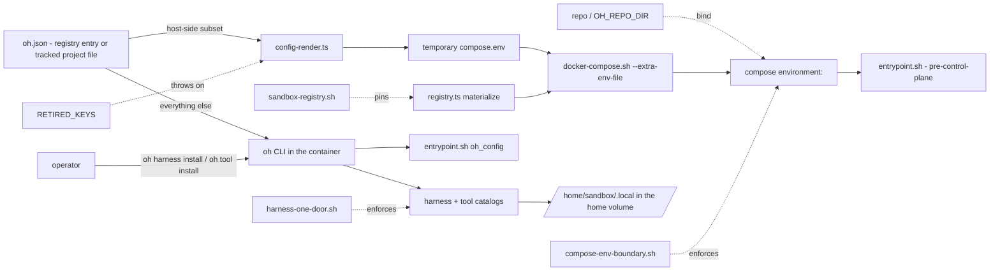

# Compose Environment Boundary

## Relevant Source Files
- `.devcontainer/docker-compose.yml` — the checkout-binding compose file; its `environment:` block is the surface this page constrains, and its bind and build context read `${OH_REPO_DIR:-..}`.
- `.devcontainer/docker-compose.image-only.yml` — the default base for a registry sandbox (no checkout); its `environment:` block is byte-identical to the other file's.
- `.devcontainer/entrypoint.sh` — the `oh_config` / `oh_config_truthy` helpers that read oh.json at boot; installs nothing.
- `.oh/cli/src/lib/config-render.ts` — renders the host-side subset into a temporary `compose.env`; refuses `RETIRED_KEYS`.
- `.oh/cli/src/lib/registry.ts` — materialises both compose files, the overlays, and the wrapper into a registry entry, which is the root the wrapper runs from.
- `.oh/cli/src/commands/harness.ts`, `.oh/cli/src/commands/tool.ts` — the only install door.
- `.devcontainer/Dockerfile`, `.oh/scripts/link-providers.sh` — the Hermes image default and additive integration validation.
- `.oh/evals/probes/compose-env-boundary.sh`, `.oh/evals/probes/harness-one-door.sh`, `.oh/evals/probes/sandbox-registry.sh` — the tier-A probes that enforce the rules, and pin the bundled compose texts to the tracked files.

## Summary
A value reaches the sandbox through Compose only if a process **outside** the sandbox — or the entrypoint **before** the control plane is readable — must act on it. Everything else lives in `oh.json` — the registry entry's for a sandbox created by `oh sandbox install docker` (#950), the tracked project file for in-repo settings — and is read inside the container through the `oh` CLI. Installs are not configuration at all: a harness or tool enters the sandbox only when the operator runs `oh harness install <id>` or `oh tool install <id>` (#948), so neither Compose nor `oh.json` carries an install key.

## Detail
Two routes carry configuration into the sandbox. The host-side route renders a fixed set — `SANDBOX_NAME`, `TZ`, `OH_HOME_MOUNT`, `OH_REPO_DIR`, `GIT_USER_NAME`, `GIT_USER_EMAIL`, `DOCKER_SOCKET`, `SANDBOX_SSH`, `SANDBOX_SSH_PORT`, `OH_SANDBOX_IMAGE`, `OH_PULL_POLICY` (`.oh/cli/src/lib/config-render.ts:37-50`) — because each selects an overlay, names the project, publishes a port, binds a path, or is needed before `oh.json` is reachable. The set is rendered into a temporary `compose.env` passed to the wrapper as `--extra-env-file`; nothing writes a `.devcontainer/.env`. `OH_REPO_DIR` is the one entry that is a path rather than a setting: it is the absolute checkout a registry sandbox binds at `/home/sandbox/harness`, rendered only when `repo` is set, and the compose file's `${OH_REPO_DIR:-..}` default keeps an in-checkout or CI run identical to before #950. A registry entry under `${OH_HOME:-~/.oh}/sandboxes/<name>/` is itself a root: the CLI materialises the compose files, the overlays, and the wrapper into it on every lifecycle call (`.oh/cli/src/lib/registry.ts`), so the wrapper's `--repo-dir` is the entry and the checkout, when there is one, arrives only through `OH_REPO_DIR`. The in-container route reads everything else at the moment it is needed: `oh_config` shells `oh config show` once and answers `jq` filters from the cached JSON (`.devcontainer/entrypoint.sh`), degrading to a caller-supplied default when the CLI is missing or old; `config show` rather than a narrower verb, because a baked `oh` can predate a new one on the boot path.

Installs take neither route. Boot provisioning, the `install.*` keys, the persist flags, the boot-time environment off-ramp and the healthcheck failure marker were retired in #948. `oh harness install <id>` and `oh tool install <id>` probe the running sandbox, install as the sandbox user into `NPM_USER_PREFIX` (`/home/sandbox/.local`) inside the home volume, verify with the catalog's `verifyArgv`, and report; they touch no `oh.json` field. Kinds are `installable` / `on-demand` for harnesses and `baked-in` / `installable` for tools; the catalogs own every pin and checksum, and `entrypoint.sh` holds none. A fresh home volume boots with no harness and no `herdr`, and the healthcheck passes anyway.

Four compose `environment:` literals survive that no config read can supply: `SANDBOX_PASSWORD` (consumed by the entrypoint's own user setup), `CLAUDE_DANGEROUSLY_SKIP_PERMISSIONS`, `CC_SAFETY_NET_STRICT` and `CC_SAFETY_NET_WORKTREE` (read by third-party binaries that know nothing of `oh.json`), plus the `GH_TOKEN` secret, which `config-render.ts` refuses to render.

Four guards keep the boundary closed. `RETIRED_KEYS` throws if a `put()` for a retired variable is ever re-added (`.oh/cli/src/lib/config-render.ts`); the compose probe fails on any `INSTALL_*` key, on `OH_IMAGE_ONLY`, or on any `environment:` key outside the rendered set — across every `docker-compose*.yml` including overlays; and `harness-one-door.sh` fails on a `default` kind, a `harnessKey` / `toolKey`, a provisioner script, an `install` key in `oh-config.ts`, a boot-time provisioning gate, or an installable binary in the Dockerfile. `sandbox-registry.sh` compares the texts a materialised entry contains against the tracked compose files and scripts byte for byte and fails if a lifecycle verb spawns `docker` outside the wrapper. Overlay `ports:` and `volumes:` blocks are unrestricted; that payload is the part only Docker can act on.

Non-goals: the image-only base is the default for a registry sandbox, because `/opt/oh-seed` ships regardless; `INSTALL_PYTHON_KERNEL` and `provision-python.sh` remain, a Dockerfile↔entrypoint duplication rather than a compose one; `start_period: 600s` was sized for the retired provisioning window and is tracked for retuning on #948.

Hermes adds a sandbox-internal default, not a Compose setting. The image sets
`HERMES_HOME=/home/sandbox/harness/.hermes` (`.devcontainer/Dockerfile:4`). Managed
installation validates the launch home and reconciles additive shared skills before
installation, verifies the executable, and reconciles again afterward
(`.oh/cli/src/commands/harness.ts:175`, `.oh/cli/src/commands/harness.ts:226`).
The canonical linker refuses unset or relative managed launch homes and conflicting
occupied paths (`.oh/scripts/link-providers.sh:110`). Ordinary provider linking in another
worktree does not redirect the image-global Hermes runtime
(`.oh/scripts/link-providers.sh:189`). No Compose variable or install setting changed.

## System Relationships

## See Also
- [[sandbox-dependency-installs]]
- [[oh-cli-portable-lifecycle]]
