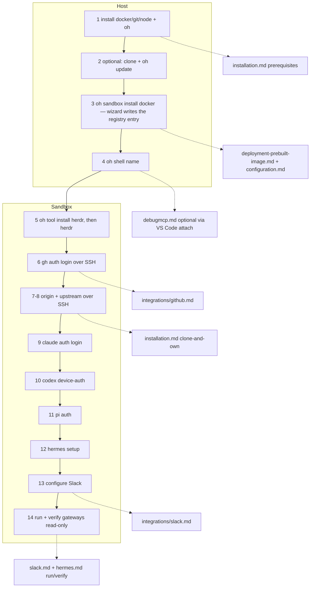

# Fresh-Machine Setup Flow

## Relevant Source Files
- `docs/quickstart.md` — the **canonical human walkthrough** (14 ordered steps, commands inlined). This entry is a synthesis + doc-handoff map only; keep it in sync with quickstart's step list.
- `docs/installation.md` — host prerequisites, the `oh` install paths, and the clone-and-own private-origin + upstream pattern.
- `docs/deployment-prebuilt-image.md` — the `oh sandbox install docker` page: image-only by default, `--repo` to bind a checkout.
- `docs/integrations/github.md` — SSH auth (interactive + entrypoint auto-keygen).
- `docs/integrations/debugmcp.md` — DebugMCP extension runbook.
- `docs/integrations/slack.md`, `docs/harnesses/hermes.md` — Slack config + gateway run/verify.
- `.devcontainer/entrypoint.sh` — auto SSH keygen + pubkey upload when `GH_TOKEN` carries `admin:public_key`.
- `.devcontainer/Dockerfile`, `.oh/cli/src/commands/harness.ts`, `.oh/scripts/link-providers.sh` — Hermes runtime home and immediate shared-skill integration.
- `.oh/scripts/gateway.sh` — sandbox-only lifecycle for the sibling `client-slack-pi` / `client-slack-hermes` sessions.

## Summary
Validated 2026-07-01 on a bare OVHcloud host and re-validated 2026-09-03 against a registry
child sandbox: the path from a fresh Linux machine to an authenticated multi-agent Open
Harness sandbox is 14 ordered steps. Steps 1–4 run on the **host** (install deps, optionally
clone, `oh sandbox install docker`, `oh shell <name>`); steps 5–14 run **inside the
sandbox** (install Herdr and each harness through the CLI, GitHub SSH auth, private origin +
upstream, per-harness auth, Slack, gateway run/verify). Each fact has one canonical doc home,
and `quickstart.md` is the single self-sufficient human walkthrough.

## Detail
Host prerequisites are Docker (+ Compose), Git, and **Node.js >= 20** — `oh` is the only
lifecycle door and needs Node to run (issue #881 retired the Makefile; `get-oh.sh`
installs Node when it is missing). Since #950 no checkout is required to create a sandbox:
`oh sandbox install docker` runs from any directory, asks name, timezone, git identity,
SSH (with port), and Docker socket (or takes every default with `--yes`; the default name
is `oh-sbx-<n>`), writes the entry under `${OH_HOME:-~/.oh}/sandboxes/<name>/`, and boots
the published image. A project checkout is an optional `--repo <dir>` bind mount; a
checkout is equipped with the `.oh/` control plane by `oh update` (`--from <dir>` or
`--from-remote`), which writes nothing else. Non-secret configuration lives in the entry's
`oh.json`, edited with `oh config set --sandbox <name>`; secrets go through
`oh secret set --sandbox <name>` into the entry's gitignored dotenv. The CLI writes no
`AGENTS.md`, provider config, or scaffold; the operator owns those files. Nothing installs at
boot: a fresh sandbox has no `herdr` and no agent CLI until `oh tool install herdr` /
`oh harness install <id>` (#948).

The recommended repo topology is **clone-and-own**: clone upstream, create a *private* repo
as `origin`, keep `mifunedev/openharness` as `upstream`. Both remotes use SSH URLs so pushes
ride the key generated in-sandbox. GitHub auth has two SSH paths: interactive (pick SSH
during login, generate a key, paste a token) or automatic (the entrypoint generates an
ed25519 key and uploads the public key when `GH_TOKEN` carries `admin:public_key`;
idempotent).

Per-harness auth, in order, each after its `oh harness install <id>`: Claude (verified
against v2.1.198), Codex (device-auth), Pi (provider OAuth), and Hermes. The **most straightforward
cross-provider login** is `/login` → **device mode** from an agent's interactive session — a
short code + URL that works on a headless/remote host, where browser-redirect OAuth
typically fails; explicit `--device-auth` CLI flags (e.g. `codex login --device-auth`) are
equivalents. **DebugMCP** is a separate, optional cross-harness MCP debugging capability, enabled by
the VS Code attach-to-container route after `oh sandbox install docker`; any MCP-capable
harness can drive it.

Slack + gateways: `pi-messenger-bridge` bridges Slack to Pi; Hermes uses its native
gateway. One `.oh/scripts/gateway.sh` lifecycle manages both in sibling tmux sessions
(`client-slack-pi`, `client-slack-hermes`), each with its own Slack app. Run commands are
sandbox-only (they need `pi` / `hermes` on `PATH`). Verify a live gateway read-only
(`tmux attach -r`, detach with `Ctrl-b d`); logs mirror to `/tmp/client-slack-{pi,hermes}.log`.

`confidence: provisional` — steps 3–5 (create, enter, `oh tool install herdr`) are
live-verified against a registry child booted from the #950 head (`.oh/tasks/sandbox-registry/evidence.md`);
the Claude auth command and the `gateway status` / `tmux -r` mechanics are live-verified in the
running sandbox; Pi/Hermes/Slack auth were not re-run live for this entry. Commands themselves
live in `quickstart.md`, not here.

Hermes onboarding now separates the program home from runtime state. The program
remains in `~/.local/lib/hermes-agent`; the image defaults runtime state to
`~/harness/.hermes` (`.devcontainer/Dockerfile:4`). The installer reconciles shared
skills immediately and checks the executable before reporting success
(`.oh/cli/src/commands/harness.ts:226`). Native skills remain beside the additive
shared link. Conflicting, unset, or relative managed homes fail before installation
(`.oh/scripts/link-providers.sh:110`).

An old container needs image recreation, not only a CLI update, to acquire the
image environment. The installer does not migrate populated legacy homes. Image-only
state resides in the home volume; checkout-backed state resides in the checkout.
The opt-in smoke scenario checks the upstream home resolver, real skill discovery,
native creation, and synthetic atomic replacement (`.oh/scripts/hermes-install-smoke.sh:1`).
The scenario neither authenticates nor invokes a model; it does not extend this page's
previous live-auth claims.

## System Relationships

## See Also
- [[sandbox-dependency-installs]]
- [[oh-cli-portable-lifecycle]]
