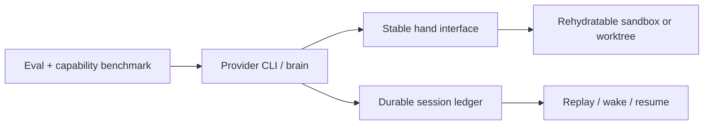

# Scaling Managed Agents: Decoupling the brain from the hands

## Relevant Source Files
- *(external seed)* — the Anthropic article this page was seeded from (published 2026-04-08) was never snapshotted and its URL was never recorded, so it is unrecoverable from this repository and is not a declared source. Everything below is verifiable against the repository documents this page compares that article to.
- `docs/rfcs/rfc-trace-ledger.md:33-101,125-155` — Open Harness's proposed append-only event ledger, session index, privacy rules, and replay/diagnosis minimums.
- `.devcontainer/docker-compose.yml:30-104` — the current single sandbox service, bind-mounted checkout, persistent auth/tool volumes, optional credential environment, and restart policy.
- `docs/security-considerations.md:34-43,121-134` — current secret-path hooks, named-volume state, and the Docker-socket isolation caveat.
- `docs/rfcs/rfc-runtime-support.md:20-40` — separate substrate, deploy, and fan-out axes and the per-task isolation gap.
- `docs/harnesses/overview.md:7-9` — current product boundary: one developer, one project, one agent.

## Summary
Anthropic's Managed Agents article treats an agent as three replaceable components: a durable session log, a harness/brain that interprets it, and sandbox/tool “hands” that perform actions. Stable interfaces let each component fail, scale, or evolve independently; the session can be replayed outside the model's context window and credentials remain outside generated-code sandboxes.

For Open Harness, the article validates the existing trace-ledger direction while exposing the next architectural seam: the current long-lived sandbox is still an operational anchor. The goal is not to copy a hosted multi-agent product, but to make sessions, tools, and sandboxes rehydratable without coupling their lifetimes.

## Detail
**1. Make the session the recovery surface.** The trace RFC already specifies immutable JSONL events, `run_id`/`session_id`, redacted side effects, and replay-required `Run`, `Step`, tool, file, validation, and handoff events (`docs/rfcs/rfc-trace-ledger.md:33-70,125-155`). It also explicitly reserves `.oh/traces/` and `.oh/sessions/` but says they are not implemented (`docs/rfcs/rfc-trace-ledger.md:77-101`). The article turns that proposal into a concrete contract: a crashed provider process should be replaceable by `wake(session_id)`-style rehydration that resumes from a durable cursor, rather than relying on a tmux pane, context window, or container to contain the truth.

**2. Decouple brains from hands.** Compose currently defines one `sandbox` service whose PID 1 is systemd, while the checkout and auth/tool state are mounted into it (`.devcontainer/docker-compose.yml`). Treat provider CLIs, Herdr, and future runners as brains; expose worktrees, sandboxes, MCP services, browsers, and deploy targets as narrow, typed hands. A hand failure should become a classified tool error and be recoverable by reprovisioning from a recipe. This would make the runtime RFC's substrate/fan-out taxonomy operational instead of making “one container” the implicit control plane (`docs/rfcs/rfc-runtime-support.md:20-40`).

**3. Make credential isolation structural.** Open Harness already keeps real credentials out of git, uses named volumes, and installs deterministic secret-exposure hooks (`docs/security-considerations.md:34-43`). But the compose surface can pass `GH_TOKEN` into the sandbox (`.devcontainer/docker-compose.yml:78-81`), and the sandbox owns the XDG auth volume. The Managed Agents lesson is to audit a stronger boundary: generated code should receive task-scoped capabilities or call a credential proxy, not inherit broad tokens that hooks merely try to stop it reading. The optional Docker socket remains an explicit host-root trade-off (`docs/security-considerations.md:121-134`).

**4. Measure model evolution and delete dead weight.** Anthropic's “context anxiety” example shows a harness workaround becoming harmful after a model change. Every Open Harness compensation should therefore have a capability/regression probe and a retirement condition. The existing `/eval` floor, capability ceiling, and self-improvement roadmap provide the right vocabulary; a green probe alone is not evidence that a workaround remains useful (`docs/rfcs/rfc-selfimprove-roadmap.md:29-39`).

**5. Scale hands before defaulting to many brains.** The current product deliberately remains one developer/project/agent (`docs/harnesses/overview.md:7-9`). Preserve that simple default. Design the interfaces so one brain can attach multiple isolated hands and optional parallel brains can share durable session/artifact references later. This is safer than making multi-agent concurrency a requirement before the session, failure, and credential boundaries exist.

## System Relationships

## See Also
- [[audit-architecture]]
- [[runtime-isolation-landscape]]
- [[recursive-language-models]]
