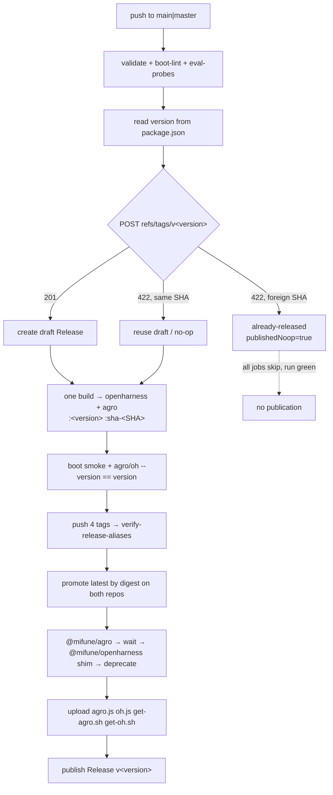

# Release Versioning

## Relevant Source Files
- `package.json:3` — `version`, the source of truth.
- `.github/workflows/release.yml` — `reserve` → `publish-image` → `publish-cli` → `finalize`.
- `.github/workflows/publish-cli.yml` — npm: `@mifune/agro`, then the `@mifune/openharness` shim.
- `.oh/scripts/release-reservation.mjs` — `parseSemVer`, `reserveReleaseVersion`; pure, no I/O, no clock.
- `.oh/scripts/reserve-github-release.mjs` — `releaseTagName` (the only `v` site), `attemptCreate`.
- `.oh/scripts/verify-release-aliases.sh` — `check`: two tags share one manifest digest.
- `.oh/scripts/promote-release-latest.sh` — canonical-branch check; digest-equal `latest` promotion.
- `.oh/cli/package.json`, `.oh/cli/legacy/package.json` — the CLI and shim versions.
- `.oh/evals/probes/version-parity.sh` — the four version sites agree.
- `.oh/skills/release/SKILL.md` — operator procedure and unverifiable prerequisites.

## Summary
Releases use **SemVer** (`MAJOR.MINOR.PATCH`). Root `package.json` holds the version, a release is a deliberate bump, and an unchanged version gives a green no-op. Creating `refs/tags/v<version>` is the **atomic reservation**; the `v` reaches the git tag and Release name only, while step outputs, GHCR tags, and concurrency groups stay bare. Since #941 one build feeds two names: the image ships as `openharness` and `agro`, npm gets `@mifune/agro` plus a delegating `@mifune/openharness` shim, and the Release carries four assets.

Before `v0.1.0` the scheme was UTC CalVer (`YYYY.M.D`, `-N` on collisions). Those tags stay as history; `v0.0.0` is a hand-cut annotated tag closing that era, outside every workflow path.

## Detail

**Trigger.** Only a push to `main` or `master` releases (`release.yml:5-9`); the workflow *creates* the tag, so no tag trigger exists. `validate`, `boot-lint`, and `eval-probes` gate `reserve` (`release.yml:122`), which reads `require('./package.json').version` from the checked-out commit, so every retry resolves the same version.

**Reservation.** `reserveReleaseVersion` calls `attemptCreate` once (`release-reservation.mjs:31`); it POSTs `refs/tags/v<version>` to `/git/refs` (`reserve-github-release.mjs`). `201` reserves; on `422` the bridge compares the peeled tag commit to the release SHA:

| Situation | `reservationKind` | `publishedNoop` | Downstream |
| --- | --- | --- | --- |
| version bumped, tag absent | `created` | `false` | full pipeline |
| same SHA, draft exists | `reused-draft` | `false` | resumes |
| same SHA, already published | `published-no-op` | `true` | all skipped |
| tag on a **different** SHA | `already-released` | `true` | all skipped, run stays green |

Under SemVer the version is an input, so `foreign-collision` maps to `already-released` (`release-reservation.mjs:47-48`) and the `publishedNoop` guards on `publish-image`, `publish-cli`, and `finalize` skip: **an unbumped push to `main` is a clean no-op**. `releaseTagName` (`reserve-github-release.mjs:10`) is the one function that adds the `v`.

**One build, four image tags.** `publish-image` runs one `docker buildx build --load` tagged `ghcr.io/mifunedev/openharness:<version>`, `:sha-<sha>`, `ghcr.io/mifunedev/agro:<version>`, `:sha-<sha>`, plus a local smoke tag (`release.yml`, "Build immutable Docker image tags"). Two gates sit between build and push: the boot smoke, and a step that fails unless `agro --version` and `oh --version` inside the image both equal `RELEASE_VERSION`. After the four pushes, `verify-release-aliases.sh check` exits 1 unless the two `:<version>` manifest digests match. `promote-release-latest.sh promote` re-reads the canonical branch (`main` else `master`), exits 0 without promoting when the release SHA is not its head, otherwise reads the `:<version>` digest of each `IMAGE_REPOSITORIES` entry (`openharness agro` by default), refuses if any differs from the first, and creates `latest` from the pinned digest on every repository.

**Two npm packages, one order.** `publish-cli.yml` receives the reserved SHA; an existing `@mifune/agro@<v>` is a successful no-op, otherwise it builds `.oh/cli` and publishes `@mifune/agro` with provenance. `legacy_guard` then requires `.oh/cli/legacy/package.json` `version` **and** its `@mifune/agro` dependency to equal that version, waits up to 10 × 15 s for `@mifune/agro@<v>` to resolve, publishes `@mifune/openharness` from `.oh/cli/legacy`, and `npm deprecate`s that version toward `@mifune/agro`.

**Finalize.** The job rebuilds the bundles at the released commit, then uploads `agro.js`, `oh.js`, `get-agro.sh`, and `get-oh.sh` (`gh release upload --clobber`) **before** the undraft, so `releases/latest/download/<asset>` resolves once the release is public — `get-agro.sh` and `agro update` fetch there ([[oh-cli-portable-lifecycle]]). Notes come from the `## [<version>] - <date>` CHANGELOG block; `promote-release-latest.sh check` decides `make_latest` from a fresh remote read.

**Four version sites.** A cut bumps root `package.json`, `.oh/cli/package.json` (with its lockfile), the shim `version`, and the shim's exact `@mifune/agro` pin; `version-parity.sh` is REGRESSION when any drifts or the CHANGELOG lacks a dated heading. The CLI no longer versions independently (`0.8.0` at this pin).

**Operator prerequisites** (`release/SKILL.md`): the npm token can publish `@mifune/agro`; the GHCR package `mifunedev/agro` is made public after its first push, because a new package is private by default and `agro sandbox install docker` cannot pull it until then.

**Caveat.** `parseSemVer` accepts a bare `2026.8.7`; the source of truth, not the pattern, prevents a CalVer release.

## System Relationships

Ownership: `package.json` owns the number; `version-parity.sh` pins the other sites to it. `release.yml` owns the pipeline, `publish-cli.yml` the npm order, `release-reservation.mjs` the decision (no I/O), `reserve-github-release.mjs` every GitHub call and the prefix, `verify-release-aliases.sh` alias equality, `promote-release-latest.sh` the canonical-branch check and `latest`.

## See Also
- [[oh-cli-portable-lifecycle]] — the `agro`/`oh` product split; `agro update` consumes the release assets.
- [[audit-architecture]]
