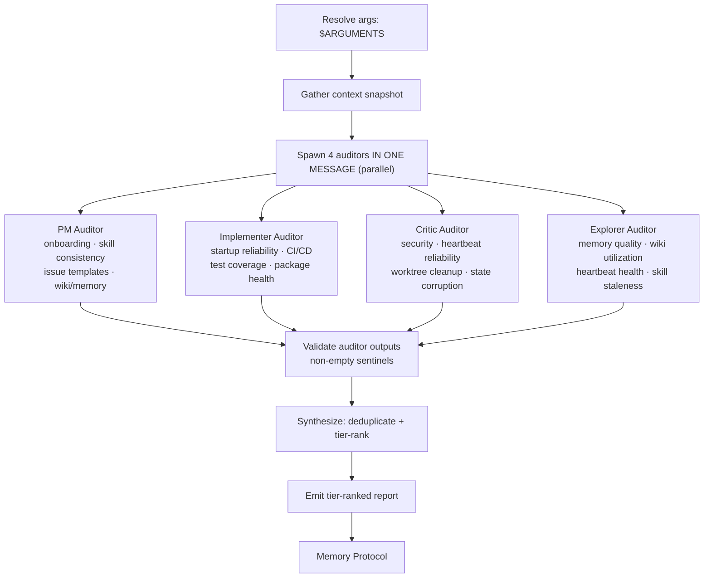

# Harness Audit

Run 4 parallel audit perspectives (PM, Implementer, Critic, Explorer), synthesize their ranked findings, and produce a single tier-classified improvement list with recommended next actions.

**Core principle: evidence over opinion.** Every finding must cite a specific file, observed behavior, or gap — no speculative items.

## External proposal implementation audits

When the user asks whether an external article, repo, or social post should be implemented into Open Harness, use this skill as a decision audit rather than a generic repo-health audit. If the request also says “Add to Wiki,” ingest the source first (or in parallel) and cite the resulting wiki entry/snapshot in the GitHub issue. Convene at least three perspectives — product/alignment, implementer/feasibility, and critic/security/reliability — then synthesize a recommendation with non-goals, acceptance criteria, and gating criteria before any larger implementation.

When `--external <url|path>` is present, load the private supporting reference
`$AUDIT_ROOT/.oh/skills/audit/references/external-proposal-audit.md`; this is the
only reachable external-proposal route. It is mutually exclusive with `--focus`
and ordinary survey mode must not load it.

## Decision Flow



## Instructions

### 1. Resolve arguments

Arguments received: `$ARGUMENTS`

- If `--focus <area>` is present, restrict each auditor to that area (pass as a constraint)
- If `--dry-run` is present, print the briefing + auditor prompts and stop — do not spawn agents
- Otherwise proceed with a full 4-agent audit

### 2. Gather context snapshot

Read the following before spawning agents. Pass the assembled snapshot to every auditor.

```bash
# The executable outer dispatcher already validated, canonicalized, and exported
# immutable roots. Routes consume them; they never re-detect or overwrite them.
: "${AUDIT_ROOT:?outer audit dispatcher did not export AUDIT_ROOT}"
: "${AUDIT_RUN_ID:?outer audit dispatcher did not export AUDIT_RUN_ID}"

# Harness structure
ls "$AUDIT_ROOT/.claude/skills/"
ls "$AUDIT_ROOT/crons/" 2>/dev/null || echo "no crons"
tail -20 "$AUDIT_ROOT/crons/.cron.log" 2>/dev/null
ls "$AUDIT_ROOT/.oh/knowledge/" 2>/dev/null | head -20

# Package health
cat "$AUDIT_ROOT/package.json" 2>/dev/null | head -30
printf 'docs site: migrated to mifunedev/openharness-web\n'

# CI definition
ls "$AUDIT_ROOT/.github/workflows/" 2>/dev/null

# Worktrees
git -C "$AUDIT_ROOT" worktree list 2>/dev/null
```

Assemble a **Context Snapshot** (compact markdown, ~300 words):

```markdown
## Harness Context Snapshot — YYYY-MM-DD

### Roots
- AUDIT_ROOT: [source checkout under audit]

### Skills present
[list]

### Agents present
[list or "none"]

### Heartbeats
[list files + frontmatter status if readable]

### Memory logs (recent)
[last 10 daily log files]

### Wiki pages
[list or "none"]

### Packages
- root: [version, dep count]
- docs site: external repo `mifunedev/openharness-web`

### CI workflows
[list]

### Git worktrees
[list]

### Focus constraint
[value of --focus or "none — full audit"]
```

### 3. Spawn 4 auditors in ONE message (parallel)

Launch 4 Agent tool calls **in a single message**. Each receives the Context Snapshot and its specific audit mandate below. All four are bounded provider-native workers driven by the prompts in this file — there is no repository agent definition behind any of them, so pass a provider built-in `subagent_type` and carry the perspective in the prompt. Worker model and effort follow `.oh/skills/delegate/SKILL.md`: operator selections and exclusions bind, and the advisor selects and records unspecified settings per task. All use **Ultra compression** for their output (consumed by the synthesis step, not humans).

---

#### PM Auditor

> You are a Product Manager auditing the Open Harness project. Read the Context Snapshot provided. Then inspect the source checkout listed as `AUDIT_ROOT` for evidence supporting or refuting each check below. Use Read, Glob, and Grep tools freely. Return findings in the Ultra-compressed format defined at the end.
>
> **Audit areas:**
>
> 1. **Developer onboarding friction** — Read `.devcontainer/`, `.oh/cli/`, `.oh/install/`, `CLAUDE.md`. Count the distinct manual steps required from `git clone` to a working sandbox. Flag any step that is undocumented, error-prone, or requires copy-pasting secrets.
>
> 2. **Skill consistency** — Read every `SKILL.md` under `.claude/skills/`. Check: does each have valid YAML frontmatter (name, description)? Does each follow imperative instructions? Is any referenced nowhere (potentially stale)?
>
> 3. **Issue template completeness** — List `.github/ISSUE_TEMPLATE/` files. For each template, check: does it have required fields, clear labels, and assignment guidance?
>
> 4. **Wiki utilization** — Count wiki pages under `.oh/knowledge/`. For each, is it populated or a placeholder stub? What percentage is populated?
>
> **Return format (Ultra compression):**
> ```
> PM_FINDINGS
> [AREA] [SEVERITY: H/M/L] [EFFORT: S/M/L] [FINDING] | [EVIDENCE: file or observation]
> ...
> WORKING
> [what is functioning well]
> END
> ```

---

#### Implementer Auditor

> You are a senior engineer auditing the Open Harness project. Read the Context Snapshot provided. Then inspect the source checkout listed as `AUDIT_ROOT`. Use Read, Glob, Grep, and Bash tools freely. Return findings in the Ultra-compressed format defined at the end.
>
> **Audit areas:**
>
> 1. **Startup reliability** — Read `.devcontainer/docker-compose.yml` and `.devcontainer/entrypoint.sh`. Look for: race conditions (services starting before deps are ready), silent failure paths (errors swallowed without exit codes), stale workspace auto-start hooks, missing healthchecks on compose services.
>
> 2. **Test coverage** — Check `.oh/scripts/__tests__/` for harness script tests and `.github/workflows/` for CI job definitions. The docs site is externalized to `mifunedev/openharness-web` and is not part of this repo's CI surface.
>
> 3. **CI/CD completeness** — Read each workflow file. Are there gaps: missing lint, missing type-check, no test job, no release job, no deploy step?
>
> 4. **Package health** — For root `package.json` and each `packages/*/package.json`, check: pinned vs caret deps, presence of `build` script, presence of `test` script.
>
> 5. **Compose overlay fragility** — Read `.devcontainer/docker-compose*.yml` files. Look for: hardcoded paths, missing `restart: unless-stopped` on long-lived services, volumes without named mounts, environment variables without defaults.
>
> **Return format (Ultra compression):**
> ```
> IMP_FINDINGS
> [AREA] [SEVERITY: H/M/L] [EFFORT: S/M/L] [FINDING] | [EVIDENCE: file:line or command output]
> ...
> WORKING
> [what is solid]
> END
> ```

---

#### Critic Auditor

> You are an adversarial security and reliability critic auditing the Open Harness project. Assume everything is broken until proven otherwise. Read the Context Snapshot. Inspect the source checkout listed as `AUDIT_ROOT`. Use Read, Glob, Grep, and Bash tools. Return findings in the Ultra-compressed format defined at the end.
>
> **Audit areas:**
>
> 1. **Security posture** — Check: is the Docker socket mounted into containers (`/var/run/docker.sock`)? Are any containers running with `--privileged` or `user: root`? Are there default passwords or hardcoded secrets in compose files or entrypoints? Is sudo unrestricted inside the sandbox?
>
> 2. **Cron reliability** — Read all cron definitions in `crons/`. For each: is there a watchdog/restart mechanism? What happens if the cron runtime crashes — does it auto-recover? Is the cron/daemon config present and valid?
>
> 3. **Worktree cleanup** — In the source checkout listed as `AUDIT_ROOT`, run `git worktree list`. Identify orphaned agent branches (`agent/*`) with no recent commits (check `git log --since="7 days ago"`). Is there any automated cleanup?
>
> 4. **State corruption risks** — Look for: shared files written by multiple agents concurrently (e.g., `crons/.cron.log`), no file locking on append operations, mid-commit crash scenarios (partial writes to critical files), compose volumes that could diverge.
>
> **Return format (Ultra compression):**
> ```
> CRITIC_FINDINGS
> [AREA] [SEVERITY: H/M/L] [EFFORT: S/M/L] [FINDING] | [EVIDENCE: file or observed gap]
> ...
> WORKING
> [what is hardened or acceptable]
> END
> ```

---

#### Explorer Auditor

> You are a system archaeologist auditing the Open Harness project. Your job is to discover what is actually happening vs. what the documentation claims. Read the Context Snapshot. Inspect the source checkout listed as `AUDIT_ROOT`. Use Read, Glob, Grep, and Bash tools. Return findings in the Ultra-compressed format defined at the end.
>
> **Audit areas:**
>
> 1. **Wiki utilization** — List all files under `.oh/knowledge/`. For each, check if it has substantive content (>10 lines) or is a placeholder stub. What percentage is populated?
>
> 2. **Cron health** — For each cron definition in `crons/`, classify: ACTIVE (recently logged evidence), STALE (defined but no recent log evidence), MISCONFIGURED (broken frontmatter or missing schedule). Check `crons/.cron.log` for cron execution traces.
>
> 3. **Agent worktree status** — In the source checkout listed as `AUDIT_ROOT`, run `git worktree list` and `git branch -a | grep agent/`. Classify each: ACTIVE (commits in last 7 days), IDLE (commits 7-30 days ago), ORPHANED (no commits in 30+ days or branch deleted).
>
> 5. **Skill usage patterns** — Use the Context Snapshot's `crons/.cron.log` excerpt plus in-repo references; keep `.claude/skills/` existence checks on `AUDIT_ROOT`. Which skills are referenced by a cron, a workflow, or another skill (evidence of use)? Which exist in `.claude/skills/` but are referenced nowhere (potentially stale or unknown)?
>
> **Return format (Ultra compression):**
> ```
> EXP_FINDINGS
> [AREA] [SEVERITY: H/M/L] [EFFORT: S/M/L] [FINDING] | [EVIDENCE: file or log reference]
> ...
> WORKING
> [what is healthy]
> END
> ```

---

### 3.5 Validate auditor outputs (fail closed)

Before synthesis, verify that every required auditor returned a real output block. An auditor result is valid only when it is non-empty and includes both its expected start sentinel and a closing `END` line:

| Auditor | Required start sentinel |
|---------|-------------------------|
| PM | `PM_FINDINGS` |
| Implementer | `IMP_FINDINGS` |
| Critic | `CRITIC_FINDINGS` |
| Explorer | `EXP_FINDINGS` |

If any result is missing, blank/whitespace-only, lacks its required start sentinel, or lacks `END`, **stop before deduplication/tier-ranking**:

1. Print `FAIL-AUDITOR-OUTPUT` and list each missing or empty auditor with the observed defect (`missing`, `blank`, `missing sentinel`, `missing END`).
2. Do **not** synthesize findings, do **not** rank tiers, and do **not** emit `Recommended Next 3 Actions` from partial evidence.
3. Still run the Memory Protocol with:
   - `Result: FAIL-AUDITOR-OUTPUT`
   - `Action: aborted before synthesis; invalid auditors: <names + defects>`
   - `Observation: required harness perspectives did not return evidence`
4. Exit non-zero for the skill invocation so automation treats the audit as failed, not as an empty successful report.

This is intentionally fail-closed: a no-output sub-agent completion is a runtime/input failure, not evidence that the audited area has no findings.

### 4. Synthesize findings

After all 4 auditors return and pass the auditor-output validation gate, synthesize into the output format:

1. **Deduplicate** — if 2+ auditors flag the same issue, merge into one entry (note multiple sources)
2. **Tier-rank** using this matrix:

| Tier | Criteria |
|------|----------|
| **Tier 1: Fix Now** | Severity H + any effort, OR Severity M + Effort S |
| **Tier 2: Build Next** | Severity M + Effort M/L, OR Severity L + Effort S with clear payoff |
| **Tier 3: Design Decisions Needed** | Requires architectural choice, policy decision, or cross-team alignment before action |

3. **Identify what's working** — consolidate all WORKING entries from auditors
4. **Select top 3 actions** — the 3 highest-leverage Tier 1 items (or Tier 2 if Tier 1 is empty), stated as concrete next steps (e.g., "Add healthcheck to postgres service in `.devcontainer/docker-compose.yml`")

### 5. Emit the report

```
## Harness Audit — YYYY-MM-DD

### Tier 1: Fix Now (high impact, low-medium effort)
| # | Issue | Source | Effort | Why |
|---|-------|--------|--------|-----|
| 1 | ... | PM/IMP/CRITIC/EXP | S/M/L | ... |

### Tier 2: Build Next (medium impact, medium effort)
| # | Issue | Source | Effort | Why |
|---|-------|--------|--------|-----|

### Tier 3: Design Decisions Needed
| # | Issue | Source | Why |
|---|-------|--------|-----|

### What's Working (keep investing)
- ...

### Recommended Next 3 Actions
1. ...
2. ...
3. ...
```

### 6. Memory Protocol

Return this structured observation to the outer dispatcher; do not report a run record from this route. The dispatcher prints it once:

```markdown
## [Harness Audit] — HH:MM UTC
- **Result**: OP
- **Action**: audited N areas, found M tier-1 issues
- **Observation**: [one sentence — top finding]
```


## Reference

### Auditor-to-area mapping

| Auditor | Primary areas |
|---------|--------------|
| PM | Onboarding, skill consistency, issue templates, wiki/memory utilization |
| Implementer | Startup reliability, test coverage, CI/CD, package health, compose overlays |
| Critic | Security, heartbeat reliability, worktree cleanup, state corruption |
| Explorer | Memory quality, wiki utilization, heartbeat health, worktree status, skill usage |

### Severity and effort definitions

| Label | Severity meaning | Effort meaning |
|-------|-----------------|---------------|
| H | Data loss, security breach, or blocks all agents | S = < 1 hour |
| M | Degrades reliability or developer experience | M = 1 hour – 1 day |
| L | Nice-to-have, cosmetic, or minor friction | L = > 1 day |

### Key paths

| Resource | Path |
|----------|------|
| Orchestrator skills | `.claude/skills/` |
| Crons | `crons/` |
| Cron liveness | `crons/.cron.log` |
| Wiki | `.oh/knowledge/` |
| Compose | `.devcontainer/docker-compose.yml` |
| Entrypoint | `.devcontainer/entrypoint.sh` |
| CI workflows | `.github/workflows/` |
| Docs site | external repo `mifunedev/openharness-web` |
| Orchestrator scripts | `.oh/scripts/` (with tests in `.oh/scripts/__tests__/`) |
