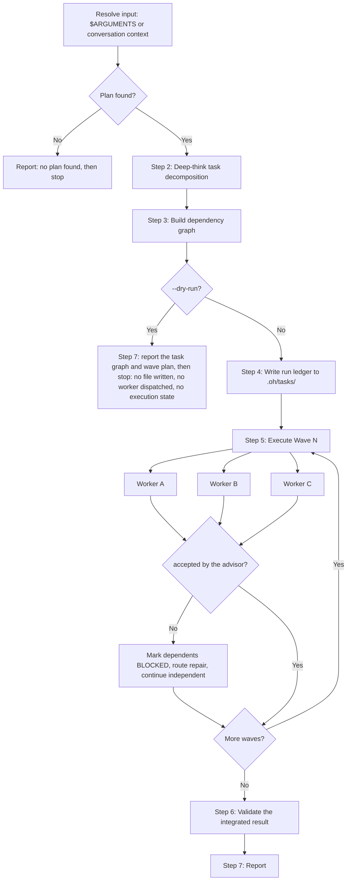

# Delegate

Parallel execution coordinator. Read a plan or conversation context, decompose it into
a dependency-ordered task graph, and spawn worker sub-agents in parallel waves. Each wave
completes before the next begins. Results are collected, validated, and reported.

**Core principle: dependency order is absolute. Size each task for usefulness,
not for a worker count.**

## When a worker is justified

> Use a worker only when the task is self-contained and gains from parallelism,
> isolated context, restricted tools, or containment of verbose disposable output.
> Keep judgment in the active session when phases share substantial context or require
> iterative refinement; keep coupled implementation with one continuing worker.

A worker is a **bounded execution context**, not a project role. The active coding
agent is the runtime and stays the owner of the work; skills — `/architect`,
`/spec`, `/audit`, `/retro` — are how it adopts a role. The active session acts as
advisor: it keeps goal interpretation, architecture, decomposition, verification,
and acceptance, and it assigns bounded implementation to workers. Delegation buys
isolation, parallelism, and bounded implementation, and nothing else.

| Assign it to a worker | Keep it in the active session |
|---|---|
| Tracked implementation edits: code, tests, docs, integration fixes, repair | Goal interpretation, architecture, decomposition, verification, acceptance |
| Coupled implementation, in one continuing worker | Reconciliation of results that share substantial context |
| Independent parallel research or source sweeps | Iterative refinement against operator feedback |
| Verbose disposable output — logs, search dumps, test runs | A result you would have to re-derive to use |
| Disjoint file ownership with no shared mutable state | The second of two tasks that touch the same file, until the first completes |
| A deliberate tool or permission restriction | Task state: `prd.json`, `progress.txt`, and acceptance records |

A small task can use one worker; parallelism is not mandatory. A factual question
or a plan-only request needs no worker: loading this skill, writing a plan, or
finishing a plan authorizes no dispatch and creates no execution state. Do not
invent named architectural roles for workers. `/delegate` owns fan-out policy;
other skills must not grow a competing worker hierarchy beside it.

## Complexity classification

Classify each subtask by uncertainty, blast radius, security exposure, reversibility,
context requirements, and acceptance clarity. Line count alone does not determine
complexity. Mechanical work has known transformations and decisive checks. Ambiguous
requirements, cross-boundary changes, migrations, and uncertain debugging warrant
stronger reasoning before a worker writes. The advisor resolves architecture; even a
high-capability worker receives bounded implementation scope, never an instruction
to redesign the architecture.

Coupled implementation stays with one continuing worker. Use the provider's native
continuation when it exists; otherwise checkpoint the artifacts and rebrief the next
bounded worker with only the incomplete scope. Never replay completed work. Parallel
writers get isolated worktrees. Serialize shared-file work. Workers stay flat
unless the recursion-authorization gate in step 5 authorizes recursion.

## Worker model and reasoning policy

Apply this policy to every worker:

1. **Explicit operator selections and exclusions are binding.** Pass a selected model
   unchanged; never dispatch to an excluded model.
2. **Select unspecified settings per task.** Choose the model and reasoning setting
   from the task's complexity, risk, and the authorized budget. Record the selection
   reason in the dispatch record before dispatch.
3. **Perform a native capability check first.** Before the first dispatch, confirm
   which model and reasoning controls the running provider's worker tool exposes.
   Record the requested settings and the observed settings separately, each with its
   provenance. An unknown value stays `unknown`; never record it as confirmed or zero.
   A display name or an accepted request does not prove the effective configuration.
4. **An unsupported required control blocks.** When a required model or reasoning
   control is unavailable, mark the affected worker and its dependents `BLOCKED` and
   ask the operator for an authorized alternative. Never substitute a model, lower a
   setting, change shared or parent settings, or call a nested inference CLI to obtain
   the control.
5. **Escalate reasoning only on evidence.** Raise a worker's reasoning setting only
   when evidence shows uncertainty or repeated failure, never because a tool or a
   credential is missing.
6. **Stop at the declared budget.** When a task reaches its declared budget, stop and
   ask the operator; do not retry indefinitely.

### Provider-specific preferences (Claude Code)

The preferences below are operator preferences, not the portable role definition.
Each one requires native verification before use.

- The advisor session runs on Fable 5.1 with the operator-selected effort.
- A low-complexity worker runs on Opus.
- The advisor judges the effort level for each worker task: `low` for mechanical work,
  `medium` for standard work, `high` or `xhigh` for high-uncertainty work, never `max`.
  Record the selected effort and its reason in the dispatch record before dispatch.
- Never route work to Sonnet, as a primary, intermediate, or fallback tier.
- Select the hardest worker per task from supported non-Sonnet models; record the
  selection reason.
- On a native surface that exposes them, Luna at Max serves the least complex work and
  Astra at high serves the hardest work.

The per-call Agent tool on Claude Code exposes `model` and has no effort argument.
The documented per-worker effort control is subagent definition frontmatter
(`effort: low|medium|high|xhigh|max`; never pass `max`), hot-reloaded from a subagent
definition at the scope the operator chooses. Apply the selected effort through that
control when one exists, after native verification. When no per-worker control is
available at dispatch time, the worker runs at the inherited session effort and the
record says so: `observed effort: inherited session level, unobserved`. Confirm an
effective effort only from the runtime's own display or the worker's self-report;
never assume it from the request. Effort is an advisor judgment, so a missing effort
control never blocks a worker and never justifies a model substitution. Rule 4 applies
to the model, to explicit operator selections and exclusions, and to any control the
operator marks required.

## Decision Flow



## Instructions

### 1. Resolve input

Arguments received: `$ARGUMENTS`

- If `--plan <path>` is provided, read that file
- If no arguments, use the current conversation context (the plan should be visible
  from a prior `/prd`, plan discussion, or issue triage output)
- If `--dry-run` is present, set DRY_RUN=true

If no plan is found in either source, report:
> No plan found. Provide a plan file path with `--plan <path>` or discuss the plan first, then run `/delegate`.

Then stop. This path writes no file, dispatches no worker, and creates no execution
state.

### 2. Decompose into tasks (reason according to complexity)

Analyze the plan deeply and produce a structured task list. Each task is one dispatch
record with every field below; a record with a missing field is not ready to dispatch.

| Field | Description |
|-------|-------------|
| **ID** | Sequential: T1, T2, T3, ... |
| **Title** | Short imperative description |
| **Description** | What the worker agent needs to do (2-3 sentences, include file paths) |
| **Depends On** | Task IDs this requires first, or "none" |
| **Complexity** | The classification from **Complexity classification**, with the deciding factors |
| **Selection reason** | Why the requested model and reasoning fit this task, recorded before dispatch |
| **Requested model / reasoning** | The exact model and reasoning setting requested, or `inherit` when the operator selected no preference for this class |
| **Observed settings + provenance** | The effective model and reasoning setting the native surface reported, each with its source; `unknown` when unobserved |
| **Read scope** | Files and directories the worker reads |
| **Search / output limits** | The search breadth and the output volume the worker stays inside, so verbose disposable output stays bounded |
| **Owned write paths** | The only paths the worker edits |
| **Exclusions** | Paths, actions, and settings the worker must not touch |
| **Execution directory** | The absolute directory the worker runs in |
| **Worktree isolation** | The isolated worktree for a parallel writer, or the reason a serialized worker shares one |
| **Worker type** | The provider built-in `subagent_type` |
| **Continuation method** | Native continuation, or checkpoint-and-rebrief with the checkpoint artifacts |
| **Deliverable** | The concrete artifact, patch, or commit the worker returns |
| **Verification** | Commands or exact review procedure, with expected results |
| **Stopping condition** | The observable state at which the worker stops and reports, including the blocked case |
| **Evidence destinations** | The paths that receive outputs, logs, and artifacts |
| **Covered DoD IDs** | The Definition of Done criteria this task covers |
| **Acceptance owner** | The advisor; a worker never accepts its own result |
| **Failure / repair route** | Which worker repairs a failed check, and what returns to the advisor |
| **Native worker ID** | Assigned at dispatch |
| **Status** | The advisor's record, never a worker's claim: `pending`/`running`/`completed`/`FAIL`/`BLOCKED`. `completed` means the advisor accepted the artifacts |
| **Artifact references** | Paths, commits, or logs the worker produced |
| **Usage** | Token or cost usage when the provider reports it; otherwise `unknown` |

**Decomposition rules:**
- Each task must be completable by a single sub-agent in one session
- Complexity, briefing overhead, shared context, and verification cost decide a useful task boundary; a further split is not a default, and one continuing bounded worker is a valid answer
- Schema/infrastructure before backend, backend before frontend
- Tasks that touch different files with no shared state CAN be parallel
- Tasks that modify the same file or depend on another's output MUST be sequential
- Every task must have at least one verifiable acceptance criterion
- Each task must have a **distinct, non-overlapping scope** — do not spawn redundant workers for the same files
- A task must not say only "implement the plan"; it names its owned write paths and covered DoD IDs
- A read-only worker never owns write paths
- A task that is itself multi-step and parallelizable MAY recursively delegate via the `Agent` tool — but only if the worker's task description includes explicit `Max depth: N` and `Step budget: N` fields (see **Recursion-authorization gate** in step 5). Absent those fields, workers stay flat.

### 3. Build dependency graph and compute waves

Arrange tasks into parallel execution waves using topological ordering:

1. **Wave 1**: All tasks with `Depends On: none` -- run first, in parallel
2. **Wave 2**: All tasks whose dependencies are entirely within Wave 1
3. **Wave N**: All tasks whose dependencies are entirely within Waves 1..N-1

Output the wave plan:

| Wave | Tasks | Parallelism | Complexity |
|------|-------|-------------|------------|
| 1 | T1, T2, T3 | 3 agents | S + S + M |
| 2 | T4, T5 | 2 agents | M + S |
| 3 | T6 | 1 agent | L |

**Validation:**
- No circular dependencies (if found, report error and stop)
- Max 5 concurrent agents per wave (split larger waves into sub-waves)

### 4. Write the run ledger

The task graph is durable state, not conversation state. A delegation outlives a
context window: `/spec execute` compacts mid-build, sessions die, and another agent
can pick up the worktree. Write the graph to disk before spawning any worker.

**Resolve the run directory** as `.oh/tasks/<slug>/`:

- Invoked inside a `/spec execute` task (a `--plan` path under `.oh/tasks/<slug>/`,
  or that folder is the current task): reuse that `<slug>`.
- Otherwise: `delegate-<kebab-topic>-<YYYY-MM-DD>`, created if absent.

**Write two files, both owned by this skill:**

| File | Contents |
|------|----------|
| `delegate-graph.json` | Every task's complete dispatch record from step 2, its assigned wave, and its `status` (`pending`/`running`/`completed`/`FAIL`/`BLOCKED`) |
| `delegate-log.txt` | Append-only run log; one line per wave boundary, per status change, per capability check, and per blocked control |

Never write `prd.json` or `progress.txt`. Those belong to the implementation owner
(`.oh/tasks/README.md`), and `progress.txt` in particular must not be edited by hand.
This skill's two files sit beside them without collision.

Both live under `.oh/tasks/`, which is gitignored — that is correct for run state.
Stage them with `git add -f` only when a PR must carry the delegation as evidence.

**Dispatch eligibility applies to initial and resumed runs.** Before any dispatch,
re-evaluate the task against the current graph, artifacts, and native capabilities. A
task is eligible only when all of these conditions hold:

- all blocking prerequisites in the plan and dispatch record are satisfied;
- every `Depends On` task is recorded `completed`, its accepted evidence still
  describes the required artifact revision, and that evidence has established
  provenance;
- every required model, control, and capability is available; and
- no unresolved native worker status, artifact provenance, or owned-path ambiguity
  remains.

A `pending`, `FAIL`, or `BLOCKED` label does not itself authorize dispatch. If every
condition holds, dispatch only the incomplete authorized scope and record `running`
before the worker starts. If any condition remains unmet, record or keep `BLOCKED`,
log each unmet condition, and dispatch nothing. Never infer eligibility from `pending`
alone or from only some accepted dependencies.

**Resume rather than restart.** If `delegate-graph.json` already exists in the resolved
directory, read it first and reconcile every task against real state before any
dispatch.

- `pending`: apply the dispatch-eligibility conditions. Do not release it from the
  label alone.
- `BLOCKED`: re-evaluate every recorded blocking condition, including all dependencies
  and required controls. It remains `BLOCKED` while any condition is unmet and becomes
  eligible only after every condition holds.
- `FAIL`: read the failed task's current artifacts before any retry, apply the
  dispatch-eligibility conditions, then route only the incomplete scope through the
  existing failure / repair route. Never replay work that is already correct.
- `running`: inspect the persisted native worker reference and the current artifacts
  before any retry. While the worker is still active, reconnect to it or observe it
  through the supported native mechanism, and never spawn a duplicate for it. Once it
  has ended, validate its artifacts first, then decide to accept, resume, or retry only
  the incomplete scope. Never replay work that is already correct.
- `completed`: the saved label holds only while its recorded evidence still describes
  the required artifact revision. Re-read the artifact references against the current
  tree. Evidence that no longer describes that revision is stale, so the task returns
  to `completed` and its dependents proceed.
- Unknown native worker status, or an artifact whose provenance cannot be established,
  is reported to the operator as ambiguity. Ambiguity blocks every write to the
  affected paths and never authorizes a second writer.

A resumed run appends to `delegate-log.txt`; it never truncates it.

If `--dry-run`, write neither file — output the full task graph and wave plan,
dispatch no worker, create no execution state, then skip to **Step 7**.

### 5. Execute waves

For each wave, starting from Wave 1, apply the dispatch-eligibility conditions before
each task enters step 5a. Wave membership and persisted status never replace that
check.

**a) Spawn worker agents in ONE message (parallel)**

Launch N `Agent` tool calls **in a single message** for parallel execution. Each worker receives:
- Task ID, title, description, read scope, owned write paths, exclusions, execution directory, and acceptance criteria
- Summaries of completed prior-wave results (not full output)
- Instruction: report what was done, what files changed, whether acceptance criteria are met

Worker configuration:
- **Model and reasoning**: apply the dispatch record per `## Worker model and reasoning
  policy`; record observed settings and provenance after dispatch.
- **run_in_background**: true (for waves with 2+ tasks)
- **subagent_type**: use a **provider-native built-in** type only. This repository defines no project agents, so no `subagent_type` resolves to a repository file. For a worker that must `Write`/`Edit`, use `general-purpose` (or `claude`); for a read-only sweep whose verbose output should stay out of this context, use a read-only built-in such as `Explore`. Verify a type is offered by the running provider before naming it — an unrecognized `subagent_type` either errors or silently degrades. Never name a type on the assumption that a repository agent definition backs it.

**a.1) Recursion-authorization gate**

If any worker's task description authorizes recursive delegation (`Max depth: N` with N ≥ 2), confirm before spawning that **all three** fields are present in that worker's briefing:

This skill owns the triple's semantics; callers cite it rather than forking their own:

- `Max depth: N` counts edges from the root (child = 1, grandchild = 2). A sub-agent MUST NOT recurse when `Max depth` is absent or `1`. A recursing child passes `Max depth: N−1` to its own grandchildren.
- `Max children per level: M` is hard-capped at **5**. A child MUST NOT rewrite a sibling's briefing to lift its own depth or scope.
- `Step budget: S` always reserves at least one final step for the parent's synthesis turn.

These are **prompt-level conventions, not runtime-enforced caps** — nothing rejects a briefing that violates them, so write every briefing to honor them rigorously.

If any field is missing, either add it or downgrade the task to flat execution (`Max depth: 1`). Workers without all three fields MUST stay flat — they have no authority to spawn grandchildren regardless of how the task is described in prose.

**b) Collect results and record acceptance**

After all agents in the wave complete, set each task's `status`, `summary`, native
worker ID, artifact references, observed settings, and usage in
`delegate-graph.json`, then append the wave's outcome to `delegate-log.txt`. Write
both before spawning the next wave — a crash between waves must leave the graph
readable. A worker's completed status is a report, not acceptance; the advisor
inspects the artifact and runs the verification before it records acceptance.

The `status` field carries the advisor's acceptance decision, never a worker's claim,
and it stays inside the existing `pending`/`running`/`completed`/`FAIL`/`BLOCKED`
values. Keep the worker's own claim in `summary`. Record `status: completed` — the
accepted state that step 5d reads — only after the advisor has read the named artifact
references and run the task's `Verification` commands with their real exit statuses. A
task whose worker reported done but whose acceptance is not yet recorded stays
`running`. A task whose inspection or verification failed is recorded `FAIL`. Append
the acceptance decision, its commands, and their exit statuses to `delegate-log.txt`.
No worker records this decision for itself.

| Task | Status | Summary | Files Changed |
|------|--------|---------|---------------|
| T1 | completed | Created schema migration | prisma/schema.prisma |
| T2 | completed | Added API route | src/app/api/... |
| T3 | FAIL | Type error in ... | -- |

**c) Handle failures**

If any task fails its verification or is otherwise not accepted:
- Log the failure with details
- Check if tasks in subsequent waves depend on the failed task
- Mark dependent tasks as BLOCKED (do not execute them)
- Continue with non-dependent tasks in the next wave
- Route the repair to the worker named in the task's failure / repair route; the advisor does not perform the repair itself

**d) Advance to next wave**

Release a dependent only on accepted artifacts. Pass the artifact references and
summaries of tasks recorded `completed` as context to the next wave's workers. A
dependency that is `running`, `FAIL`, or `BLOCKED` is not accepted: its dependents
stay `BLOCKED`, and the defect returns to the bounded writer named in the task's
failure / repair route. Re-evaluate a `BLOCKED` dependent against all dependencies,
blocking prerequisites, required controls, and provenance conditions; release it only
when every condition holds. Repeat until all waves complete or all remaining tasks are
blocked. Per-task acceptance does not replace step 6; the integrated validation there
is a separate, still-required check.

### 6. Validate

After all waves complete:

1. Review acceptance criteria for every completed task.
2. Determine validation commands from the plan's acceptance criteria and the target
   repository's own instructions/configuration (for example, its `AGENTS.md`,
   `README.md`, package scripts, Makefile, or CI workflow). Run only commands relevant
   to the changed scope, from that repository's root.
3. Preserve and record each command's real exit status. Do not append `|| true`, pipe
   through a command that masks failure, or substitute hard-coded harness-wide checks.
4. If validation fails, report the command, exit status, and tasks likely responsible.

### 7. Report

Output a structured summary:

```
## Delegation Report

### Task Summary
| Task | Wave | Status | Summary |
|------|------|--------|---------|
| T1   | 1    | DONE   | ...     |
| T2   | 1    | DONE   | ...     |
| T3   | 1    | FAIL   | ...     |
| T4   | 2    | BLOCKED| Depends on T3 |

### Execution Stats
- Total tasks: N
- Completed: N
- Failed: N
- Blocked: N
- Waves executed: N
- Max parallelism: N agents

### Worker settings
| Task | Requested model / reasoning | Observed settings | Provenance | Usage |
|------|-----------------------------|-------------------|------------|-------|
| T1   | <model> / <reasoning>       | <observed or unknown> | <source> | <usage or unknown> |

### Validation
| Command | Scope | Exit status | Result |
|---------|-------|-------------|--------|
| `<repo-specific command>` | `<changed scope>` | `<code>` | PASS/FAIL |

### Issues Requiring Attention
- [list any failures, blocked tasks, or validation errors]
```

### 8. Example

For a mechanical rename across three files under the Claude Code preferences, record
`Complexity: mechanical (known transformation, decisive check, low blast radius)`,
`Selection reason: operator low-complexity preference; mechanical work takes low
effort (advisor judgment)`, and
`Requested model / reasoning: opus / effort low (advisor judgment)`. Dispatch with
`model: opus`. Apply the effort through a subagent definition with `effort: low` when
one exists at the operator-chosen scope; when none exists, record
`Observed settings: effort inherited session level, unobserved (no per-worker
control)`. Record the effort as observed only when the runtime displays it or the
worker reports it, and do not record the request as confirmed.

## Reference

### Wave Execution Rules

| Rule | Value |
|------|-------|
| Max concurrent agents per wave | 5 (split larger waves) |
| Failure handling | Mark dependent tasks BLOCKED, continue independent ones; the named repair worker repairs |
| Context passing | Accepted prior-wave artifact references and summaries, not full output |
| Model, reasoning, and settings evidence | See `## Worker model and reasoning policy` |

### Key Resources

| Resource | Path |
|----------|------|
| Write-capable worker | `subagent_type: general-purpose` (or `claude`) — provider built-in |
| Read-only sweep worker | a read-only provider built-in such as `Explore` |
| Worker boundary rule | **When a worker is justified** above |
| Architecture decisions | `/architect` — runs inline, never as a worker identity |

There is **no** repository-authored agent catalog: no `.oh/agents/` pack and no
`.claude/agents/` or `.codex/agents/` provider mirror. Every `subagent_type` above
is a provider built-in with no definition file behind it, so there is no repository
path to cite. A read-only built-in makes zero file changes by design — never assign
one a task that must `Write` or `Edit`.
