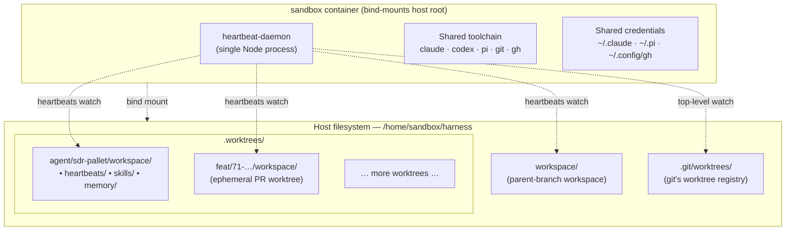

# 🏗️ Open Harness

Isolated, pre-configured sandbox containers for AI coding agents — [Claude Code](https://docs.anthropic.com/en/docs/claude-code), [OpenAI Codex](https://github.com/openai/codex), [Pi Agent](https://shittycodingagent.ai), and more.

> Spin up a fully-provisioned container where AI coding agents can operate with full permissions, persistent memory, and autonomous background tasks — without touching your host system.

**Only host dependency:** [Docker](https://docs.docker.com/get-docker/).

---

## 🚀 Quickstart

### 1. Clone and configure

```bash
git clone https://github.com/ryaneggz/open-harness.git && cd open-harness
cp .devcontainer/.example.env .devcontainer/.env   # configure name, password, etc.
```

### 2. Start the sandbox

```bash
docker compose --env-file .devcontainer/.env -f .devcontainer/docker-compose.yml up -d --build
```

### 3. Connect

**Option A — Terminal (works everywhere):**
```bash
docker exec -it -u sandbox oh-local bash   # use your SANDBOX_NAME
```

**Option B — VS Code Attach to Container (local):**
Install the [Dev Containers](https://marketplace.visualstudio.com/items?itemName=ms-vscode-remote.remote-containers) extension → `Cmd+Shift+P` → **"Attach to Running Container"** → select your sandbox.

**Option C — VS Code Remote SSH + Attach (remote server):**
If Docker is running on a remote host, SSH into the host first, then attach to the container.

1. Add an entry to your local `~/.ssh/config` so credentials forward automatically:

   ```
   Host openharness
     HostName your-server-ip
     User openharness
     ForwardAgent yes
   ```

2. In VS Code: **Remote-SSH: Connect to Host** → `openharness`
3. Once connected to the remote host: **Attach to Running Container** → select your sandbox.

**Option D — SSH directly into sandboxes (multi-sandbox host):**
Enable the `sshd` overlay and assign each sandbox a unique port. This lets you SSH straight into any sandbox — from your laptop, from another sandbox, or from CI. See [Multi-sandbox SSH](#multi-sandbox-ssh) for full setup.

### 4. Onboard (one-time, inside the sandbox)

```bash
gh auth login                    # authenticate GitHub CLI
gh auth setup-git                # configure git auth (no SSH keys needed)
pi                               # authenticate Pi Agent (OAuth) — powers Slack, heartbeats, and extensions
```

### 5. Start working

```bash
claude                           # terminal coding agent
pi                               # automations — Slack, heartbeats, extensions
```

### Cleanup

```bash
docker compose -f .devcontainer/docker-compose.yml down -v
```

---

## 🏛️ Architecture

Open Harness runs **one sandbox container, N git worktrees, one heartbeat daemon**. The container is the shared runtime (toolchain, credentials, processes). Each agent lives on its own branch under `.worktrees/`, shipping its own `workspace/` (SOUL.md, skills, heartbeats, memory, projects). A single Node daemon inside the sandbox watches every worktree's `heartbeats/` directory and spawns scheduled agent runs with the correct `cwd`, so each agent's skills and relative paths resolve to its own subtree. This gives every agent a stable identity and independent schedule without duplicating containers, credentials, or toolchains.

### Topology



### Actors

- **Orchestrator** — the session at the project root. Scaffolds agents, manages git/issues/PRs, runs sandbox lifecycle skills (`/provision`, `/destroy`, `/repair`). Does not write application code.
- **Worktree agent** — a `claude`/`codex` session (or heartbeat spawn) with `cwd` inside a worktree's `workspace/`. Owns its subtree: SOUL.md, skills, heartbeats, memory, branch history.
- **Sandbox** — one Docker container with the host's project root bind-mounted in. All worktrees are visible automatically; toolchain and credentials are shared.
- **Heartbeat daemon** — single Node process inside the sandbox. Discovers worktrees via `git worktree list`, watches each `heartbeats/` directory, and spawns scheduled runs with per-root `cwd` and per-root logs.

For the deep reference, see [`.claude/specs/orchestrator-worktree-architecture.md`](./.claude/specs/orchestrator-worktree-architecture.md) and the docs-site architecture page: [`/docs/architecture/orchestrator-worktrees`](https://ryaneggz.github.io/open-harness/architecture/orchestrator-worktrees).

---

## 📦 What's in the box

The sandbox image (Debian bookworm-slim) comes pre-installed with:

| Category | Tools |
|----------|-------|
| **AI agents** | Claude Code, OpenAI Codex, Pi Agent, Mom (Slack bot) |
| **Runtimes** | Node.js 22, pnpm, Bun, uv (Python) |
| **DevOps** | Docker CLI + Compose, GitHub CLI, cloudflared, tmux, cron |
| **Browser** | agent-browser + Chromium (headless, for web-capable agents) |
| **Utilities** | git, jq, ripgrep, nano, curl, wget, SSH server |

The sandbox user has passwordless `sudo` and full Docker socket access (with the `docker` overlay). Agents run with `--dangerously-skip-permissions` / `--full-auto` so they can operate autonomously.

---

## ⚙️ Configuration

Copy the example env file and edit to taste:

```bash
cp .devcontainer/.example.env .devcontainer/.env
```

Docker Compose and the `openharness` CLI read `.devcontainer/.env` directly.

### Sandbox

| Variable | Default | Description |
|----------|---------|-------------|
| `SANDBOX_NAME` | `openharness` | Container name, compose project name, and CLI identifier |
| `SANDBOX_PASSWORD` | `changeme` | Linux user password — only used when the `sshd` overlay is active |
| `TZ` | `America/Denver` | Container timezone — affects cron schedules and log timestamps |

### Heartbeats (autonomous scheduling)

Heartbeats are cron-scheduled tasks that run an AI agent CLI on a recurring schedule (e.g., hourly issue triage). Each heartbeat is a markdown file in `workspace/heartbeats/` with YAML frontmatter defining its schedule, agent, and active hours.

| Variable | Default | Description |
|----------|---------|-------------|
| `HEARTBEAT_AGENT` | `claude` | Default agent CLI for heartbeats without an `agent` frontmatter field |
| `HEARTBEAT_INTERVAL` | `1800` | Default interval (seconds) for legacy `HEARTBEAT.md` fallback |

Per-heartbeat scheduling and active hours are configured via YAML frontmatter (`schedule`, `agent`, `active` fields) — see [Heartbeats](#heartbeats) below.

### SSH

| Variable | Default | Description |
|----------|---------|-------------|
| `HOST_SSH_DIR` | _(empty)_ | Host SSH directory mounted read-only for git auth. **Setting this auto-enables the `ssh.yml` overlay** — no need to add it to `config.json` manually. |

### Slack bot

The Slack bot (Mom) connects to a workspace via Socket Mode and delegates messages to a Pi agent. Only used with the `slack` overlay.

| Variable | Default | Description |
|----------|---------|-------------|
| `SLACK_APP_TOKEN` | _(empty)_ | Slack app-level token for Socket Mode (`xapp-...`) |
| `SLACK_BOT_TOKEN` | _(empty)_ | Slack bot OAuth token for posting messages (`xoxb-...`) |

---

## 🧩 Compose overlays

The base `docker-compose.yml` provides the sandbox container with bind-mounted workspace and persistent auth volumes. Overlays add optional services and capabilities.

Toggle overlays in `.openharness/config.json`:

```json
{
  "composeOverrides": [
    ".devcontainer/docker-compose.slack.yml"
  ]
}
```

| Overlay | File | What it adds |
|---------|------|-------------|
| **postgres** | `docker-compose.postgres.yml` | Postgres 16 on a bridge network. Sets `DATABASE_URL`, `PGHOST`, `PGUSER`, `PGPASSWORD`, `PGDATABASE` automatically. Data persisted in a `pgdata` volume. |
| **ssh** | `docker-compose.ssh.yml` | Mounts `HOST_SSH_DIR` read-only so git can authenticate with your existing SSH keys. Auto-enabled when `HOST_SSH_DIR` is set in `.env`. |
| **ssh-generate** | `docker-compose.ssh-generate.yml` | Persists `~/.ssh` in a named volume so generated keys survive container rebuilds. Use this instead of `ssh` if the sandbox should have its own keys. |
| **sshd** | `docker-compose.sshd.yml` | Runs an SSH server inside the sandbox on port `2222:22`. Enables direct SSH access for remote workflows and multi-sandbox setups. Uses `SANDBOX_PASSWORD` for auth. |
| **slack** | `docker-compose.slack.yml` | Passes Slack tokens into the container and persists agent auth in a named volume. The bot auto-starts in a tmux session on container boot if both tokens are set. |
| **cloudflared** | `docker-compose.cloudflared.yml` | Sets `INSTALL_CLOUDFLARED=true` and `INSTALL_BROWSER=true` so the entrypoint installs Cloudflare Tunnel and agent-browser on first boot. |
| **git** | `docker-compose.git.yml` | Mounts `GIT_COMMON_DIR` for git worktree support across host and container. |

Multiple overlays can be combined. Order doesn't matter.

---

## 🔐 Multi-sandbox SSH

Run multiple sandboxes on a single host, each reachable via SSH on a unique port. This enables:

- **Direct SSH** from your laptop into any sandbox
- **Sandbox-to-sandbox** communication (agents orchestrating other agents)
- **CI/CD integration** — run commands inside sandboxes from pipelines

### Setup

1. **Enable the `sshd` overlay** for each sandbox and assign unique host ports.

   Each sandbox gets its own project directory (or override file) with a distinct port mapping:

   ```yaml
   # sandbox-alpha — port 2222
   services:
     sandbox:
       ports:
         - "2222:22"

   # sandbox-bravo — port 2223
   services:
     sandbox:
       ports:
         - "2223:22"
   ```

2. **Configure your local `~/.ssh/config`** so each sandbox is a named host:

   ```
   Host sandbox-alpha
     HostName your-server-ip   # or 127.0.0.1 for local Docker
     Port 2222
     User sandbox
     ForwardAgent yes

   Host sandbox-bravo
     HostName your-server-ip
     Port 2223
     User sandbox
     ForwardAgent yes
   ```

   `ForwardAgent yes` passes your local SSH keys through to the sandbox, so git operations inside the container use your host credentials without copying keys.

3. **Connect:**

   ```bash
   # Terminal
   ssh sandbox-alpha

   # VS Code
   # Remote-SSH: Connect to Host → sandbox-alpha
   ```

### Sandbox-to-sandbox

Sandboxes on the same host can reach each other via the host ports or the Docker network. An agent in `sandbox-alpha` can SSH into `sandbox-bravo`:

```bash
ssh -p 2223 sandbox@host.docker.internal
```

This is useful for orchestration patterns where one agent delegates work to others.

---

## 💾 Volumes and persistence

The base compose file creates three named Docker volumes that persist across container rebuilds:

| Volume | Mount | Contents |
|--------|-------|----------|
| `claude-auth` | `~/.claude` | Claude Code OAuth tokens and config |
| `cloudflared-auth` | `~/.cloudflared` | Cloudflare Tunnel credentials |
| `gh-config` | `~/.config/gh` | GitHub CLI auth tokens |

The workspace directory (`workspace/`) is bind-mounted from the host, so changes are immediately visible in both directions. Project files, agent memory, heartbeat configs, and skills all live here and survive container rebuilds without needing a volume.

Overlays may add additional volumes:

| Overlay | Volume | Contents |
|---------|--------|----------|
| `slack` | `agent-auth` | Pi agent auth (`~/.pi`) |
| `ssh-generate` | `ssh-keys` | Generated SSH keys (`~/.ssh`) |
| `postgres` | `pgdata` | Postgres data directory |

`docker compose down -v` removes all volumes. Omit `-v` to keep them.

---

## 📁 Workspace structure

The `workspace/` directory is the agent's home. It's bind-mounted into the container at `/home/sandbox/harness/workspace/`.

```
workspace/
  AGENTS.md             # Operating procedures — decision rules, skills, sub-agents
  CLAUDE.md             # Symlink → AGENTS.md (Claude Code reads this automatically)
  SOUL.md               # Agent personality, tone, values, guardrails
  IDENTITY.md           # Name, role, mission, stack, URLs
  USER.md               # Owner preferences, constraints, goals
  TOOLS.md              # Environment, available tools, service endpoints
  HEARTBEAT.md          # Meta-maintenance routines
  MEMORY.md             # Long-term memory (learned decisions, lessons)

  heartbeats/           # Heartbeat task definitions (frontmatter .md files)
  startup.sh            # Runs on container boot after onboarding

  memory/               # Daily activity logs (YYYY-MM-DD.md)
  projects/             # Application code (e.g., Next.js app)

  .claude/
    rules/              # Coding standards (auto-loaded by Claude Code)
    skills/             # Reusable skill definitions
    agents/             # Sub-agent prompts
```

### Identity files

| File | Owns | Updated by |
|------|------|------------|
| `IDENTITY.md` | Name, role, mission, stack, URLs | Orchestrator (initial), agent (evolves) |
| `SOUL.md` | Personality, tone, values, guardrails | Orchestrator (initial), agent (evolves) |
| `USER.md` | Owner preferences, constraints, goals | User or orchestrator |
| `TOOLS.md` | Environment details, service endpoints | Orchestrator |
| `AGENTS.md` | Decision rules, skills, procedures | Orchestrator (initial), agent (evolves) |
| `HEARTBEAT.md` | Meta-maintenance routines | Agent |
| `MEMORY.md` | Learned facts, decisions, lessons | Agent |

The orchestrator scaffolds these files during provisioning. Once the agent is running, it owns and evolves them.

---

## ❤️ Heartbeats

Heartbeats are cron-scheduled autonomous tasks. A TypeScript daemon watches `workspace/heartbeats/` and runs each heartbeat's prompt via an AI agent CLI on its configured schedule.

### Configuration

Each heartbeat is a markdown file in `workspace/heartbeats/` with YAML frontmatter:

```markdown
---
schedule: "*/30 * * * *"
agent: claude
active: 9-21
---

# Build Health Check

Run a quick health check on the project...
```

| Field | Required | Default | Description |
|-------|----------|---------|-------------|
| `schedule` | Yes | — | Standard 5-field cron expression (`min hour dom mon dow`) |
| `agent` | No | `claude` | Which CLI to use (`claude`, `codex`, `pi`) |
| `active` | No | _(always)_ | `START-END` hour range (24h) — heartbeat only fires in this window |

Comment out the `schedule` field (prefix with `#`) to disable a heartbeat without deleting it.

### Creating heartbeats

Use the `/heartbeat` skill inside the sandbox to create a new heartbeat:

```
/heartbeat check build health every 30 minutes during business hours
```

This writes the `.md` file and the daemon auto-detects it within 500ms — no manual sync needed.

### Management

From the host, use the `openharness` CLI:

```bash
openharness heartbeat status <sandbox-name>   # Show running schedules and recent logs
openharness heartbeat sync <sandbox-name>     # Force re-read of all heartbeat files
openharness heartbeat stop <sandbox-name>     # Remove all heartbeat schedules
```

Inside the sandbox, use the `heartbeat-daemon` binary directly:

```bash
heartbeat-daemon status    # Show running schedules and recent logs
heartbeat-daemon sync      # Force re-read of all heartbeat files
```

The daemon starts automatically on container boot, watches the `heartbeats/` directory for file changes (`fs.watch`), and performs differential sync — only restarting jobs whose schedule or config actually changed.

Logs are written to `workspace/heartbeats/heartbeat.log`.

---

## 🛠️ CLI commands

The `openharness` CLI runs on the host (outside the container).

| Command | Description |
|---------|-------------|
| `openharness sandbox [name]` | Build and start a sandbox |
| `openharness run [name]` | Start an existing (stopped) container |
| `openharness shell <name>` | Open a bash shell inside the sandbox |
| `openharness stop [name]` | Stop the container |
| `openharness clean [name]` | Full cleanup — containers and volumes |
| `openharness onboard [name]` | Run the first-time setup wizard |
| `openharness list` | List running sandboxes |
| `openharness heartbeat <action> <name>` | Manage heartbeats (`sync`, `stop`, `status`) |
| `openharness worktree <name>` | Create a git worktree for parallel branches |

Run `openharness` with no arguments for interactive AI agent mode.

### Install the CLI (optional)

The CLI requires Node.js on the host. It's optional — all core operations can be done with `docker compose` and `docker exec` directly.

```bash
curl -fsSL https://raw.githubusercontent.com/ryaneggz/open-harness/refs/heads/main/install.sh | bash
```

---

## 🗂️ Project structure

```
.devcontainer/                # Sandbox environment
  Dockerfile                  # Debian bookworm-slim + all tooling
  devcontainer.json           # Dev Container metadata
  docker-compose.yml          # Base sandbox service
  docker-compose.*.yml        # Compose overlays (postgres, sshd, slack, etc.)
  entrypoint.sh               # Container bootstrap script
  init-env.sh                 # Seed .devcontainer/.env on first provision (SANDBOX_NAME, GIT_COMMON_DIR)
  .example.env                # Environment variable template

install/                      # Provisioning scripts
  entrypoint.sh               # Late-stage container setup (starts heartbeat daemon)
  setup.sh                    # Environment setup utilities
  tmux-agent.sh               # tmux session management for agents
  cloudflared-tunnel.sh       # Cloudflare Tunnel configuration
  slack-manifest.json         # Slack app manifest for Socket Mode

workspace/                    # Agent workspace template (bind-mounted)

packages/
  sandbox/                    # @openharness/sandbox — CLI + container lifecycle
  slack/                      # Vendored fork of pi-mom — Slack bot

.openharness/                 # Runtime config (config.json, settings)
.github/                      # CI workflows + issue templates
docs/                         # Documentation site (Nextra)
```

---

## 🚢 Releases

CalVer: `YYYY.M.D` (e.g., `2026.4.4`). Push a tag to build and publish to `ghcr.io/ryaneggz/open-harness`.

---

[Full documentation](https://ryaneggz.github.io/open-harness/)
