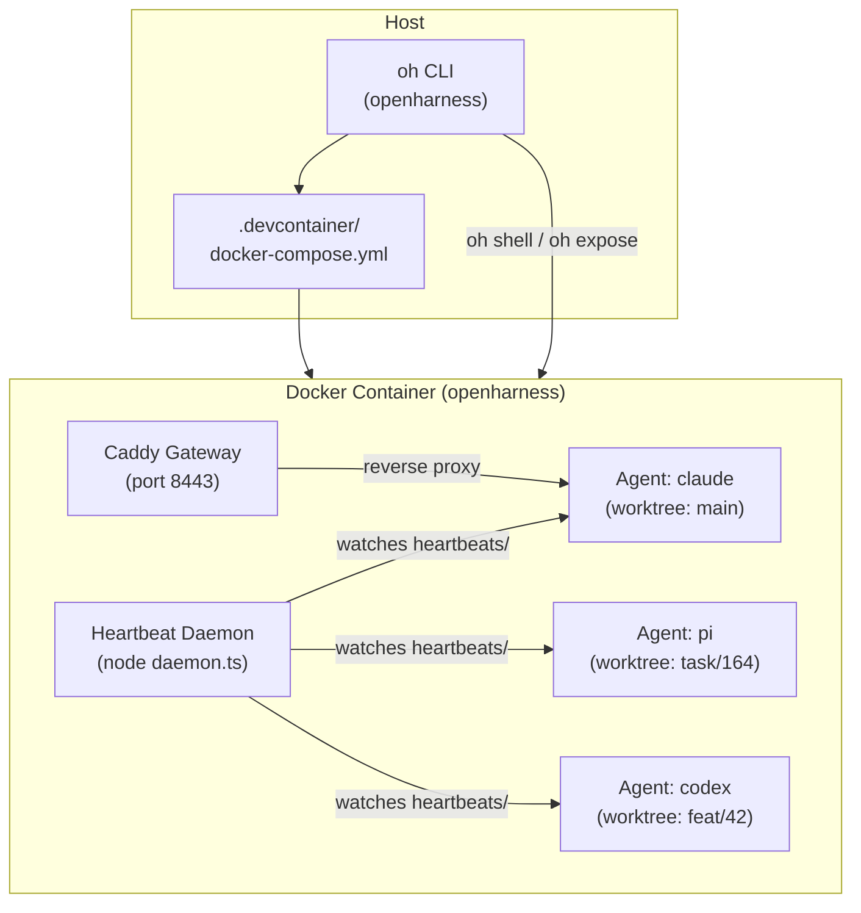

# Architecture Overview

Open Harness runs every AI agent inside a single Docker container. That container hosts multiple git worktrees side by side, one per agent branch. A heartbeat daemon watches all worktrees and fires scheduled tasks. The orchestration layer — the `oh` CLI and the Docker Compose configuration — lives on the host and manages the container lifecycle without entering it for day-to-day work.

## The Shape of the System



**ASCII version** (for terminal-friendly viewing):

```text
┌─────────────────────────────────────────────────────────┐
│  HOST                                                   │
│  ┌──────────────────┐   ┌──────────────────────────┐   │
│  │  oh CLI          │   │  docker-compose.yml       │   │
│  │  (openharness)   │──▶│  (.devcontainer/)         │   │
│  └──────────────────┘   └────────────┬─────────────┘   │
│                                      │ builds/starts    │
└──────────────────────────────────────┼─────────────────┘
                                       ▼
┌──────────────────────────────────────────────────────────┐
│  DOCKER CONTAINER  (openharness)                         │
│                                                          │
│  ┌────────────────────────────────────────────────────┐  │
│  │  Orchestration Layer                               │  │
│  │  oh CLI (inside) · gh · docker CLI · tmux          │  │
│  └───────────┬────────────────────────────────────────┘  │
│              │                                           │
│  ┌───────────▼──────────────────────────────────────┐   │
│  │  Worktrees (bind-mounted from host)               │   │
│  │  /home/orchestrator/harness/                (main)     │   │
│  │  /home/orchestrator/harness/.worktrees/task/164  (PR)  │   │
│  │  /home/orchestrator/harness/.worktrees/feat/42   (PR)  │   │
│  └───────────┬──────────────────────────────────────┘   │
│              │                                           │
│  ┌───────────▼──────────────────────────────────────┐   │
│  │  Agents (tmux sessions)                           │   │
│  │  agent-claude  ·  agent-pi  ·  agent-codex        │   │
│  └───────────┬──────────────────────────────────────┘   │
│              │                                           │
│  ┌───────────▼──────────────────────────────────────┐   │
│  │  Heartbeat Daemon                                 │   │
│  │  Watches workspace/heartbeats/ in every worktree  │   │
│  │  Fires cron jobs → invokes agent CLI              │   │
│  └──────────────────────────────────────────────────┘   │
│                                                          │
│  ┌──────────────────────────────────────────────────┐   │
│  │  Caddy Gateway (port 8443)                        │   │
│  │  Routes https://<name>.<sandbox>.localhost → app  │   │
│  └──────────────────────────────────────────────────┘   │
└──────────────────────────────────────────────────────────┘
```

## Key Principles

**One container, many agents.** All AI agent CLIs — Claude Code, Pi, Codex — share the same sandbox image built from `.devcontainer/Dockerfile`. There is no separate image per agent. Isolation is achieved through git worktrees and tmux sessions, not separate containers.

**Host stays thin.** The host only runs Docker and the `oh` CLI. No Node runtime, no Python, and no agent toolchain is required on the developer's machine. The project root is bind-mounted into the container at `/home/orchestrator/harness`, so files written inside the container are immediately visible on the host and in git.

**Worktrees are the unit of isolation.** Each in-flight branch maps to a worktree under `.worktrees/`. The heartbeat daemon discovers all active worktrees and manages schedules independently per worktree. Agents work in their own branch without touching each other's working tree.

**Process lifecycle is owned by tmux.** Every long-running process — dev servers, agents, tunnels, heartbeat daemon — runs in a named tmux session. This enables attach/detach, log capture via `tee /tmp/<session>.log`, and deterministic restart without `nohup` or background processes.

## Where to go next

- [Container Runtime](./container-runtime) — Dockerfile base, preinstalled tools, bind mounts, Caddy overlay.
- [Worktrees](./worktrees) — Branch naming, `.worktrees/` path, isolation rules.
- [Daemon](./daemon) — Heartbeat polling, config location, sync command.
