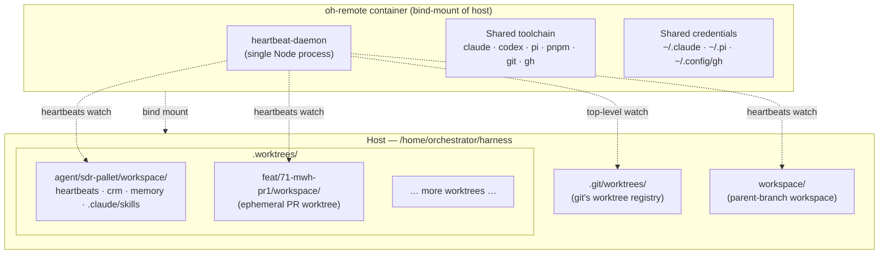
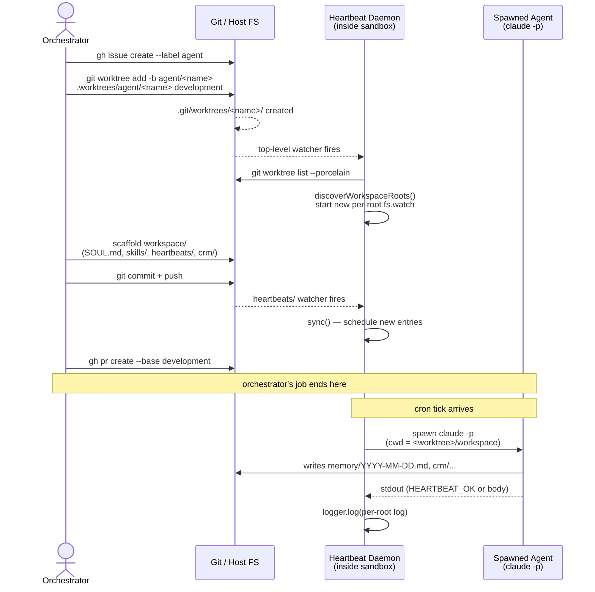

# Worktrees

Open Harness uses `git worktree` to give each in-flight branch its own working tree on disk — no branch switching, no stashing, no risk of accidentally committing to the wrong branch. Each agent or task can occupy its own worktree simultaneously.

## What a Worktree Is

A git worktree is a second (or third, or fourth) checkout of the same repository on a different branch. All worktrees share the same `.git` directory and object store. Creating a worktree does not clone anything — it is a lightweight operation that creates a new directory linked to the repo.

Inside the container, the primary checkout lives at `/home/orchestrator/harness`. Worktrees live under `/home/orchestrator/harness/.worktrees/`, which maps back to `.worktrees/` in the project root on the host.

## Directory Layout

```
/home/orchestrator/harness/                       ← primary checkout (development branch)
/home/orchestrator/harness/.worktrees/            ← worktree root (gitignored)
/home/orchestrator/harness/.worktrees/.gitkeep    ← tracked so the directory exists in git
/home/orchestrator/harness/.worktrees/task/164-docusaurus-docs-site/   ← worktree for task branch
/home/orchestrator/harness/.worktrees/feat/42-slack-thread-replies/    ← worktree for feature branch
```

The `.worktrees/` directory is gitignored via `.gitignore`. Only `.worktrees/.gitkeep` is committed, ensuring the directory exists after a fresh clone without committing any worktree content.

## Creating a Worktree

To cut a new branch and check it out in a worktree in one step:

```bash
BASE=development
git worktree add -b task/164-docusaurus-docs-site \
  .worktrees/task/164-docusaurus-docs-site $BASE
```

To add an existing branch as a worktree:

```bash
git worktree add .worktrees/task/164-docusaurus-docs-site task/164-docusaurus-docs-site
```

To remove a worktree when the branch is merged:

```bash
git worktree remove .worktrees/task/164-docusaurus-docs-site
```

## Branch Naming Convention

Branch names follow the format `<prefix>/<issue#>-<short-desc>` where:

- `<prefix>` is one of: `feat`, `fix`, `task`, `audit`, `skill`, `agent`
- `<issue#>` is the GitHub issue number the branch addresses
- `<short-desc>` is kebab-case, five words or fewer

Examples: `task/164-docusaurus-docs-site`, `feat/42-slack-thread-replies`

The worktree path mirrors the branch name exactly: `.worktrees/<prefix>/<issue#>-<short-desc>`.

PRs always target the `development` branch (the default target branch for this repo). New branches are always cut from `development`.

## Isolation Rules

Each worktree provides file-level isolation. Two agents can work simultaneously on different branches without any conflict at the working-tree level. However, there are important constraints to respect:

**Do not stash and switch branches.** When a primary checkout has uncommitted changes that belong to a separate PR, use a worktree instead. Stashing and switching branches risks losing context. The correct flow is:

1. Cut a worktree off the target base: `git worktree add -b <new-branch> .worktrees/<new-branch> development`
2. Copy any in-flight files into the worktree with `cp`
3. Commit in the worktree — the primary checkout remains untouched

Before discarding duplicated state from the primary checkout, verify byte-equivalence using `md5sum` to confirm the worktree commit matches the working-tree files.

**Stacked PRs.** When a branch depends on another open PR, stack it instead of waiting. Rebase the dependent branch onto the parent branch, update the PR base with `gh pr edit <pr#> --base <parent-branch>`, and let GitHub auto-retarget when the parent merges.

## Heartbeat Daemon and Worktrees

The heartbeat daemon in `packages/sandbox/src/lib/heartbeat/` watches the `workspace/heartbeats/` directory inside every active worktree. When a new worktree appears (detected by watching `.git/worktrees/`), the daemon discovers it automatically and starts managing its heartbeat schedules. See the [Daemon](./daemon) page for details.

## Practical Example

The worktree for this documentation task was created as:

```bash
git worktree add -b task/164-docusaurus-docs-site \
  .worktrees/task/164-docusaurus-docs-site development
```

Work happens in `/home/orchestrator/harness/.worktrees/task/164-docusaurus-docs-site/`. A PR is opened targeting `development`. When the PR merges, the worktree is removed with `git worktree remove .worktrees/task/164-docusaurus-docs-site`.

## Topology

Open Harness runs on a single pattern: **one parent sandbox, N git worktrees, one heartbeat daemon**. Every harness is a git branch checked out as a worktree under `.worktrees/`. The sandbox container bind-mounts the entire repo, so all worktrees are visible to one shared toolchain and one shared credential set.



One container. N git worktrees. One daemon watching every worktree's `heartbeats/` directory at once.

## Who Owns What

### Orchestrator

- **Runs at:** the project root (`/home/orchestrator/harness`) — usually a Claude Code session attached to the sandbox.
- **Owns:** harness source (`packages/sandbox/`, `.devcontainer/`, `install/`), git operations, GitHub issues/PRs/releases, sandbox lifecycle skills (`/provision`, `/destroy`, `/repair`), and the one-time scaffold of each new harness's `workspace/`.
- **Does not write application code.** Agents do that inside their workspaces.

### Worktree harness

- **Runs at:** `.worktrees/<prefix>/<slug>/workspace/` — either as an interactive `claude` session or as a short-lived heartbeat spawn.
- **Owns:** its `workspace/` subtree (SOUL.md, MEMORY.md, skills, heartbeats, memory, crm, wiki, projects) and its branch history.
- **Does not touch:** harness source, other worktrees, or the daemon.

### Sandbox container

Default name `oh-remote`. Bind-mounts `/home/orchestrator/harness` into the container so all worktrees are visible automatically. Hosts the shared toolchain (`claude`, `codex`, `pi`, `pnpm`, `git`, `gh`, Docker socket) and shared credentials (`~/.claude`, `~/.pi`, `~/.config/gh`). Boots via `install/entrypoint.sh`, which starts the heartbeat daemon under a watchdog.

### Heartbeat daemon

One Node process per sandbox. On startup (and whenever `.git/worktrees/` changes), it runs `git worktree list --porcelain` and includes every worktree whose `workspace/heartbeats/` exists. Each worktree gets its own `fs.watch`, its own log file, and namespaced scheduler keys (`${label}::${slug}`) so two worktrees can ship identically-named heartbeats without collision. Each heartbeat spawn sets `cwd = <worktree>/workspace`, so the agent CLI resolves skills, settings, and relative paths against the correct worktree. See the [heartbeats overview](../heartbeats/overview.md) for env vars and log layout.

## New-Harness Boot Sequence



The orchestrator's job ends once the PR is opened. After that, the agent is self-directing on its heartbeat schedule (plus interactive sessions inside the sandbox).

## Discovery

The daemon discovers worktrees from `.git/worktrees/` — git's own authoritative registry — not from walking the filesystem. Rules:

1. Run `git -C <home>/harness worktree list --porcelain`.
2. Include any worktree whose `<path>/workspace/heartbeats/` exists.
3. Compute a label: strip `refs/heads/`, replace `/` with `-`, lowercase. `agent/sdr-pallet` → `agent-sdr-pallet`. Detached HEAD → `detached-<shortsha>`.
4. Honor `HEARTBEAT_ROOTS=path1:label1,path2:label2` overrides. Overrides win on path collisions.
5. Warn if the discovered root count exceeds 32 (inotify sanity check).

Layout under `.worktrees/` can be nested, flat, or symlinked — discovery doesn't care.

## Spawn Semantics

Every heartbeat spawn sets `cwd` to its worktree's `workspace/`:

```ts
spawn("claude", ["-p", prompt, "--dangerously-skip-permissions"], {
  cwd: entry.root.workspacePath,        // e.g. .../sdr-pallet/workspace
  signal: AbortSignal.timeout(300_000),
});
```

Consequences:

- `claude` loads that worktree's `workspace/.claude/settings.json` (model, permissions, hooks).
- Slash-skills resolve against `workspace/.claude/skills/`.
- Relative paths in prompts (`memory/YYYY-MM-DD.md`, `crm/leads.csv`) land in the right worktree.
- Credentials are shared — one `gh auth`, one Anthropic key across all agents.

## Isolation Properties

| Dimension | Isolated? | Notes |
|-----------|-----------|-------|
| Filesystem under `workspace/` | Yes | Each worktree owns its subtree |
| Git history / branch state | Yes | Worktrees are fully independent |
| Heartbeat schedules + logs | Yes | Per-root logger, per-root watcher |
| Agent identity (SOUL.md, skills) | Yes | Per-root, loaded via spawn cwd |
| Memory + CRM + wiki artifacts | Yes | Per-root directories |
| Credentials | **No** | One `gh auth`, one Anthropic key |
| Container runtime | **No** | Same processes, /tmp, network |
| API quotas | **No** | `HEARTBEAT_MAX_CONCURRENT` smooths bursts |
| OS / kernel | **No** | One container |

This is **thin isolation** — enough to keep agent artifacts clean and independently committable, not enough to sandbox a hostile agent. All agents in a sandbox must be mutually trusted.

## Worktree vs New Sandbox

**Add a new worktree harness when:**

- The work lives on a branch you'd eventually merge back.
- The harness shares the same stack, credentials, and trust level.
- You want shared tooling and independent identity.
- The daemon should schedule it alongside other agents.

**Add a new sandbox when:**

- You need kernel-level isolation (untrusted code, tenant separation).
- The harness needs a different OS, different base image, or conflicting global tooling.
- You need isolated rate limits (separate Anthropic account, separate API quota).
- You're reproducing a customer environment for debugging.

Most "I want to add a harness" cases are the first bucket. New sandboxes are rare.

## Operational Snippets

Add a harness:

```bash
# From the orchestrator session (project root)
gh issue create --label agent --title "agent(#N): <name> — <role>"
git worktree add -b agent/<name> .worktrees/agent/<name> development
# Scaffold workspace/ for the harness's role
git commit -m "agent(#N): scaffold <name>"
git push -u origin agent/<name>
# Daemon auto-discovers within ~500 ms
```

Verify it's live:

```bash
# Inside the sandbox
heartbeat-daemon status
# Look for: "Roots:" section includes the harness, per-root schedules listed
```

Read per-root logs:

```bash
tail -f /home/orchestrator/harness/workspace/heartbeats/heartbeat.log
tail -f /home/orchestrator/harness/.worktrees/agent/<name>/workspace/heartbeats/heartbeat.log
```

Retire a harness:

```bash
git worktree remove .worktrees/agent/<name>
# Daemon drops it on the next .git/worktrees/ mutation
```
