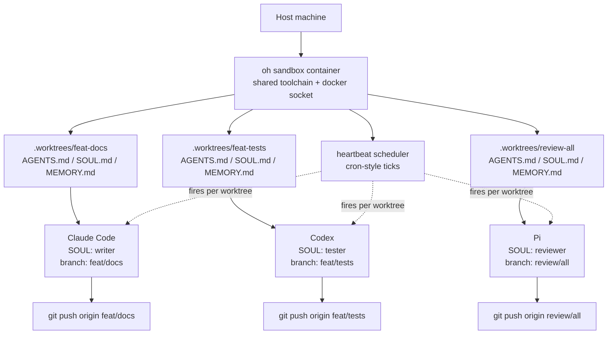

# One Worktree Per Agent

We tried one container per agent. It cost $40 a month per agent. Here is what we did instead.

## The $40 problem

Spinning up a fresh container for every coding agent is the obvious first move. It is also the wrong one. A small VPS that can comfortably host a Claude Code session — Node, pnpm, Python, Docker-in-Docker, a checkout of the repo, and enough memory not to thrash — runs about $8 a month on a budget host. Multiply that by five agents and you are at $40 a month before you have shipped a single feature. Make it ten and you are paying $80 to keep ten copies of the same toolchain warm.

The cost is the visible part of the problem. The hidden part is worse. Each container has its own `node_modules`, its own pnpm store, its own Docker image cache, its own git object database. A change to a shared dependency means rebuilding it five times. A new tool installed for one agent has to be reinstalled for the rest, or the agents diverge. There is no shared workspace, so when two agents need to look at the same generated artifact they each have to regenerate it. The agents are isolated, and that isolation has a real cost in money, in disk, and in the friction of keeping five identical setups identical.

## The constraint

What do agents actually need from each other? Two things, mostly: a separate branch and separate state. One agent should be able to commit to `feat/docs` while another commits to `feat/tests` without either one stepping on the other. One agent should be able to keep its memory, its current task, and its working files distinct from the next agent's.

Notice what is **not** on that list. Agents do not need separate kernels. They do not need separate package managers. They do not need separate Docker daemons. They do not even need separate filesystems — they need separate **views** of a filesystem.

Git already solves the "separate branch, separate working tree" problem cheaply. It is called `git worktree`. A worktree is a second working directory backed by the same `.git` object store as your main checkout. Each worktree is on a different branch, has its own staged index, its own untracked files. From the inside, an agent in a worktree looks like an agent that owns the whole repo. From the outside, it is just another directory pointing at shared objects.

So the design fell out: one container, many worktrees, one agent per worktree. The container handles the toolchain and the kernel and the Docker socket. The worktree handles the branch and the working state. An agent gets full isolation where isolation matters and shares everything where sharing is free.

## The architecture



One sandbox container at the top. Inside it, `oh worktree <name>` carves a new directory under `.worktrees/`. Each worktree gets its own `AGENTS.md` (operating procedures), `SOUL.md` (persona), `MEMORY.md` (running notes), and its own heartbeat config. The heartbeat scheduler runs once at the container level and fans out per worktree, so agent A's hourly check does not block agent B's nightly release. Every agent gets the same Docker socket — they can all build images, run containers, talk to the same registry — but no agent can see another agent's branch or working tree without crossing a directory boundary.

The cost model collapses. One VPS, one toolchain, one pnpm store, one Docker image cache. The marginal cost of adding the sixth agent is whatever a new directory and a new branch costs, which is to say, nothing.

## A real example

Suppose you want a Claude Code agent writing documentation and a Codex agent writing tests, both on the same repo, both committing without stepping on each other. From the host you start the sandbox once:

```bash
openharness sandbox up
```

Inside the sandbox you create two worktrees, one per agent:

```bash
oh worktree feat/docs    # cuts .worktrees/feat/docs from development
oh worktree feat/tests   # cuts .worktrees/feat/tests from development
```

Each worktree comes with the workspace template — an `AGENTS.md` you edit to give that agent its operating rules, a `SOUL.md` for personality, a `MEMORY.md` it will write to as it works. You launch the agents in their own tmux sessions so they survive disconnects:

```bash
tmux new-session -d -s agent-docs  -c .worktrees/feat/docs  'claude'
tmux new-session -d -s agent-tests -c .worktrees/feat/tests 'codex'
```

Two agents, two branches, one container. Claude opens files under `.worktrees/feat/docs/` and commits to `feat/docs`. Codex does the same under `feat/tests`. They never see each other's working files. When they push, two separate PRs land on GitHub. You can attach to either tmux session at any time, watch the agent work, detach, and walk away. You could run five Claudes and five Codexes the same way — ten worktrees, ten branches, one bill. The constraint is your CPU, not your billing page.

Heartbeats per worktree fire independently. Drop a `heartbeats/nightly-release.md` into the docs worktree and only the docs agent runs it. The tests worktree has its own `heartbeats/` directory and its own schedule. No global cron file to coordinate.

## The honest tradeoffs

What worktree-per-agent does **not** solve: concurrent writes to non-git state. Two agents installing different versions of the same npm package into a shared `node_modules` will fight. We handle that with per-worktree `node_modules` (a symlink dance, or just a plain `pnpm install` per worktree) — the disk cost is trivial because the pnpm store is shared, and most installs are hardlinks. If your toolchain has its own global cache (Cargo, Go modules, Maven), the same logic applies: shared store, per-worktree resolution.

The other thing it does not solve is genuinely incompatible toolchains. If one agent needs Node 18 and another needs Node 22, you are back to multiple containers. We have not hit that yet — most coding agents are happy on the same Node — but it is the obvious cliff.

## Try it

The whole pattern lives in [open-harness](https://github.com/ryaneggz/open-harness). Clone it, run `openharness sandbox up`, run `oh worktree my-first-agent`, and you have your first isolated agent workspace in under a minute. The full walkthrough is in the [docs](../README.md), and the companion piece on the wider design — [Bring Your Own Harness](./byoh.md) — dropped Tuesday and explains why the harness itself is a project worth owning, not a SaaS to rent.

If you have been hesitating because you assumed multi-agent setups were expensive, they are not. They are one container and a few `git worktree add` commands away.
