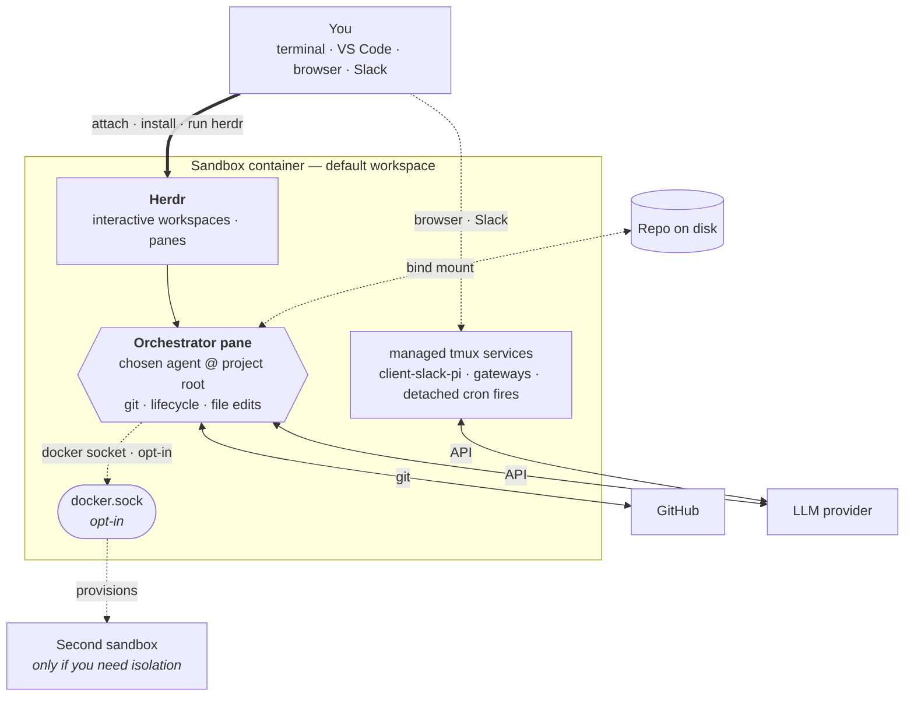

# Open Harness

Open Harness is your **portable harness** — one repo per sandbox — that wraps your project in an isolated Docker container and versions its state. The repo tracks the agent's identity, skills, crons, and memory in git; the sandbox keeps the agent (Claude Code, Codex, Pi, or another of your choice) off your host machine. The agent owns its workspace, runs against your code, and wakes itself on a schedule via a tiny croner runtime.

## What is Open Harness?

Open Harness is a single repo that *is* your harness: it boots one Docker container — the sandbox — and wraps your project inside it. You bring the sandbox up with `oh sandbox install docker`, attach to it from your terminal or VS Code, and let your chosen agent work the project over time. Because the harness is a git repo, its whole setup is tracked and versioned — reproducible and portable. There is no per-agent fan-out: one host CLI, `oh`, drives the whole lifecycle, and the croner runtime that ships in the image wakes the agent on a schedule.

Key capabilities:

- **One repo, one sandbox.** Your portable harness is one repo; it boots one container. The agent owns its workspace; your machine stays clean — you're not running agents straight on your host.
- **Markdown-defined crons.** `crons/*.md` files declare schedules; an in-container croner runtime fires the bodies as agent prompts so the agent can work autonomously while you focus on other things.
- **Host dependencies: Docker, Git, and Node.js ≥ 20.** No Python, no pnpm, no agent CLIs, and no toolchain maintenance on your laptop — Node runs the `oh` CLI and nothing else, and `get-oh.sh` installs it for you when it is missing. (See [Prerequisites](/docs/installation#prerequisites).)
- **Cloudflared previews.** Share sandbox app ports through Cloudflared tunnels; SSH and pack-supplied services remain opt-in Docker Compose overlays.
- **Multi-agent messaging.** Bridge Slack (and other messengers) to a Pi agent with the [`pi-messenger-bridge`](/docs/integrations/slack) npm package; SSH and pack-supplied services remain opt-in Docker Compose overlays.

## How it works

The harness uses Docker Compose to build a sandbox image from `.devcontainer/`. Bring it up with `oh sandbox install docker`, attach with `oh shell <name>` (or VS Code), then run `oh tool install herdr` and `herdr` first — nothing installs at boot. Authenticate GitHub and your chosen provider and launch agents from Herdr panes. `oh stop` preserves state; `oh destroy` is the destructive teardown, and it asks before it wipes the volumes. Every one of those verbs runs `.oh/scripts/docker-compose.sh` — see [lifecycle commands](/docs/lifecycle-commands).

The primary agent pane at the project root inside Herdr is your **orchestrator** — git, sandbox lifecycle, and most file edits all flow through that organized workspace. When the optional Docker socket is enabled (off by default — see [security-considerations.md](security-considerations.md#3-sandbox-isolation--the-docker-socket-caveat--enforced-with-a-caveat)), the orchestrator can also drive other containers and edit files inside them over that socket, so day-to-day work rarely needs anything else. Drop back to the host shell only when something can't be done from inside the container — typically adding a new bind-mounted volume, which requires a `.devcontainer/docker-compose.yml` change and restart.

Stand up a **second sandbox** only when you want isolation — an independent identity, branch, or provider key running on its own. Most users won't need this.

Inside the sandbox, systemd runs `scripts/cron-runtime.ts` as `openharness-cron.service`, which reads `crons/*.md` and fires each body as a prompt to the configured agent on its declared schedule.

## How to read these docs

If you are new, follow this order:

1. [Installation](/docs/installation) — install Docker, Git, and the `oh` CLI.
2. [Quickstart](/docs/quickstart) — go from zero to a running sandbox in under five minutes.

If you already have a sandbox running, jump directly to the page you need.

## Where to get help

- Source code and issues: [github.com/mifunedev/openharness](https://github.com/mifunedev/openharness)
- Learning material: [Resources](/docs/resources)
- Philosophy: [How Open Harness embodies compound engineering](https://github.com/mifunedev/openharness-web/tree/main/blog) — why each unit of work here should make the next one easier.

[Connecting to the Sandbox](/docs/connecting)
