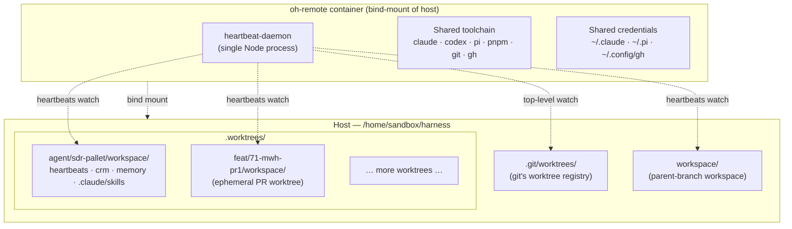
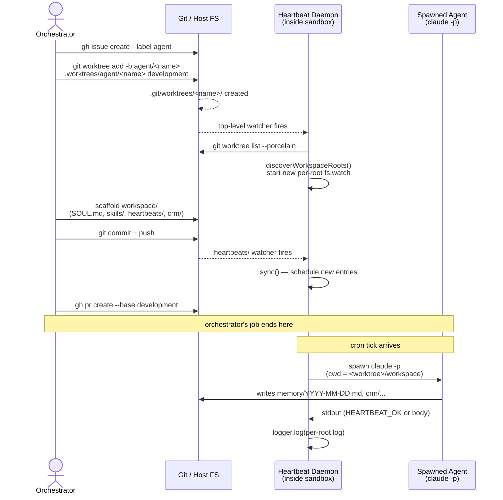
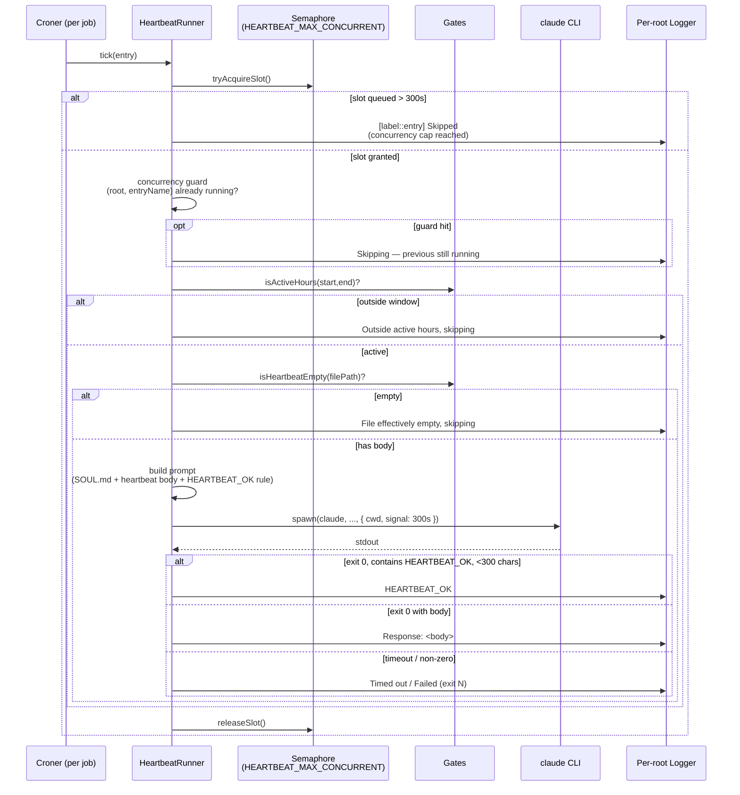

Open Harness runs on a single pattern: **one parent sandbox, N git worktrees, one heartbeat daemon**. Every agent is a git branch checked out as a worktree under `.worktrees/`. The sandbox container bind-mounts the entire repo, so all worktrees are visible to one shared toolchain and one shared credential set. A single heartbeat daemon inside the sandbox watches all of them at once.

This page explains the topology, who owns what, and how a new agent comes online. For implementation detail (file paths, scheduler keys, change targets), see the [canonical spec](https://github.com/ryaneggz/open-harness/blob/development/.claude/specs/orchestrator-worktree-architecture.md).

## At a glance



One container. N git worktrees. One daemon watching every worktree's `heartbeats/` directory at once.

## Why this shape

- **Branches have identities.** An `agent/<name>` branch owns a whole workspace — SOUL.md, skills, CRM, heartbeats, memory. Agent identity is files on disk, not runtime config.
- **One container per agent is too heavy.** A sandbox is a real OS with its own toolchain, credentials, and dev servers. Duplicating that per agent explodes resource use.
- **Merging agent work back is a git problem.** Git worktrees already solve "multiple branches checked out at once." The natural fit: worktrees on the host, one container for all of them.

## Actors

### Orchestrator

- **Runs at:** the project root (`/home/sandbox/harness`) — usually a Claude Code session attached to the sandbox.
- **Owns:** harness source (`packages/sandbox/`, `.devcontainer/`, `install/`), git operations, GitHub issues/PRs/releases, sandbox lifecycle skills (`/provision`, `/destroy`, `/repair`), and the one-time scaffold of each new agent's `workspace/`.
- **Does not write application code.** Agents do that inside their workspaces.

### Worktree agent

- **Runs at:** `.worktrees/<prefix>/<slug>/workspace/` — either as an interactive `claude` session or as a short-lived heartbeat spawn.
- **Owns:** its `workspace/` subtree (SOUL.md, MEMORY.md, skills, heartbeats, memory, crm, wiki, projects) and its branch history.
- **Does not touch:** harness source, other worktrees, or the daemon.

### Sandbox container

Default name `oh-remote`. Bind-mounts `/home/sandbox/harness` into the container so all worktrees are visible automatically. Hosts the shared toolchain (`claude`, `codex`, `pi`, `pnpm`, `git`, `gh`, Docker socket) and shared credentials (`~/.claude`, `~/.pi`, `~/.config/gh`). Boots via `install/entrypoint.sh`, which starts the heartbeat daemon under a watchdog.

### Heartbeat daemon

One Node process per sandbox. On startup (and whenever `.git/worktrees/` changes), it runs `git worktree list --porcelain` and includes every worktree whose `workspace/heartbeats/` exists. Each worktree gets its own `fs.watch`, its own log file, and namespaced scheduler keys (`${label}::${slug}`) so two worktrees can ship identically-named heartbeats without collision. Each heartbeat spawn sets `cwd = <worktree>/workspace`, so the agent CLI resolves skills, settings, and relative paths against the correct worktree. See the [heartbeats guide](/guide/heartbeats) for env vars and log layout.

## Lifecycle of a new agent



The orchestrator's job ends once the PR is opened. After that, the agent is self-directing on its heartbeat schedule (plus interactive sessions inside the sandbox).

## Discovery

The daemon discovers worktrees from `.git/worktrees/` — git's own authoritative registry — not from walking the filesystem. Rules:

1. Run `git -C <home>/harness worktree list --porcelain`.
2. Include any worktree whose `<path>/workspace/heartbeats/` exists.
3. Compute a label: strip `refs/heads/`, replace `/` with `-`, lowercase. `agent/sdr-pallet` → `agent-sdr-pallet`. Detached HEAD → `detached-<shortsha>`.
4. Honor `HEARTBEAT_ROOTS=path1:label1,path2:label2` overrides. Overrides win on path collisions.
5. Warn if the discovered root count exceeds 32 (inotify sanity check).

Layout under `.worktrees/` can be nested, flat, or symlinked — discovery doesn't care.

## Spawn semantics

Every heartbeat spawn sets `cwd` to its worktree's `workspace/`:

```ts
spawn("claude", ["-p", prompt, "--dangerously-skip-permissions"], {
  cwd: entry.root.workspacePath,        // e.g. .../sdr-pallet/workspace
  signal: AbortSignal.timeout(300_000),
});
```

Consequences:

- `claude` loads that worktree's `workspace/.claude/settings.json` (model, permissions, hooks).
- Slash-skills resolve against `workspace/.claude/skills/`.
- Relative paths in prompts (`memory/YYYY-MM-DD.md`, `crm/leads.csv`) land in the right worktree.
- Credentials are shared — one `gh auth`, one Anthropic key across all agents.

## Isolation properties

| Dimension | Isolated? | Notes |
|-----------|-----------|-------|
| Filesystem under `workspace/` | Yes | Each worktree owns its subtree |
| Git history / branch state | Yes | Worktrees are fully independent |
| Heartbeat schedules + logs | Yes | Per-root logger, per-root watcher |
| Agent identity (SOUL.md, skills) | Yes | Per-root, loaded via spawn cwd |
| Memory + CRM + wiki artifacts | Yes | Per-root directories |
| Credentials | **No** | One `gh auth`, one Anthropic key |
| Container runtime | **No** | Same processes, /tmp, network |
| API quotas | **No** | `HEARTBEAT_MAX_CONCURRENT` smooths bursts |
| OS / kernel | **No** | One container |

This is **thin isolation** — enough to keep agent artifacts clean and independently committable, not enough to sandbox a hostile agent. All agents in a sandbox must be mutually trusted.

## Worktree vs new sandbox

**Add a new worktree agent when:**

- The work lives on a branch you'd eventually merge back.
- The agent shares the same stack, credentials, and trust level.
- You want shared tooling and independent identity.
- The daemon should schedule it alongside other agents.

**Add a new sandbox when:**

- You need kernel-level isolation (untrusted code, tenant separation).
- The agent needs a different OS, different base image, or conflicting global tooling.
- You need isolated rate limits (separate Anthropic account, separate API quota).
- You're reproducing a customer environment for debugging.

Most "I want to add an agent" cases are the first bucket. New sandboxes are rare.

## Heartbeat firing flow



Key invariants: `cwd` is set per entry, never shared across worktrees. The semaphore is daemon-global and FIFO. Each worktree writes to its own `heartbeats/heartbeat.log`.

## Trust boundary

All worktrees discovered from the main checkout's `.git/worktrees/` are treated as trusted. This is the same trust model as the rest of the sandbox: if you can `git commit` to a branch in this repo, you can make the daemon run code on your behalf. The `--dangerously-skip-permissions` flag on the `claude` spawn makes this explicit. Do not point `HEARTBEAT_ROOTS` at untrusted paths; do not provision a sandbox from a repo you don't own.

## Operational snippets

Add an agent:

```bash
# From the orchestrator session (project root)
gh issue create --label agent --title "agent(#N): <name> — <role>"
git worktree add -b agent/<name> .worktrees/agent/<name> development
# Scaffold workspace/ for the agent's role
git commit -m "agent(#N): scaffold <name>"
git push -u origin agent/<name>
# Daemon auto-discovers within ~500 ms
```

Verify it's live:

```bash
# Inside the sandbox
heartbeat-daemon status
# Look for: "Roots:" section includes the agent, per-root schedules listed
```

Read per-root logs:

```bash
tail -f /home/sandbox/harness/workspace/heartbeats/heartbeat.log
tail -f /home/sandbox/harness/.worktrees/agent/<name>/workspace/heartbeats/heartbeat.log
```

Retire an agent:

```bash
git worktree remove .worktrees/agent/<name>
# Daemon drops it on the next .git/worktrees/ mutation
```

## Further reading

- [How It Works](/architecture/how-it-works) — boot sequence and container environment.
- [Project Structure](/architecture/structure) — repo layout.
- [Heartbeats guide](/guide/heartbeats) — multi-root discovery, env vars, log layout.
- **Canonical spec** — [`.claude/specs/orchestrator-worktree-architecture.md`](https://github.com/ryaneggz/open-harness/blob/development/.claude/specs/orchestrator-worktree-architecture.md) — file-path tables, change-target matrices, failure modes.
- **Daemon spec** — [`.claude/specs/multi-worktree-heartbeats-spec.md`](https://github.com/ryaneggz/open-harness/blob/development/.claude/specs/multi-worktree-heartbeats-spec.md) — internal daemon design.
