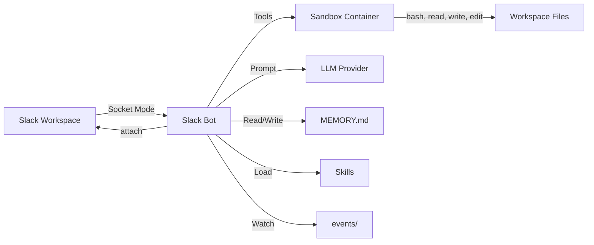

The Open Harness Slack bot is an LLM-powered agent that connects to your workspace via Socket Mode and runs inside the sandbox container, giving it direct access to the full runtime environment.

## Capabilities

| Capability | Description |
|------------|-------------|
| Self-managing | Installs its own tools, configures credentials, maintains its workspace |
| Full bash access | Execute any command inside the sandbox container |
| Per-channel isolation | Each channel gets its own conversation history, memory, and working directory |
| Thread-based details | Clean main messages with verbose tool details in threads |
| Skills | Custom CLI tools the agent creates for your workflows |
| Events | Schedule reminders and periodic tasks via JSON files |
| Persistent memory | Remembers context across sessions via MEMORY.md files |

## Quick links

- [Setup](./setup.md) — Configure your Slack app and connect the bot
- [How It Works](./how-it-works.md) — Message flow and workspace layout
- [Events](./events.md) — Schedule tasks and reminders
- [Security](./security.md) — Prompt injection, isolation, access control
