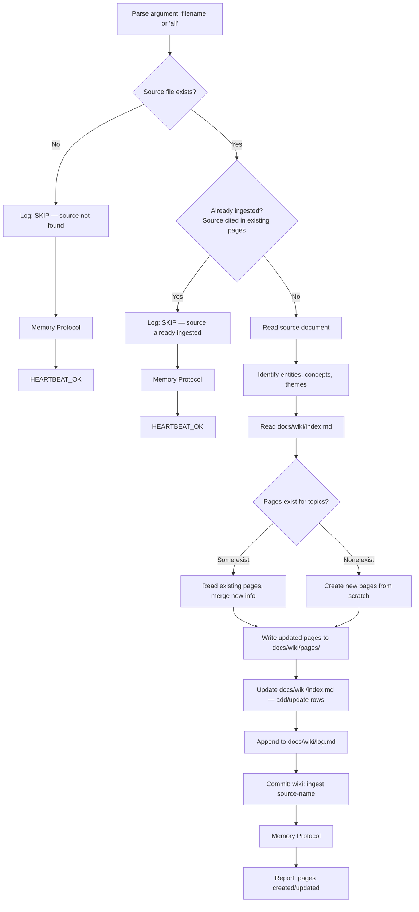

# Wiki Ingest

Process source documents into structured, interlinked wiki pages. Each source
is read once and its knowledge compiled into entity and concept pages that
accumulate over time.

## Decision Flow



## Instructions

### 1. Parse target

Arguments: `$ARGUMENTS`

| Argument | Behavior |
|----------|----------|
| `<filename>` | Ingest specific file from `docs/wiki/sources/` |
| `all` | Find all unprocessed sources (not yet cited in any page's frontmatter) |
| *(none)* | Default to `all` |

### 2. Guard: source exists

```bash
ls docs/wiki/sources/<filename>
```

If not found, log `[wiki-ingest] SKIP: source not found — <filename>`, then Memory Protocol, `HEARTBEAT_OK`.

### 3. Guard: dedup check

For each target source, scan existing wiki pages for citations:

```bash
grep -rl "<filename>" docs/wiki/pages/ 2>/dev/null
```

If the source is already cited in the `sources:` frontmatter of existing pages, log `[wiki-ingest] SKIP: <filename> already ingested`, then Memory Protocol, `HEARTBEAT_OK`.

To re-ingest a source (force update), the user must explicitly pass the filename — `all` mode skips already-ingested sources.

### 4. Read the source document

Read the full content. Identify the document type from content structure:
- Article (headings, paragraphs, links)
- Paper (abstract, sections, references)
- Transcript (speaker labels, timestamps)
- Notes (bullets, fragments)
- Data (tables, JSON, CSV)

### 5. Extract topics

Identify from the source:
- **Entities**: people, organizations, projects, tools, products, repos
- **Concepts**: ideas, frameworks, methodologies, patterns, techniques
- **Themes**: cross-cutting connections to existing wiki content

Each topic becomes a candidate page. Reuse existing tags from `docs/wiki/index.md` when possible to avoid tag proliferation.

### 6. Check existing pages

Read `docs/wiki/index.md`. For each candidate topic, check if a page already exists (match by title, case-insensitive). Classify each as:
- **CREATE** — new page needed
- **UPDATE** — existing page needs new info from this source

### 7. Create new pages

For each CREATE candidate, write `docs/wiki/pages/<kebab-case-title>.md`:

```markdown
---
title: "<Entity or Concept Name>"
description: "<One-line summary>"
type: entity | concept
tags: [tag1, tag2]
sources: [source-filename.md]
created: YYYY-MM-DD
updated: YYYY-MM-DD
related: [other-page.md]
---

# <Title>

<2-3 sentence summary>

## Key Points

- Point 1 [Source: source-filename.md]
- Point 2 [Source: source-filename.md]

## Context

<How this entity/concept relates to other wiki pages>

## See Also

- [Related Page Title](related-page.md)
```

Rules:
- `title` and `description` are required (Fumadocs-compatible)
- `type` is `entity` or `concept` (never `synthesis` — that's for query file-back)
- `tags` reuse existing tags from the index; add new tags sparingly
- `sources` lists the source filename(s) this page was derived from
- `related` links to other wiki pages by filename
- Body uses standard markdown links, not `[[wikilinks]]`
- Citations inline as `[Source: filename.md]`

### 8. Update existing pages

For each UPDATE candidate:
1. Read the existing page from `docs/wiki/pages/`
2. Add new key points with source citations
3. Add the new source to the `sources:` frontmatter array
4. Update the `updated:` date
5. Add new `related:` entries if the source reveals connections
6. Do NOT remove existing content — only add or refine

### 9. Update index

Read `docs/wiki/index.md`. For each page created or updated:
- **Created**: add a new row to the Pages table
- **Updated**: update the `Sources` count and `Updated` column

Recalculate the Statistics section. Update the "Last updated" and "Last ingest" timestamps.

### 10. Append to log

Append to `docs/wiki/log.md`:

```markdown
## [INGEST] — YYYY-MM-DD HH:MM UTC
- **Pages**: [comma-separated page filenames]
- **Sources**: [source filename(s)]
- **Summary**: Ingested <source>, created N new pages, updated M existing pages
```

### 11. Commit

```bash
git add docs/wiki/
git commit -m "wiki: ingest <source-filename>"
```

### 12. Memory Improvement Protocol

**a) Log** — append to `memory/YYYY-MM-DD.md`:

```markdown
## Wiki Ingest — HH:MM UTC
- **Result**: OP | NO-OP | SKIP
- **Item**: "<source filename>" (or "none")
- **Action**: [ingested source, created N pages, updated M pages / skipped (not found) / no unprocessed sources]
- **Duration**: ~Xs
- **Observation**: [one sentence — topic coverage, quality of source, connections found]
```

**b) Qualify** — ask:
- Did the source reveal connections between existing pages? → Note in observation
- Did tag reuse work or did new tags proliferate? → Note if tags need cleanup
- Was the source too large for a single ingest? → Note chunking suggestion
- Did any extracted topic overlap ambiguously with an existing page? → Note merge candidate

**c) Improve** — if qualification found something actionable:
- Append to `MEMORY.md > Lessons Learned` for durable insights
- Do NOT update MEMORY.md for routine ingests

**d) Report** — end with:
- `HEARTBEAT_OK` (skipped or no unprocessed sources)
- `HEARTBEAT_OK — memory updated` (learned something)
- Full report (ingested — pages created/updated + source name)

## Reference

| Resource | Path |
|----------|------|
| Wiki index | `docs/wiki/index.md` |
| Wiki log | `docs/wiki/log.md` |
| Source documents | `docs/wiki/sources/` |
| Wiki pages | `docs/wiki/pages/` |
| Identity | `IDENTITY.md` |
| Memory | `MEMORY.md` |
| Daily Logs | `memory/YYYY-MM-DD.md` |
