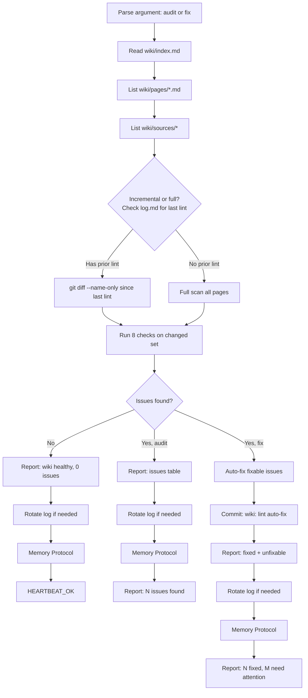

# Wiki Lint

Health-check the wiki for structural issues and optionally auto-fix them.
Runs incrementally — only checks files changed since last lint when possible.

## Decision Flow



## Instructions

### 1. Parse mode

Arguments: `$ARGUMENTS`

| Argument | Behavior |
|----------|----------|
| `audit` | Report only — no modifications (default) |
| `fix` | Auto-fix where safe, report unfixable issues |

If no argument, default to `audit`.

### 2. Gather state

```bash
# Index
cat wiki/index.md

# Pages on disk
ls wiki/pages/*.md 2>/dev/null

# Sources on disk
ls wiki/sources/* 2>/dev/null
```

Parse each page's YAML frontmatter for `title`, `type`, `tags`, `sources`, `updated`, `related`.

### 3. Determine scope (incremental vs full)

Search `wiki/log.md` for the most recent `[LINT]` entry:

```bash
grep "^\## \[LINT\]" wiki/log.md | tail -1
```

If found, extract the timestamp and run incremental lint:

```bash
git diff --name-only --since="<timestamp>" -- wiki/
```

Only lint changed files + their related pages. If no prior lint found, run a full scan of all pages.

### 4. Run 8 checks

#### Check 0: Index integrity

Verify `wiki/index.md` exists and contains a valid markdown table with the expected columns (File, Title, Type, Tags, Sources, Updated).

- **Missing or malformed**: Severity **error**. Auto-fixable: **yes** — rebuild the entire index from `wiki/pages/` filesystem by reading each page's frontmatter.

#### Check 1: Orphan pages

Files in `wiki/pages/` not listed in `wiki/index.md` Pages table.

- Severity: **warn**. Auto-fixable: **yes** — add missing rows to the index by reading the orphan page's frontmatter.

#### Check 2: Phantom entries

Rows in `wiki/index.md` with no matching file in `wiki/pages/`.

- Severity: **error**. Auto-fixable: **yes** — remove phantom rows from the index.

#### Check 3: Stale pages

Compare each page's `updated` frontmatter date against its cited sources. For each source in the page's `sources:` array:

```bash
git log -1 --format='%ci' -- "wiki/sources/<source-filename>"
```

If any source was modified after the page's `updated` date, the page is stale.

- Severity: **warn**. Auto-fixable: **no** — flag for re-ingest with `/wiki-ingest <source>`.

#### Check 4: Broken cross-references

Check each page's `related:` frontmatter array. If a listed filename doesn't exist in `wiki/pages/`, it's broken.

- Severity: **error**. Auto-fixable: **yes** — remove broken entries from `related:` arrays.

#### Check 5: Missing sources

Check each page's `sources:` frontmatter array. If a listed filename doesn't exist in `wiki/sources/`, it's missing.

- Severity: **error**. Auto-fixable: **no** — warn only (source may have been intentionally removed or renamed).

#### Check 6: Tag inconsistency

Collect all tags across all pages. Detect near-duplicates:
- Case differences (`ML` vs `ml`)
- Hyphen vs space (`machine-learning` vs `machine learning`)
- Singular vs plural (`model` vs `models`)

- Severity: **info**. Auto-fixable: **yes** — normalize to the most common variant across all affected pages.

#### Check 7: Unsourced pages

Pages with `type` other than `synthesis` that have an empty `sources:` array.

- Severity: **warn**. Auto-fixable: **no** — warn only (page may have been manually created).

### 5. Report

Output a table:

```markdown
## Wiki Lint Report

| # | Check | Status | Detail |
|---|-------|--------|--------|
| 0 | Index integrity | PASS/FAIL | OK / rebuilt from N pages |
| 1 | Orphan pages | PASS/WARN | N pages not in index |
| 2 | Phantom entries | PASS/FAIL | N index entries without files |
| 3 | Stale pages | PASS/WARN | N pages older than sources |
| 4 | Broken cross-refs | PASS/FAIL | N broken related links |
| 5 | Missing sources | PASS/FAIL | N source refs to missing files |
| 6 | Tag consistency | PASS/INFO | N near-duplicate tag groups |
| 7 | Unsourced pages | PASS/WARN | N non-synthesis pages without sources |

Summary: N issues (E errors, W warnings, I info)
```

### 6. Fix mode

For each fixable issue (checks 0, 1, 2, 4, 6):
1. Apply the fix
2. Track what was changed

Commit:

```bash
git add wiki/
git commit -m "wiki: lint auto-fix — N issues resolved"
```

Report what was fixed and what still needs manual attention (checks 3, 5, 7).

### 7. Rotate log

Check `wiki/log.md` entry count:

```bash
grep -c "^## \[" wiki/log.md
```

If > 200, trim to last 200 entries (keep the file header + last 200 `##` blocks).

### 8. Append to log

```markdown
## [LINT] — YYYY-MM-DD HH:MM UTC
- **Pages**: [pages modified in fix mode, or "none"]
- **Sources**: []
- **Summary**: <audit|fix> — N issues (E errors, W warnings, I info). Fixed: M.
```

### 9. Memory Improvement Protocol

**a) Log** — append to `memory/YYYY-MM-DD.md`:

```markdown
## Wiki Lint — HH:MM UTC
- **Result**: OP | NO-OP
- **Item**: "wiki health check"
- **Action**: [N issues found, M fixed / wiki healthy / index rebuilt]
- **Duration**: ~Xs
- **Observation**: [one sentence — recurring issues, wiki growth, health trend]
```

**b) Qualify** — ask:
- Are the same issues recurring across lint runs? → Note systemic problem
- Is the wiki growing healthily (entities + concepts balanced)? → Note if lopsided
- Did the index need rebuilding? → Note fragility
- Should the ingest skill be adjusted to prevent recurring issues? → Note suggestion

**c) Improve** — if qualification found something actionable:
- Append to `MEMORY.md > Lessons Learned`
- Do NOT update MEMORY.md for routine clean lints

**d) Report** — end with:
- `HEARTBEAT_OK` (wiki healthy or audit-only)
- `HEARTBEAT_OK — memory updated` (learned something)
- Full report (fix mode — what was fixed + what needs attention)

## Scaling Notes

When the wiki exceeds ~50 pages, consider splitting `wiki/index.md` into per-type shards:
- `wiki/index-entities.md`
- `wiki/index-concepts.md`
- `wiki/index-synthesis.md`

This reduces context consumption during `/wiki-query`. The lint skill would validate all shards; the ingest skill would update the correct shard based on page type.

## Reference

| Resource | Path |
|----------|------|
| Wiki index | `wiki/index.md` |
| Wiki log | `wiki/log.md` |
| Source documents | `wiki/sources/` |
| Wiki pages | `wiki/pages/` |
| Wiki-lint heartbeat | `heartbeats/wiki-lint.md` |
| Identity | `IDENTITY.md` |
| Memory | `MEMORY.md` |
| Daily Logs | `memory/YYYY-MM-DD.md` |
