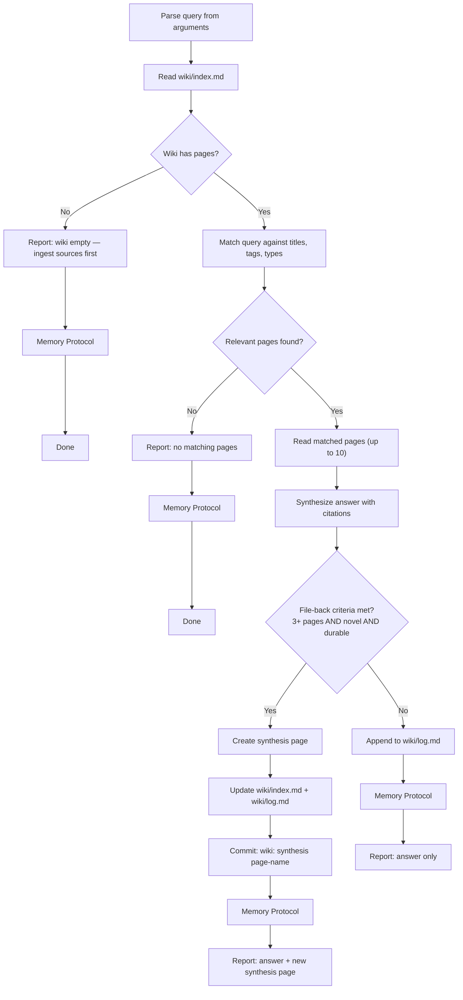

# Wiki Query

Search the wiki knowledge base and synthesize answers from existing pages.
When a query produces novel cross-cutting insight, file it back as a
synthesis page so the knowledge compounds.

## Decision Flow



## Instructions

### 1. Parse query

`$ARGUMENTS` is the question or search terms. If empty, ask the user what they want to search for.

### 2. Read the index

Read `wiki/index.md`. If the Pages table is empty:

```
Wiki is empty. Add source documents to wiki/sources/ and run /wiki-ingest.
```

Then Memory Protocol, done.

### 3. Find relevant pages

Scan the index table. Match the query against:
- **Titles**: fuzzy match (partial, case-insensitive)
- **Tags**: exact or substring match
- **Type**: if query implies entity vs concept (e.g., "who is X" → entity, "how does X work" → concept)

Rank by relevance. Select top 10 matches. If fewer than 3 matches, also check page filenames for keyword overlap.

### 4. Read matched pages

Read each matched page from `wiki/pages/`. Extract:
- Key points and their source citations
- Context sections (relationships to other pages)
- The `related:` frontmatter for additional leads

If a `related:` page looks relevant but wasn't in the initial match set, read it too (one hop only).

### 5. Synthesize answer

Produce a clear answer that:
1. Directly addresses the query
2. Cites specific pages as `[Page: page-filename.md]`
3. Notes contradictions between pages (if any)
4. Notes gaps — what the wiki doesn't cover yet
5. Suggests related pages the user might also want to read

### 6. Evaluate file-back criteria

Ask three questions:
1. Does this answer synthesize information from **3 or more** existing pages?
2. Does the synthesis produce a **novel insight** not already captured by an existing page?
3. Is the insight **durable** — would it be useful for future queries, not just this one?

All three must be **yes** to file back. If any is no, skip to step 8.

### 7. Create synthesis page

Write `wiki/pages/<kebab-case-title>.md`:

```markdown
---
title: "<Synthesis Title>"
description: "<One-line summary of the cross-cutting insight>"
type: synthesis
tags: [tag1, tag2]
sources: []
created: YYYY-MM-DD
updated: YYYY-MM-DD
related: [page-a.md, page-b.md, page-c.md]
---

# <Title>

<Summary of the synthesis — what it connects and why it matters>

## Analysis

<The synthesized insight, structured by theme or argument>

## Contributing Pages

- [Page A Title](page-a.md) — what it contributed
- [Page B Title](page-b.md) — what it contributed
- [Page C Title](page-c.md) — what it contributed

## Open Questions

- <Gaps or contradictions that emerged from this synthesis>
```

Rules:
- `type: synthesis` — distinguishes from entity/concept pages
- `sources: []` — synthesis pages cite other wiki pages, not raw sources
- `related:` lists all pages that contributed to the synthesis
- Update `wiki/index.md` — add new row, update Statistics
- Append to `wiki/log.md`
- Commit: `git add wiki/ && git commit -m "wiki: synthesis <page-name>"`

### 8. Log query (no file-back)

Append to `wiki/log.md`:

```markdown
## [QUERY] — YYYY-MM-DD HH:MM UTC
- **Pages**: [pages read]
- **Sources**: []
- **Summary**: Queried "<terms>", read N pages, answered from M
```

### 9. Memory Improvement Protocol

**a) Log** — append to `memory/YYYY-MM-DD.md`:

```markdown
## Wiki Query — HH:MM UTC
- **Result**: OP | NO-OP
- **Item**: "<query terms>"
- **Action**: [answered from N pages / filed synthesis / no matches / wiki empty]
- **Duration**: ~Xs
- **Observation**: [one sentence — coverage quality, gaps noticed, connections found]
```

**b) Qualify** — ask:
- Did the query reveal a gap in wiki coverage? → Note missing topic
- Did contradictions appear between pages? → Flag for lint
- Was the file-back decision borderline? → Note reasoning
- Did the index help or was it insufficient? → Note if index needs restructuring

**c) Improve** — if qualification found something actionable:
- Append to `MEMORY.md > Lessons Learned`
- Do NOT update MEMORY.md for routine queries

**d) Report** — end with:
- Answer text (always)
- If filed back: "Filed as synthesis page: wiki/pages/<name>.md"
- `HEARTBEAT_OK` (if run from heartbeat context)

## Reference

| Resource | Path |
|----------|------|
| Wiki index | `wiki/index.md` |
| Wiki log | `wiki/log.md` |
| Source documents | `wiki/sources/` |
| Wiki pages | `wiki/pages/` |
| Identity | `IDENTITY.md` |
| Memory | `MEMORY.md` |
| Daily Logs | `memory/YYYY-MM-DD.md` |
